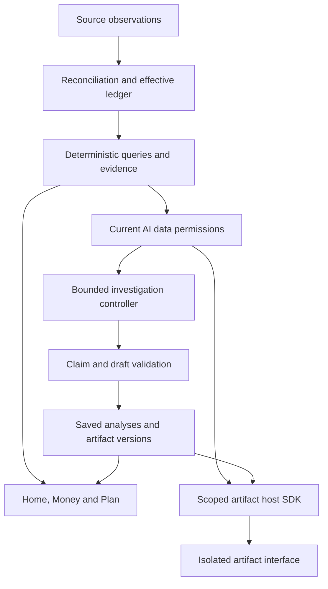

# Moneo — Product, Financial Engine, AI and Artifact Audit

**GitHub-ready issue pack · 6 October 2026**

| Audit detail | Value |
| --- | --- |
| Repository | [indkhan/Moneo](https://github.com/indkhan/Moneo) |
| Audited revision | [`3b3809631e06e54f8a35e63a843215ede5c56b04`](https://github.com/indkhan/Moneo/commit/3b3809631e06e54f8a35e63a843215ede5c56b04) |
| Scope | Financial truth, imports/reconciliation, financial analysis, AI orchestration and permissions, artifact generation/runtime/state, interface workflows and verification |
| Deliverable | 50 actionable issue drafts, a target architecture, repair order and acceptance journeys |
| Priority distribution | 1 P0 · 15 P1 · 34 P2 |
| Changes made to product | None; repository source remained unchanged |
| GitHub issue status | Drafts only. MNE identifiers belong to this report; they are not existing GitHub issue numbers. |

## How to use this file

Start with the diagnosis and repair order, then use the issue index to open the relevant draft. Each issue has a title, priority, suggested labels, impact, triggering condition or reproduction, expected behavior, root cause, proposed fix, acceptance criteria, pinned source links and a verification statement. Its body can be copied into GitHub. Labels are suggestions, not a claim that those labels already exist in the repository.

The report distinguishes **reproduced defects**, **source-confirmed control-flow defects**, **architectural/product gaps**, and **intentional conservative policies whose user workflow is incomplete**. It does not count all 50 items as demonstrated production bugs. Related-work links describe useful sequencing and integration ownership; independent narrow fixes can proceed in parallel.

**Sensitive-data handling:** the privacy issue is intentionally redacted. Real bank filenames, identifiers and transaction contents should not be copied into a public issue. All numerical examples elsewhere are synthetic.

## 1. Executive diagnosis

Moneo has useful foundations, but it does not yet deliver a dependable power-user financial analysis workspace. The strongest evidence is a combination of wrong financial results in specific supported cases, incomplete analysis interfaces, disconnected execution lifecycles and an artifact system whose capabilities are much narrower than the intended product.

The central architectural problem is that **financial meaning is implemented differently in several places**. Accepted ledger aggregation, budget presentation, forecast projection, review snapshots and artifact snapshots do not consistently share the same scope, completeness, date, currency and lifecycle semantics. The model can only reason with the facts and operations it receives. A more capable model cannot compensate reliably for omitted coverage, a hard-coded review period or an artifact SDK that discards the correct scenario result. See [MNE-008](#mne-008), [MNE-009](#mne-009), [MNE-017](#mne-017), [MNE-018](#mne-018) and [MNE-031](#mne-031).

The next problem is **fragmented investigation state**. Chat, saved review jobs, artifact generation, local artifact execution and Activity each have different state and recovery behavior. Questions lose their requested period/focus; completed reviews are not naturally part of the originating conversation; deep-review cancellation suppresses publication without signaling the active model request to abort; saved state can be overwritten from stale editors. See [MNE-019](#mne-019) through [MNE-021](#mne-021), [MNE-024](#mne-024) through [MNE-026](#mne-026), [MNE-029](#mne-029) and [MNE-034](#mne-034) through [MNE-037](#mne-037).

The interface reflects those boundaries. A desktop assistant that opens as a modal prevents interacting with the finance page beside it. Metric links lead to general destinations; forecasts show lines without enough dated/account detail to inspect a decision; evidence often appears as JSON. Home customization and ledger bulk edits exist, but require awkward separate workflows. These are concrete interaction limits, not a screenshot-based aesthetic judgment. See [MNE-043](#mne-043), [MNE-045](#mne-045), [MNE-046](#mne-046) and [MNE-050](#mne-050).

**Recommendation:** retain the existing TypeScript/Next.js, Supabase/PostgreSQL, OpenRouter and Vercel Workflow stack. Replace the weak shared contracts and affected modules. The audit does not justify a new Python backend, another database, a separate always-running worker, or an automatic move to paid models. The most valuable redesign starts with one trustworthy financial query/evidence layer and connects the product around it.

### Immediate privacy finding

[MNE-001](#mne-001) is separate from the redesign: two real bank exports are tracked in the audited public repository. The acceptance notes identify the statements as real. Owner-controlled containment and sensitive-history remediation take priority. Removing a file in a new commit alone does not remove historical or externally retained copies; GitHub documents the additional history and coordination work required. [GitHub sensitive-data removal guidance](https://docs.github.com/en/authentication/keeping-your-account-and-data-secure/removing-sensitive-data-from-a-repository).

### Concrete contradictions found with synthetic inputs

| Scenario | Observed implementation behavior | Required interpretation | Issue |
| --- | --- | --- | --- |
| A decimal-dot source contains `1.234 KWD` | Parser produces `1234000` minor units | `1234` minor units under that declared decimal convention; ambiguous formats need review | [MNE-002](#mne-002) |
| Today's €1,000 salary is already included in a €2,000 current balance, then its recurrence is confirmed | Forecast can add the salary again and report €3,000 with uncertainty set to zero | The observed occurrence contributes once; future unfulfilled occurrences remain planned | [MNE-004](#mne-004) |
| Checking €100, savings €1,000, checking bill €500 tomorrow | Pooled available amount is €600 while checking reaches −€400 | Surface a €400 funding gap and any explicit transfer assumption | [MNE-005](#mne-005) |
| A €20 pending hold settles, and a later booked balance is €80 | Retained pending row can reduce availability to €60 again | The settled hold no longer counts as an outstanding deduction | [MNE-006](#mne-006) |
| Opening funds €100, salary €1,000 on day 3, trip €200 on day 8 | Trip fallback reports −€100; the shared engine's 30-day minimum available-to-spend is €100, reached before the trip | Evaluate the cost on its date; the balance immediately after this trip is €900, distinct from the horizon minimum | [MNE-031](#mne-031) |
| A spending-only artifact accesses `balances.length` | Overbroad validation fixture lets it pass; actual scoped snapshot omits balances | Validation and runtime must use the same declared-data contract | [MNE-032](#mne-032) |
| A saved view includes a tag and event | Saved filter builder discards both | Reopening preserves the original semantic scope | [MNE-041](#mne-041) |

These examples prove bounded implementation failures. They are not claims about the user's real balances, losses or model hallucination frequency. Where a scenario crosses a database transition, the individual issue states whether the SQL path was inspected or executed.

### Foundations worth retaining

There is meaningful work to build on: exact minor-unit arithmetic; source-preserving import operations and idempotency; workspace-scoped authorization; version/history and undo mechanisms; deterministic forecasts and scenario calculations; QuickJS execution isolation; saved review evidence/freshness; and a substantial test suite. The issue pack identifies specific gaps in these mechanisms and their integration, rather than assuming they are absent. Code anchors: [exact forecasts](https://github.com/indkhan/Moneo/blob/3b3809631e06e54f8a35e63a843215ede5c56b04/lib/finance/calculations.ts#L122-L150); [source-preserving import control](https://github.com/indkhan/Moneo/blob/3b3809631e06e54f8a35e63a843215ede5c56b04/supabase/migrations/202610010051_atomic_import_control.sql#L62-L158); [workspace authorization](https://github.com/indkhan/Moneo/blob/3b3809631e06e54f8a35e63a843215ede5c56b04/lib/auth.ts#L4-L15); [QuickJS isolation](https://github.com/indkhan/Moneo/blob/3b3809631e06e54f8a35e63a843215ede5c56b04/lib/artifacts/isolate.ts); [saved review completion](https://github.com/indkhan/Moneo/blob/3b3809631e06e54f8a35e63a843215ede5c56b04/supabase/migrations/202610010043_atomic_review_completion.sql#L16-L45); [documented acceptance coverage](https://github.com/indkhan/Moneo/blob/3b3809631e06e54f8a35e63a843215ede5c56b04/e2e/README.md#L9-L22).

## 2. Scope, assumptions and confidence

The product target is a personal, desktop-first finance workspace for importing and organizing spending, investigating changes, planning scenarios and saving useful AI-assisted tools. The current [product plan](https://github.com/indkhan/Moneo/blob/3b3809631e06e54f8a35e63a843215ede5c56b04/plan.md) is the main repository scope reference.

The audit proceeds with these working decisions:

- Use the audited main revision and existing stack. Substantial replacement of weak modules is a valid proposal when justified by a finding.
- Keep free OpenRouter models during development. Model routing, retries and repair attempts must stay within that policy unless the user changes it.
- Keep exact financial calculations in application/domain code, with original records, dated evidence, controlled corrections and undo.
- Read-only investigations and hypothetical scenarios should operate autonomously within permitted scopes and bounded budgets. Canonical edits retain explicit intent, validation and review/undo appropriate to the operation.
- Richer artifacts may need editable HTML/CSS/JavaScript mini-app presentation, while simple structured cards and existing opening shortcuts remain valid. An artifact is useful when it helps repeat a task; every answer does not need one.
- Bank connections are a later data-ingestion capability. Payments, trading, external subscription cancellation and public artifact sharing are outside this audit's requested improvement scope.

The plan already permits Home pins to be opening shortcuts and already includes a Financial Model area, uncertainty review, customization and evidence disclosures. Findings about these areas concern their specific limits; they do not erase the implemented features.

### What was verified

| Check | Audit result | What it establishes |
| --- | --- | --- |
| Source and migration inspection | Completed at the pinned revision | Actual tool contracts, query semantics, active SQL control flow, UI structure and persistence behavior |
| `npm test` | **78 files passed, 1 skipped; 286 tests passed, 1 skipped** | Existing default unit coverage passes; the DB-dependent resolver test did not run |
| `npm run lint` | Passed | Current ESLint checks pass |
| Targeted synthetic probes | Executed for finance parsing/projection, AI lifecycle/permissions/publication paths, artifact contracts and saved filters | Bounded failures in actual modules, with controlled/mocked boundary inputs where needed |
| Production build | Compilation and TypeScript phases finished; static generation did not reach a complete successful summary | **Inconclusive** production build; a native-runtime error was observed around static generation |
| Browser smoke attempt | Blocked by missing/uninstallable Chromium and a Next host network-interface startup error | **No authenticated browser acceptance or visual walkthrough was completed** |
| Live Supabase, SQL roles/races and migration deployment | Not executed | SQL findings remain source-traced where marked; production behavior/migration state not independently certified |
| Live OpenRouter quality, billing and cancellation | Not executed | No measured real-model success rate, latency, usage cost or provider cancellation guarantee |

Browser failures in this audit are not counted as four product regressions. The host reported `uv_interface_addresses`/network-interface errors, and the Chromium download did not produce a usable installation. The build also did not provide a trustworthy final success outcome. These limits belong to the verification record; their source was not established as an application defect.

The UI audit is therefore a **code-based workflow and presentation audit**. It supports findings such as modal background blocking, absent columns, mismatched filters and a compiled dark-theme contrast pair. It does not establish the overall visual polish, responsive behavior or usability of a deployed signed-in session.

### Severity definitions

| Priority | Meaning in this report |
| --- | --- |
| **P0** | Active public exposure of private financial source data requiring immediate owner attention |
| **P1** | Financial correctness, data-control, validation or core analysis failures that should be resolved before relying on the corresponding workflow |
| **P2** | Material capability, correctness-at-an-edge, usability, resilience, performance or verification gaps; still actionable, with sequencing based on dependencies |

Priority and certainty are separate. A core architecture gap can be P1 without a production incident. A confirmed P2 race remains a real defect even if its trigger is narrow. The issue-specific verification statement is the authority for confidence.

## 3. Target architecture

### 3.1 One financial query and evidence contract

The shared financial service should own the meaning of a result before any screen or model formats it. Use the existing accepted/effective ledger and domain calculations, then add a versioned query specification and evidence envelope. AI-specific data delivery should recheck current permissions without disabling the same deterministic operations for ordinary non-AI Money/Home use. This distinction matters for [MNE-022](#mne-022).

| Contract component | Required behavior | Primary work |
| --- | --- | --- |
| Query | Explicit periods/comparisons, owned accounts/entities, category/merchant/tag/event filters, grouping, pagination, ranking and signed/absolute amount semantics | [MNE-017](#mne-017), [MNE-041](#mne-041), [MNE-042](#mne-042) |
| Money | Exact minor-unit strings/integers, original currency and declared reporting currency, dated FX source and rounding policy | [MNE-002](#mne-002), [MNE-010](#mne-010) |
| Reconciliation | A covered-through balance boundary; observed pending/posted lifecycle; fulfillment state for recurring occurrences | [MNE-003](#mne-003), [MNE-004](#mne-004), [MNE-006](#mne-006), [MNE-007](#mne-007) |
| Coverage | Accepted and observed counts, unresolved source/classification rows, included/excluded reasons, statement periods and explicit unknowns | [MNE-008](#mne-008), [MNE-009](#mne-009), [MNE-012](#mne-012) |
| Decision result | Per-account dated headroom, explicit funding assumptions, baseline and scenario results from the same engine | [MNE-005](#mne-005), [MNE-031](#mne-031) |
| Evidence identity | Query/result ID, source/entity versions, data revision, fetched/as-of times, calculation version and links | [MNE-018](#mne-018), [MNE-036](#mne-036), [MNE-045](#mne-045) |
| AI delivery | Fresh workspace/scope checks before each new permitted release, and provenance sufficient for scoped context handling | [MNE-022](#mne-022), [MNE-025](#mne-025) |

Do not reduce uncertainty to a single generic error or a misleading zero. A result can contain an exact accepted-ledger subtotal while its coverage is incomplete; it can contain an observed historical balance without establishing current liquidity. Those distinctions should survive through a chart, AI answer, artifact and export.

This is a proposed ownership map, not a claim that one generic service should replace every domain module. Preserve separate balance, budget, scenario and import operations behind shared semantics and result identities.

### 3.2 A question-driven AI investigator

Persist a typed investigation request: the user's question, target and comparison periods, selected entities, visible context, allowed data scopes and budgets. Let the controller choose a small set of deterministic queries, inspect results, drill into material changes and assemble supported conclusions. Retrieval should adapt to what is found, with limits on tools, time, tokens and retries. The current fixed 90-day single-completion review cannot provide that behavior. See [MNE-017](#mne-017) through [MNE-019](#mne-019).

Models should identify useful questions, choose permitted operations, explain measured patterns and propose interfaces. Domain code should calculate and format money. A published financial claim should reference validated evidence IDs, periods, currencies and exact metrics; its internal links should be generated or verified by the host. Explanation can remain flexible prose, but a causal interpretation must not masquerade as an observed fact. Unsupported sections should be repaired within a bounded budget or visibly omitted while retaining supported results.

Use durable Workflows for long reviews and artifact generation. Store the workflow run identity alongside the application job, use checked transitions, reconcile abandoned jobs and record useful stage/attempt events. Distinguish retryable failure, terminal failure, cancel requested and cancel acknowledged. A short chat still needs request identity, reconnection and a lease/recovery path; it need not become a heavyweight durable workflow. See [MNE-020](#mne-020), [MNE-021](#mne-021), [MNE-028](#mne-028), [MNE-029](#mne-029) and [MNE-037](#mne-037).

Current Workflow documentation confirms automatic retries for thrown step errors. The installed project version must govern the implementation: provider retries, Workflow step retries and application job states are different mechanisms and need one deliberate policy. The present eager `failed` state can cause a retried step to skip its work, while an un-awaited asynchronous rejection can bypass the application failure transition. [Workflow retry documentation](https://workflow-sdk.dev/docs/foundations/errors-and-retries).

Restore conversational continuity through shared thread identity, accessible history and typed selected/pinned context. Summaries can retain user decisions and preferences, but dated financial facts should be refreshed through evidence references. Disabling one scope should remove the affected evidence without discarding unrelated conversation meaning. Completed reviews should appear in the originating conversation as typed result cards and remain queryable in follow-up questions. See [MNE-024](#mne-024) through [MNE-026](#mne-026).

Keep model policy small and evaluated: a task-specific prompt/model configuration for mapping, investigation, synthesis and artifact generation; verified free-model fallback ordering; explicit budgets; safe catalogue caching; and representative task evaluations. A successful “OK” response proves connectivity, not financial investigation or code-generation quality. Routine preference/privacy saves must not wait for that provider test. See [MNE-023](#mne-023) and [MNE-027](#mne-027).

### 3.3 An artifact platform with reliable calculation, state and presentation

The current calculator can remain useful for simple tasks. A richer artifact should have a versioned manifest describing its interface, typed parameters/state, allowed host queries, SDK version, compact/full presentation and resource limits. Its host data and critical financial calculations should come from the shared query/scenario services. Generated presentation should bind to those results rather than reimplementing affordability arithmetic. See [MNE-030](#mne-030) and [MNE-031](#mne-031).

For editable HTML/CSS/JavaScript presentation, use an isolated rendering surface and a narrow validated host message/SDK bridge. Generated code receives no authentication material, direct database client or arbitrary financial-data/network access. Define and test network/egress and navigation restrictions, and bind every bridge message to the expected artifact instance/version with validated arguments and current permissions. Preserve the existing QuickJS isolation for calculation code where appropriate. A frame's sandbox configuration must be designed deliberately: script execution and same-origin privileges together can undermine the intended isolation for same-origin content. [MDN iframe sandbox reference](https://developer.mozilla.org/en-US/docs/Web/HTML/Reference/Elements/iframe#sandbox).

Treat generation as a sequence of retained draft stages: capture intent and base version; generate; parse/type-check; validate permissions and runtime limits; exercise realistic declared-data fixtures and domain expectations; render a preview; repair with exact diagnostics within budget; then activate atomically through a trusted validation authority. Structural validation alone is not proof of financial correctness. A caller-supplied `validated` flag must never be the authority for activation. See [MNE-032](#mne-032), [MNE-038](#mne-038) and [MNE-039](#mne-039).

Keep three distinct revisions: **artifact code/manifest version**, **persisted state version**, and **financial evidence revision**. An editor saves against the version actually edited. State saves carry the user's expected revision and changed fields. A completed run stores the normalized inputs and evidence that produced its output. Export that immutable completed record; do not combine current editable inputs with an older result. See [MNE-033](#mne-033) through [MNE-036](#mne-036) and [MNE-040](#mne-040).

Unify creation from chat, the side panel and the tool library. Preserve the original task through generation and edits; preview the actual artifact instead of requiring source inspection. An invalid draft leaves the active version untouched. Users can still choose a small structured chart or a shortcut pin; expressive artifacts should add a useful repeatable workflow rather than becoming mandatory UI for every answer.

### 3.4 Interface design around investigation

| Surface | Recommended interaction | Main issues |
| --- | --- | --- |
| Home | Arrange widgets in place; make scope visible; open exact evidence; show specific reconciliation actions; optional compact live artifacts | [MNE-045](#mne-045), [MNE-046](#mne-046) |
| Money | One query/selection model, visible categories/tags/events, useful amount inputs, saved-view fidelity, full-query bulk review | [MNE-041](#mne-041), [MNE-042](#mne-042), [MNE-050](#mne-050) |
| Plan / Financial Model | Explain covered balances and assumptions; inspect account/date shortfalls and scenario differences; retain useful dated evidence | [MNE-003](#mne-003), [MNE-005](#mne-005), [MNE-012](#mne-012), [MNE-045](#mne-045) |
| AI workspace and side panel | One persistent investigation across a modeless desktop panel and full view; selected context, live stages, stop/recovery and usable completed results | [MNE-024](#mne-024) through [MNE-029](#mne-029), [MNE-043](#mne-043) |
| Artifact detail | Rendered draft, declared data access, typed inputs, version comparison, trustworthy refresh/state/export behavior | [MNE-030](#mne-030) through [MNE-040](#mne-040) |
| Shared visual system | Semantic foreground/background tokens, readable tables and controls, consistent result/error/evidence presentation | [MNE-044](#mne-044), [MNE-045](#mne-045), [MNE-048](#mne-048) |

This can be a substantial interface redesign while preserving the navigation areas. It should make the same financial state easier to inspect and manipulate, with successful end-to-end journeys as the acceptance standard.

## 4. Recommended repair order

| Stage | Work | Exit condition |
| --- | --- | --- |
| **0 — Contain private-data exposure** | [MNE-001](#mne-001) | Owner has removed/restricted the public sensitive data and assessed history/copies; synthetic acceptance inputs replace private committed files |
| **1 — Stabilize trust and control** | [MNE-002](#mne-002) through [MNE-007](#mne-007); [MNE-020](#mne-020), [MNE-022](#mne-022), [MNE-023](#mne-023); [MNE-031](#mne-031), [MNE-032](#mne-032), [MNE-039](#mne-039); begin [MNE-049](#mne-049) | Money/occurrence/lifecycle cases reconcile; saved revocation blocks new AI evidence; retries converge; invalid artifact source cannot claim activation authority |
| **2 — Establish shared query/evidence semantics** | [MNE-008](#mne-008) through [MNE-011](#mne-011), [MNE-012](#mne-012); [MNE-017](#mne-017), [MNE-018](#mne-018); [MNE-041](#mne-041), [MNE-042](#mne-042) | The same scoped question yields the same exact result and coverage in Money, AI and artifacts |
| **3 — Deliver useful investigations and reliable artifacts** | [MNE-019](#mne-019), [MNE-021](#mne-021), [MNE-024](#mne-024) through [MNE-029](#mne-029); [MNE-030](#mne-030), [MNE-033](#mne-033) through [MNE-038](#mne-038), [MNE-040](#mne-040) | A selected question survives navigation, produces supported findings, can be followed up, and becomes a reliable saved tool when useful |
| **4 — Complete the power-user interface and intake workflow** | [MNE-043](#mne-043) through [MNE-048](#mne-048), [MNE-050](#mne-050); [MNE-013](#mne-013) through [MNE-016](#mne-016) | Users can import/reconcile, investigate, correct and reuse their work without losing scope or facing separate disconnected workflows |

These stages express dependency order, not a requirement to finish every P1 before improving any screen. Theme/configuration fixes, saved-filter repair and unrelated narrow defects can be handled immediately. Add regression cases beside each fix. The shared contract and UI components can be designed in parallel, but final correctness acceptance must use the same actual domain operations.

### The first development batches I would create

1. **Financial trust:** exact amount interpretation, manual reconciliation boundaries, occurrence settlement, pending settlement and account-level liquidity. Keep source history and undo intact.
2. **AI control:** save privacy/settings independently of provider health; recheck current scopes; repair job-state/retry handling; introduce consistent runtime identity and cancellation semantics.
3. **Shared result contract:** scoped queries, complete supporting records, source coverage, dated FX and evidence-bound claims. Use one reference comparison journey to drive integration.
4. **Artifact contract:** fix the trip calculation and fixture mismatch immediately; protect activation authority and revisions; then add expressive presentation and durable repair/preview.
5. **Investigation interface:** shared conversations, modeless panel, metric evidence, richer ledger selection and Home composition.

Do not begin by changing only the model selector or applying a new visual theme. The issues above show which financial and execution contracts must change for either improvement to produce trustworthy behavior.

## 5. Acceptance journeys that define a successful rebuild

| Journey | Required evidence of success | Coverage |
| --- | --- | --- |
| **Import and reconcile a month** | Mixed decimal conventions are reviewed; source rows are preserved; overlaps use stable account IDs; pending settlements retire holds; invalid rows are explainable; complete/partial coverage is visible | [MNE-002](#mne-002), [MNE-003](#mne-003), [MNE-006](#mne-006), [MNE-007](#mne-007), [MNE-008](#mne-008), [MNE-011](#mne-011), [MNE-016](#mne-016) |
| **Explain a spending change** | Ask for two named months, one account, grocery merchants, excluding a trip; retrieve all relevant rows; reconcile splits/refunds/transfers; give exact deltas and working source links; a follow-up uses the same context | [MNE-017](#mne-017), [MNE-018](#mne-018), [MNE-019](#mne-019), [MNE-025](#mne-025), [MNE-041](#mne-041) |
| **Decide whether a trip is affordable** | Use dated reconciled balances, posted salary, future bills and reservations; show paying-account shortfalls; native Plan and artifact agree; scenario leaves the real ledger untouched | [MNE-003](#mne-003), [MNE-004](#mne-004), [MNE-005](#mne-005), [MNE-006](#mne-006), [MNE-031](#mne-031), [MNE-045](#mne-045) |
| **Stop, leave and return** | An investigation or artifact generation survives navigation or reports a truthful terminal state; cancellation status matches acknowledged work; no late publication; completed results rejoin their conversation | [MNE-020](#mne-020), [MNE-021](#mne-021), [MNE-026](#mne-026), [MNE-028](#mne-028), [MNE-029](#mne-029), [MNE-037](#mne-037) |
| **Revoke AI access during an outage** | Settings save despite provider failure; subsequent tool steps/fetches release no newly denied data; ordinary non-AI finance pages still function; revocation is not falsely described as retroactively recalling or deleting data already submitted to a provider | [MNE-022](#mne-022), [MNE-023](#mne-023), [MNE-025](#mne-025), [MNE-036](#mne-036) |
| **Create, repair and keep a reusable tool** | Description survives into generation; declared-data validation catches missing inputs; diagnostics guide repair; user sees a rendered preview; only a trusted validated draft activates | [MNE-030](#mne-030), [MNE-032](#mne-032), [MNE-033](#mne-033), [MNE-038](#mne-038), [MNE-039](#mne-039) |
| **Edit concurrently and export** | Two tabs preserve independent state edits or show conflict; stale source cannot overwrite a newer version; exports pair the exact completed result with its actual input/evidence revisions | [MNE-034](#mne-034), [MNE-035](#mne-035), [MNE-036](#mne-036), [MNE-040](#mne-040) |
| **Work continuously in the interface** | AI remains usable beside editable filters; saved scopes persist; multi-page correction is reviewable; dark text is readable; failed data requests are not presented as empty finance | [MNE-041](#mne-041) through [MNE-045](#mne-045), [MNE-048](#mne-048), [MNE-050](#mne-050) |

Use synthetic fixtures, deterministic assertions and disposable authenticated database/browser environments. Model evaluations should score tool selection, numerical grounding, coverage disclosures, task completion, artifact validity and recovery—not only prose style. A required skipped suite is a blocked acceptance result. The repository already states this policy; [MNE-049](#mne-049) makes it repeatable and enforceable.

## 6. Issue index

| Draft | Priority | Area | Title |
| --- | --- | --- | --- |
| [MNE-001](#mne-001) | P0 | Privacy | Remove real bank exports from the public repository and prevent recurrence |
| [MNE-002](#mne-002) | P1 | Finance / imports | Parse three-decimal currency amounts using a reviewed numeric convention |
| [MNE-003](#mne-003) | P1 | Finance / imports | Let manual balance reconciliation establish an explicit covered-through boundary |
| [MNE-004](#mne-004) | P1 | Finance / imports | Reconcile recurring occurrences before adding them to current-day forecasts |
| [MNE-005](#mne-005) | P1 | Finance / imports | Surface account-level liquidity shortfalls before reporting safe spending |
| [MNE-006](#mne-006) | P1 | Finance / imports | Retire pending holds when their posted settlement is accepted |
| [MNE-007](#mne-007) | P1 | Finance / imports | Make overlap acceptance use frozen routes and the full normalized import contract |
| [MNE-008](#mne-008) | P2 | Finance / imports | Attach source coverage and unresolved-observation metadata to financial results |
| [MNE-009](#mne-009) | P2 | Finance / imports | Use one completeness-aware budget calculation across native and AI views |
| [MNE-010](#mne-010) | P2 | Finance / imports | Add authoritative base-currency expenditure aggregation using dated FX evidence |
| [MNE-011](#mne-011) | P2 | Finance / imports | Unify import validation and quarantine invalid rows before execution |
| [MNE-012](#mne-012) | P2 | Finance / imports | Keep useful reconciled and dated financial views when evidence becomes historical |
| [MNE-013](#mne-013) | P2 | Finance / imports | Extend import intelligence from column mapping to reviewable financial organization |
| [MNE-014](#mne-014) | P2 | Finance / imports | Make recurring detection aware of coverage, merchant variation and separate occurrence runs |
| [MNE-015](#mne-015) | P2 | Finance / imports | Stage normalized imports once and process bounded batches with fewer round trips |
| [MNE-016](#mne-016) | P2 | Finance / imports | Make XLSX sheet selection and typed date evidence explicit during intake |
| [MNE-017](#mne-017) | P1 | AI / orchestration | Add a general deterministic investigation API; the current chat cannot answer ordinary detailed finance questions |
| [MNE-018](#mne-018) | P1 | AI / orchestration | Validate financial claims and persist their evidence before publishing AI answers |
| [MNE-019](#mne-019) | P1 | AI / orchestration | Replace the fixed one-shot “deep review” with question-driven, bounded investigation |
| [MNE-020](#mne-020) | P1 | AI / orchestration | Repair financial-review failure/retry state transitions and reconcile Workflow runs with application jobs |
| [MNE-021](#mne-021) | P2 | AI / orchestration | Make Stop cancel active AI work, not only suppress publication |
| [MNE-022](#mne-022) | P1 | AI / orchestration | Recheck AI data permissions at every execution boundary |
| [MNE-023](#mne-023) | P1 | AI / orchestration | Allow settings and data-access revocation to save during a provider outage |
| [MNE-024](#mne-024) | P2 | AI / orchestration | Make every saved conversation and its latest messages reachable |
| [MNE-025](#mne-025) | P2 | AI / orchestration | Preserve meaningful conversation context without replaying stale financial claims |
| [MNE-026](#mne-026) | P2 | AI / orchestration | Connect saved reviews and their completion back into the originating conversation |
| [MNE-027](#mne-027) | P2 | AI / orchestration | Add task-specific model routing, verified fallbacks, and evaluation gates |
| [MNE-028](#mne-028) | P2 | AI / orchestration | Persist meaningful run activity, execution provenance, and review usage |
| [MNE-029](#mne-029) | P2 | AI / orchestration | Recover chat request state across navigation, interruption, and process failure |
| [MNE-030](#mne-030) | P1 | Artifacts | Add an expressive artifact runtime and a shared chat-to-tool creation flow |
| [MNE-031](#mne-031) | P1 | Artifacts | Calculate dated trip scenarios with the shared forecast engine |
| [MNE-032](#mne-032) | P1 | Artifacts | Validate artifacts against the actual scoped snapshot and output contracts |
| [MNE-033](#mne-033) | P2 | Artifacts | Enforce one manifest input contract across editing, execution and persistence |
| [MNE-034](#mne-034) | P2 | Artifacts | Protect artifact versions from stale editor and draft overwrites |
| [MNE-035](#mne-035) | P2 | Artifacts | Use the user's edited state revision when saving artifact inputs |
| [MNE-036](#mne-036) | P2 | Artifacts | Refresh artifact evidence and identify the data revision behind results |
| [MNE-037](#mne-037) | P2 | Artifacts | Make artifact generation durable, recoverable and independently cancelable |
| [MNE-038](#mne-038) | P2 | Artifacts | Repair failed generated drafts using diagnostics and a rendered preview |
| [MNE-039](#mne-039) | P2 | Artifacts | Require trusted validation authority before activating artifact source |
| [MNE-040](#mne-040) | P2 | Artifacts | Export the exact inputs and evidence that produced the completed result |
| [MNE-041](#mne-041) | P2 | Interface | Persist tag and event filters when saving and reopening a transaction view |
| [MNE-042](#mne-042) | P2 | Interface | Make transaction amount filtering and sorting currency-aware and use normal monetary inputs |
| [MNE-043](#mne-043) | P2 | Interface | Make contextual AI a modeless desktop panel that shares the active investigation |
| [MNE-044](#mne-044) | P2 | Interface | Fix dark-theme text contrast with shared semantic color tokens |
| [MNE-045](#mne-045) | P2 | Interface | Give financial metrics, forecasts and saved analyses a usable evidence drill-down |
| [MNE-046](#mne-046) | P2 | Interface | Make Home customization and financial scope editable on the dashboard |
| [MNE-047](#mne-047) | P2 | Operation / quality | Handle missing Supabase configuration before proxy and layout create an auth client |
| [MNE-048](#mne-048) | P2 | Operation / quality | Distinguish authentication, data-loading and input failures with recoverable UI states |
| [MNE-049](#mne-049) | P2 | Operation / quality | Provide a reproducible required acceptance gate for financial and AI workflows |
| [MNE-050](#mne-050) | P2 | Interface | Make ledger exploration and bulk correction a single power-user table workflow |

## 7. GitHub-ready issue drafts

## MNE-001 — Remove real bank exports from the public repository and prevent recurrence

**Priority:** P0  
**Classification:** Confirmed privacy exposure; sensitive evidence redacted  
**Suggested labels:** `priority:p0`, `privacy`, `repository`, `data-handling`

### Problem and user impact

Two bank-export CSVs are tracked at the repository root in the audited public revision. The acceptance notes identify the supplied statements as real. A redacted structural inspection found transaction records and checksum-valid bank-account identifiers. This is private financial source data in a distribution channel intended for source code. Ignoring environment keys and browser auth state does not protect already committed financial exports.

### Reproduction or triggering condition

Inspect the tracked root inventory at the pinned commit and the acceptance notes. The exports contain 169 and 426 data rows; one contains checksum-valid IBAN occurrences. The audit deliberately omits the original filenames, account identifiers and transaction values from this issue. These files can be located by the repository owner without pasting their contents into a public issue or support ticket.

### Expected behavior

Public repository revisions contain synthetic or irreversibly anonymized fixtures only. Real statement acceptance uses private temporary inputs and redacted outcome evidence.

### Root cause

Private acceptance inputs were added to the tracked repository. The current ignore rules cover credentials and selected test outputs but do not establish an isolated private source-data area or prevent committed bank exports.

### Proposed fix

Treat containment as the first owner action. Restrict repository access if necessary, remove the private files from the working tree and replace required tests with synthetic fixtures. Follow a coordinated sensitive-data history-removal process covering branches, tags and hosted remnants; changing the latest commit or adding an ignore rule alone is insufficient. Assess forks, copies and any exposed credentials separately; bank identifiers are not automatically API secrets that can simply be rotated. Add ignored private input/evidence locations and a review or scan gate that detects accidental financial-data commits. Preserve only redacted acceptance summaries.

### Acceptance criteria

- [ ] Public current branches and tags contain no real bank exports or identifying acceptance attachments.
- [ ] History remediation and any remaining externally retained copies are assessed and documented privately by the owner.
- [ ] Synthetic fixtures reproduce the useful parsing cases without retaining real identities or purchases.
- [ ] A regression check rejects a representative private bank export without logging its sensitive contents.

### Code evidence

- [customer-acceptance.md:3-10](https://github.com/indkhan/Moneo/blob/3b3809631e06e54f8a35e63a843215ede5c56b04/customer-acceptance.md#L3-L10)
- [.gitignore:22-44](https://github.com/indkhan/Moneo/blob/3b3809631e06e54f8a35e63a843215ede5c56b04/.gitignore#L22-L44)

**Verification and limits:** Repository visibility and tracked-file presence were checked; a redacted local structural/checksum scan corroborated the acceptance notes. This does not establish whether anyone else accessed or copied the data. No file deletion, history rewrite or visibility change was performed.

**Related work / sequencing:** No prerequisite issue; this work can begin independently.

[Back to issue index](#6-issue-index)

---

## MNE-002 — Parse three-decimal currency amounts using a reviewed numeric convention

**Priority:** P1  
**Classification:** Confirmed arithmetic defect; synthetic runtime reproduction  
**Suggested labels:** `priority:p1`, `finance`, `imports`, `correctness`, `bug`

### Problem and user impact

The amount parser can inflate valid small amounts in a three-decimal currency by 1,000 times. It treats a single separator followed by three digits as integer grouping before considering currency precision. Exact bigint arithmetic then preserves the incorrectly interpreted amount. Imports, source fees, source balances, manual balance entry, and several planning inputs use this parser.

### Reproduction or triggering condition

For a decimal-dot KWD source, parseAmountMinor('1.234', 'KWD') returns 1234000 minor units instead of 1234; '0.123' returns 123000 instead of 123. '1234.567' correctly returns 1234567 because four whole digits bypass the grouping branch. These results were executed against current TypeScript. The defect is conditional on ambiguous numeric forms and supported three-decimal currencies; it does not establish that ordinary EUR imports are universally wrong.

### Expected behavior

A reviewed decimal-dot KWD amount of 1.234 is exactly 1234 minor units. A genuinely grouped integer must remain supported under its declared source format. Ambiguity must be resolved before authoritative amounts are accepted.

### Root cause

The mapping schema records date format and sign direction but no decimal/grouping convention. parseAmountMinor applies a global grouping heuristic ahead of the accounting precision check. Existing KWD tests use mixed separators or more than three whole digits and miss small three-fractional-digit values.

### Proposed fix

Add a reviewed per-source numeric convention and parse consistently across amounts, balances, and fees. Reject unresolved ambiguity. Use a clearly specified decimal input contract for manual forms, reusing parseManualAmount where appropriate. Preserve original text and the parser/mapping version so repaired interpretations can be audited.

### Acceptance criteria

- [ ] Decimal-dot and decimal-comma KWD/BHD/OMR inputs preserve exactly three fractional digits, including negative and sub-unit values.
- [ ] Explicit grouped-integer EUR/JPY cases remain correct; ambiguous inputs require clarification.
- [ ] Preview, persisted amount, fee, balance, and manual-entry results agree without floating-point conversion.
- [ ] A correction to previously misinterpreted source money retains evidence and invalidates affected derived results.

### Code evidence

- [lib/csv.ts:164-185](https://github.com/indkhan/Moneo/blob/3b3809631e06e54f8a35e63a843215ede5c56b04/lib/csv.ts#L164-L185)
- [lib/csv.ts:315-325](https://github.com/indkhan/Moneo/blob/3b3809631e06e54f8a35e63a843215ede5c56b04/lib/csv.ts#L315-L325); [lib/csv.ts:341-344](https://github.com/indkhan/Moneo/blob/3b3809631e06e54f8a35e63a843215ede5c56b04/lib/csv.ts#L341-L344); [lib/csv.ts:367](https://github.com/indkhan/Moneo/blob/3b3809631e06e54f8a35e63a843215ede5c56b04/lib/csv.ts#L367)
- [lib/csv.ts:13-45](https://github.com/indkhan/Moneo/blob/3b3809631e06e54f8a35e63a843215ede5c56b04/lib/csv.ts#L13-L45)
- [app/actions.ts:21-35](https://github.com/indkhan/Moneo/blob/3b3809631e06e54f8a35e63a843215ede5c56b04/app/actions.ts#L21-L35)
- [lib/csv.test.ts:127-137](https://github.com/indkhan/Moneo/blob/3b3809631e06e54f8a35e63a843215ede5c56b04/lib/csv.test.ts#L127-L137)

**Verification and limits:** Confirmed with current functions transpiled in memory. No financial statement contents or database services were used.

**Related work / sequencing:** No prerequisite issue; this work can begin independently.

[Back to issue index](#6-issue-index)

---

## MNE-003 — Let manual balance reconciliation establish an explicit covered-through boundary

**Priority:** P1  
**Classification:** Confirmed product and engine incompatibility; synthetic runtime reproduction  
**Suggested labels:** `priority:p1`, `finance`, `balances`, `reconciliation`, `bug`

### Problem and user impact

Entering a current booked balance does not recover a usable forecast when the account contains nonzero posted transactions from today. The form supplies an amount/date, but the resolver needs a stronger boundary than the action records. Users can repeatedly follow the instruction to update their balance without resolving the reported uncertainty.

### Reproduction or triggering condition

Create a posted transaction at 08:00Z on 2026-10-06. Enter the current booked balance at 12:00Z and evaluate at 12:01Z. The action writes the actual current timestamp but leaves boundary_kind at its date_only default. resolveBalances returns amount_minor:null, estimated_amount_minor:null and status:'ambiguous', even though the posting timestamp precedes the manual entry. The synthetic resolver result was executed.

### Expected behavior

A user should be able to explicitly confirm which recorded activity the newly observed bank balance includes. The engine should then use that evidence, count subsequent postings once, and retain uncertainty when the user has not confirmed a sufficient boundary.

### Root cause

The schema only supports date_only and source-linked after_transaction boundaries. Same-day ordering is accepted only for the latter. setManualBalance never supplies it or an equivalent reviewed manual boundary. The SQL reservation balance resolver shares this conservative model.

### Proposed fix

Add a versioned reconciliation command and interface for current booked balance, opening/closing balance, or balance after selected activity. Store the covered observations or explicit boundary with provenance. Update both TypeScript and SQL readers consistently. Do not weaken the existing refusal to guess merely because a manual timestamp is later.

### Acceptance criteria

- [ ] A reviewed current balance after today's timestamped or date-only activity becomes usable without double counting.
- [ ] An unconfirmed same-day boundary remains ambiguous, preserving existing safety tests.
- [ ] Later postings adjust the balance once; earlier covered postings do not.
- [ ] Forecasts and reservation commands return the same available cash and preserve correction/undo history.

### Code evidence

- [app/actions.ts:21-35](https://github.com/indkhan/Moneo/blob/3b3809631e06e54f8a35e63a843215ede5c56b04/app/actions.ts#L21-L35)
- [lib/db/schema.ts:79-92](https://github.com/indkhan/Moneo/blob/3b3809631e06e54f8a35e63a843215ede5c56b04/lib/db/schema.ts#L79-L92)
- [lib/finance/balances.ts:34-62](https://github.com/indkhan/Moneo/blob/3b3809631e06e54f8a35e63a843215ede5c56b04/lib/finance/balances.ts#L34-L62)
- [lib/finance/model.ts:147-151](https://github.com/indkhan/Moneo/blob/3b3809631e06e54f8a35e63a843215ede5c56b04/lib/finance/model.ts#L147-L151)
- [app/page.tsx:119](https://github.com/indkhan/Moneo/blob/3b3809631e06e54f8a35e63a843215ede5c56b04/app/page.tsx#L119)
- [lib/finance/balances.test.ts:57-63](https://github.com/indkhan/Moneo/blob/3b3809631e06e54f8a35e63a843215ede5c56b04/lib/finance/balances.test.ts#L57-L63)

**Verification and limits:** Confirmed action/schema/resolver trace and pure runtime reproduction. Existing tests intentionally reject ambiguous evidence; the missing reconciliation workflow is the defect.

**Related work / sequencing:** No prerequisite issue; this work can begin independently.

[Back to issue index](#6-issue-index)

---

## MNE-004 — Reconcile recurring occurrences before adding them to current-day forecasts

**Priority:** P1  
**Classification:** Confirmed conditional financial projection defect; synthetic runtime reproduction  
**Suggested labels:** `priority:p1`, `finance`, `forecast`, `recurring`, `bug`

### Problem and user impact

An already-posted recurring income or expense can be added again when its scheduled date is today's forecast start. The current balance may correctly include the posting, while the schedule independently emits the same economic occurrence. This overstates income-driven affordability or double-deducts a paid bill.

### Reproduction or triggering condition

Use three monthly salary observations, with the latest EUR 1,000 salary posted today and an imported after-transaction balance of EUR 2,000. Confirm the detected series today. The RPC sets starts_on to the already-observed latest_date. Expanding the schedule emits another EUR 1,000 today. Executed pure functions report EUR 3,000 available with zero uncertainty; the default 10% conservative case would still report EUR 2,900. An occurrence strictly before today is excluded: this finding does not claim every forecast is wrong.

### Expected behavior

A salary or bill already reflected in the opening balance must not generate another cash movement. Only an unfulfilled occurrence, or its remaining unsettled amount, should affect the forecast.

### Root cause

Confirmed series store historical evidence and an assumption anchor, but no ordinary occurrence-to-posting settlement state. evaluatePlan expands all confirmed assumptions from today without reconciling them against recorded activity. Only separate debt logic has targeted pending-association handling.

### Proposed fix

Introduce stable occurrence identities and evidence-backed states for scheduled, pending, posted, canceled, and partially fulfilled events. Record the next unfulfilled occurrence separately from the latest observed posting. Match with controlled evidence/confirmation, preserving user-authored assumptions. Do not broadly merge unrelated same-amount transactions.

### Acceptance criteria

- [ ] Confirming a series whose latest posting is today does not repeat its salary or rent movement.
- [ ] A current balance already containing the occurrence and one not yet containing it both produce correct forecasts.
- [ ] Early, late, partial, changed-amount, and pending-to-posted occurrences count once.
- [ ] Undo or reclassification restores the correct remaining obligation without merging ambiguous similar transactions.

### Code evidence

- [lib/finance/model.ts:12-49](https://github.com/indkhan/Moneo/blob/3b3809631e06e54f8a35e63a843215ede5c56b04/lib/finance/model.ts#L12-L49); [lib/finance/model.ts:101-107](https://github.com/indkhan/Moneo/blob/3b3809631e06e54f8a35e63a843215ede5c56b04/lib/finance/model.ts#L101-L107)
- [lib/finance/calculations.ts:122-139](https://github.com/indkhan/Moneo/blob/3b3809631e06e54f8a35e63a843215ede5c56b04/lib/finance/calculations.ts#L122-L139)
- [lib/db/schema.ts:331-353](https://github.com/indkhan/Moneo/blob/3b3809631e06e54f8a35e63a843215ede5c56b04/lib/db/schema.ts#L331-L353); [lib/db/schema.ts:503-536](https://github.com/indkhan/Moneo/blob/3b3809631e06e54f8a35e63a843215ede5c56b04/lib/db/schema.ts#L503-L536)
- [supabase/migrations/202610010041_verified_transaction_links.sql:330-378](https://github.com/indkhan/Moneo/blob/3b3809631e06e54f8a35e63a843215ede5c56b04/supabase/migrations/202610010041_verified_transaction_links.sql#L330-L378)

**Verification and limits:** Numeric reproduction executed against current resolver, schedule expander and forecast functions; confirmation anchor verified in the active SQL. The database confirmation flow itself was not executed.

**Related work / sequencing:** No prerequisite issue; this work can begin independently.

[Back to issue index](#6-issue-index)

---

## MNE-005 — Surface account-level liquidity shortfalls before reporting safe spending

**Priority:** P1  
**Classification:** Confirmed financial decision defect; synthetic runtime reproduction  
**Suggested labels:** `priority:p1`, `finance`, `forecast`, `accounts`, `bug`

### Problem and user impact

Available-to-spend uses pooled balances and protections, allowing a positive savings balance to hide a shortfall in the account responsible for a payment. The engine already calculates per-account conservative balances, but neither the decision result nor its native and AI consumers expose the required funding movement.

### Reproduction or triggering condition

Start with checking EUR 100 and savings EUR 1,000. Schedule tomorrow's EUR 500 payment from checking. Current functions return EUR 600 available while conservativeByAccount.checking reaches EUR -400 and savings remains EUR 1,000. No internal transfer is modeled. This is a missing account-level liquidity check, not a claim that the aggregate arithmetic sum is numerically incorrect.

### Expected behavior

Show the EUR 400 shortfall in checking, its date and supporting payment, even if aggregate assets remain positive. A safe-to-spend amount from a chosen account should respect its daily obligations and protected funds. Pooled funds require an explicit funding assumption.

### Root cause

availableToSpend minimizes only conservativeMinor across days and subtracts summed reservations, buffers and minimums. conservativeByAccount is otherwise unused. Goal allocations are stored per account, but that identity is discarded in the final affordability calculation.

### Proposed fix

Calculate headroom and shortfalls per account after its own obligations and protections. Return these alongside any aggregate figure. Model planned internal funding as paired offsetting account events with explicit dates, rather than assuming automatic instantaneous access to another account's cash.

### Acceptance criteria

- [ ] The two-account reproduction surfaces checking's EUR 400 shortfall while preserving the EUR 600 aggregate amount as a separately explained figure.
- [ ] A timely explicit transfer resolves the shortfall; one arriving after the payment does not.
- [ ] Reservations in one account and minimum balances retain their account identity.
- [ ] Internal transfers conserve total money, and native/AI results expose the same limiting dates and accounts.

### Code evidence

- [lib/finance/calculations.ts:131-150](https://github.com/indkhan/Moneo/blob/3b3809631e06e54f8a35e63a843215ede5c56b04/lib/finance/calculations.ts#L131-L150)
- [lib/finance/tools.ts:82-86](https://github.com/indkhan/Moneo/blob/3b3809631e06e54f8a35e63a843215ede5c56b04/lib/finance/tools.ts#L82-L86)
- [app/plan/page.tsx:73-75](https://github.com/indkhan/Moneo/blob/3b3809631e06e54f8a35e63a843215ede5c56b04/app/plan/page.tsx#L73-L75)
- [lib/db/schema.ts:292-301](https://github.com/indkhan/Moneo/blob/3b3809631e06e54f8a35e63a843215ede5c56b04/lib/db/schema.ts#L292-L301); [lib/db/schema.ts:310-319](https://github.com/indkhan/Moneo/blob/3b3809631e06e54f8a35e63a843215ede5c56b04/lib/db/schema.ts#L310-L319)
- [lib/finance/calculations.test.ts:45-58](https://github.com/indkhan/Moneo/blob/3b3809631e06e54f8a35e63a843215ede5c56b04/lib/finance/calculations.test.ts#L45-L58)

**Verification and limits:** Executed against current forecast and availableToSpend functions. Repository search found no consumer enforcing conservativeByAccount. Existing early-minimum tests cover one account only.

**Related work / sequencing:** No prerequisite issue; this work can begin independently.

[Back to issue index](#6-issue-index)

---

## MNE-006 — Retire pending holds when their posted settlement is accepted

**Priority:** P1  
**Classification:** Confirmed lifecycle gap with reproduced financial consequence  
**Suggested labels:** `priority:p1`, `finance`, `imports`, `pending-transactions`, `bug`

### Problem and user impact

The import pipeline preserves pending and posted observations but lacks a settlement lifecycle connecting them. Accepting a posted settlement can leave the old pending transaction active indefinitely, so the same payment affects the booked balance and remains an extra forecast hold.

### Reproduction or triggering condition

Import reference bank-1 as a EUR 20 pending hold. A later statement reports its posted EUR 20 settlement. The executed matcher returns review because the status changed. Review offers accept or reject; traced acceptance inserts a second transaction and never retires the hold. On the following day, a current booked balance of EUR 80 already includes settlement. Actual evaluatePlanForWorkspace, run against synthetic in-memory evidence, deducts the old EUR 20 hold and returns EUR 60 available.

### Expected behavior

Both original observations remain auditable, but the settled economic payment contributes booked spending once and no longer contributes an active hold. Rejecting legitimate posted evidence or undoing an entire previous import should not be required.

### Root cause

The transaction/source relationship records provenance without a pending-to-posted association or consumed-hold state. The review contract only accepts a new row or rejects it. Forecast loading subtracts every negative pending posting dated at or before today.

### Proposed fix

Add an evidence-backed settlement action and lifecycle, retaining source observations and changed dates/amounts. Consume a pending hold exactly once when its posted settlement is accepted. Provide explicit settle/cancel actions for manual holds. Ambiguous matches should remain reviewable rather than automatically merged by amount.

### Acceptance criteria

- [ ] Same-reference pending-to-posted imports preserve both observations and remove the obsolete hold deduction.
- [ ] Changed amount/date, cancellation, partial settlement and multiple candidate holds receive correct review behavior.
- [ ] Repeated and concurrent imports remain idempotent.
- [ ] Undo settlement restores the prior hold state without duplicating booked spending or deleting source evidence.

### Code evidence

- [lib/import-match.ts:13-19](https://github.com/indkhan/Moneo/blob/3b3809631e06e54f8a35e63a843215ede5c56b04/lib/import-match.ts#L13-L19)
- [app/api/imports/[id]/review/route.ts:10-30](https://github.com/indkhan/Moneo/blob/3b3809631e06e54f8a35e63a843215ede5c56b04/app/api/imports/%5Bid%5D/review/route.ts#L10-L30)
- [supabase/migrations/202610010020_review_account_routing.sql:229-236](https://github.com/indkhan/Moneo/blob/3b3809631e06e54f8a35e63a843215ede5c56b04/supabase/migrations/202610010020_review_account_routing.sql#L229-L236)
- [supabase/migrations/202610010022_import_classification.sql:110-125](https://github.com/indkhan/Moneo/blob/3b3809631e06e54f8a35e63a843215ede5c56b04/supabase/migrations/202610010022_import_classification.sql#L110-L125)
- [lib/finance/model.ts:153-159](https://github.com/indkhan/Moneo/blob/3b3809631e06e54f8a35e63a843215ede5c56b04/lib/finance/model.ts#L153-L159)
- [lib/db/schema.ts:177-214](https://github.com/indkhan/Moneo/blob/3b3809631e06e54f8a35e63a843215ede5c56b04/lib/db/schema.ts#L177-L214)

**Verification and limits:** Matcher and forecast consequences reproduced in memory; acceptance behavior traced through active SQL wrappers. No database settlement journey was executed. Existing refusal to blindly merge status changes is a safeguard to preserve.

**Related work / sequencing:** No prerequisite issue; this work can begin independently.

[Back to issue index](#6-issue-index)

---

## MNE-007 — Make overlap acceptance use frozen routes and the full normalized import contract

**Priority:** P1  
**Classification:** Confirmed code-path divergence; SQL trace only, not an executed database reproduction  
**Suggested labels:** `priority:p1`, `finance`, `imports`, `data-integrity`, `bug`

### Problem and user impact

Ordinary ingestion and explicit overlap acceptance use different account identity and normalization rules. The worker freezes UUID routes and preserves timestamps/balance boundaries, while acceptance delegates to an older name-based RPC that omits those fields. The same source observation therefore changes meaning depending on its review path.

### Reproduction or triggering condition

Finish an import with an overlap awaiting review, then rename its account. Acceptance still searches the old mapping name and can fail. If another same-currency account now uses the old name, the SQL can select that account instead of the frozen UUID. Separately, accept a genuine timestamped second posting with a source balance: the acceptance insert omits posted_at and creates no balance snapshot. These consequences are established by current SQL trace; no database journey was executed.

### Expected behavior

Accepted review rows must retain the same owned account identity and normalized timestamp, classification, fee and balance evidence as ordinary ingestion, unless the user explicitly reviews a route change.

### Root cause

Migration 022 wraps the older migration-020 function only to add classification fields. Migration 051 adds frozen route_accounts and richer worker ingestion without migrating this acceptance path. The API still sends only date, description, amount and currency.

### Proposed fix

Use one normalized-row contract and shared transactional domain operation for ingestion and reviewed acceptance. Resolve destinations from frozen UUIDs; require explicit rerouting when unavailable. Preserve all source-derived fields and boundary evidence, with idempotency, optimistic concurrency and ownership checks.

### Acceptance criteria

- [ ] Renaming the original account cannot block review or redirect it to an account reusing the old name.
- [ ] Archived/unavailable destinations require an explicit reviewed resolution.
- [ ] Timestamped balances, fees, refunds and metadata survive both ingestion paths identically.
- [ ] Acceptance retries and undo preserve source attribution without duplicate canonical rows.

### Code evidence

- [workflows/import-file.ts:60-98](https://github.com/indkhan/Moneo/blob/3b3809631e06e54f8a35e63a843215ede5c56b04/workflows/import-file.ts#L60-L98); [workflows/import-file.ts:145-161](https://github.com/indkhan/Moneo/blob/3b3809631e06e54f8a35e63a843215ede5c56b04/workflows/import-file.ts#L145-L161)
- [app/api/imports/[id]/review/route.ts:22-30](https://github.com/indkhan/Moneo/blob/3b3809631e06e54f8a35e63a843215ede5c56b04/app/api/imports/%5Bid%5D/review/route.ts#L22-L30)
- [supabase/migrations/202610010020_review_account_routing.sql:79-103](https://github.com/indkhan/Moneo/blob/3b3809631e06e54f8a35e63a843215ede5c56b04/supabase/migrations/202610010020_review_account_routing.sql#L79-L103); [supabase/migrations/202610010020_review_account_routing.sql:229-236](https://github.com/indkhan/Moneo/blob/3b3809631e06e54f8a35e63a843215ede5c56b04/supabase/migrations/202610010020_review_account_routing.sql#L229-L236)
- [supabase/migrations/202610010022_import_classification.sql:108-125](https://github.com/indkhan/Moneo/blob/3b3809631e06e54f8a35e63a843215ede5c56b04/supabase/migrations/202610010022_import_classification.sql#L108-L125)
- [supabase/migrations/202610010051_atomic_import_control.sql:62-82](https://github.com/indkhan/Moneo/blob/3b3809631e06e54f8a35e63a843215ede5c56b04/supabase/migrations/202610010051_atomic_import_control.sql#L62-L82); [supabase/migrations/202610010051_atomic_import_control.sql:143-158](https://github.com/indkhan/Moneo/blob/3b3809631e06e54f8a35e63a843215ede5c56b04/supabase/migrations/202610010051_atomic_import_control.sql#L143-L158)
- [lib/db/schema.ts:103-128](https://github.com/indkhan/Moneo/blob/3b3809631e06e54f8a35e63a843215ede5c56b04/lib/db/schema.ts#L103-L128); [lib/db/schema.ts:177-214](https://github.com/indkhan/Moneo/blob/3b3809631e06e54f8a35e63a843215ede5c56b04/lib/db/schema.ts#L177-L214)

**Verification and limits:** Active migration wrappers and later replacements were inspected. P1 covers potential wrong-ledger routing; omitted timestamp/balance evidence is additionally a P2 integrity/usability consequence. Database integration reproduction remains required.

**Related work / sequencing:** No prerequisite issue; this work can begin independently.

[Back to issue index](#6-issue-index)

---

## MNE-008 — Attach source coverage and unresolved-observation metadata to financial results

**Priority:** P2  
**Classification:** Architecture and financial-trust limitation; accepted-ledger sums remain exact  
**Suggested labels:** `priority:p2`, `finance`, `evidence`, `imports`, `architecture`

### Problem and user impact

Financial readers report exact included-ledger totals without carrying the unresolved source observations or statement coverage that determine how complete those totals are. Existing partial flags describe canonical classification uncertainty; they do not disclose source-only review rows or missing import coverage. A processing status of completed does not establish financial completeness.

### Reproduction or triggering condition

An account contains accepted EUR 10 spending and another EUR 10 observation with the same date/description awaiting overlap review. That observation could be a duplicate or a genuinely separate expense. Ingestion leaves it outside canonical transactions. cashflow reads only effective_transactions and can return EUR 10 with partial:false if no canonical review_reasons exist. The available data does not justify a lower or upper bound. This is missing result context, not an incorrect sum of accepted records.

### Expected behavior

Every analytical result should identify its account/period scope, included records, unresolved observations, exclusions and known source coverage. The AI and user should distinguish exact arithmetic over included evidence from a fully reconciled financial period.

### Root cause

Import counters/source statuses and canonical classifications are separate schema concepts, but financial result envelopes only include the latter. Saved reviews and ordinary cashflow tools do not load source coverage. A separate optional import-status tool does not automatically repair every result.

### Proposed fix

Create a shared evidence envelope with observed, accepted, unresolved and excluded counts, coverage intervals, reconciliation freshness and reason-coded limitations. Propagate it through native metrics, AI tools, saved reviews, exports and artifact datasets. Update it after correction or resolution without guessing omitted rows' financial meaning.

### Acceptance criteria

- [ ] Running/failed imports and unresolved overlap rows appear in relevant result coverage.
- [ ] Resolving a duplicate versus a genuine new posting changes counts and totals appropriately.
- [ ] Missing statement intervals and partial account coverage remain explicit.
- [ ] No consumer converts unknown classifications into an asserted spending upper or lower bound.

### Code evidence

- [lib/finance/tools.ts:29-50](https://github.com/indkhan/Moneo/blob/3b3809631e06e54f8a35e63a843215ede5c56b04/lib/finance/tools.ts#L29-L50)
- [lib/finance/review.ts:95-108](https://github.com/indkhan/Moneo/blob/3b3809631e06e54f8a35e63a843215ede5c56b04/lib/finance/review.ts#L95-L108)
- [lib/finance/review-loader.ts:9-43](https://github.com/indkhan/Moneo/blob/3b3809631e06e54f8a35e63a843215ede5c56b04/lib/finance/review-loader.ts#L9-L43)
- [supabase/migrations/202610010051_atomic_import_control.sql:110-116](https://github.com/indkhan/Moneo/blob/3b3809631e06e54f8a35e63a843215ede5c56b04/supabase/migrations/202610010051_atomic_import_control.sql#L110-L116); [supabase/migrations/202610010051_atomic_import_control.sql:169-175](https://github.com/indkhan/Moneo/blob/3b3809631e06e54f8a35e63a843215ede5c56b04/supabase/migrations/202610010051_atomic_import_control.sql#L169-L175)
- [lib/db/schema.ts:103-128](https://github.com/indkhan/Moneo/blob/3b3809631e06e54f8a35e63a843215ede5c56b04/lib/db/schema.ts#L103-L128); [lib/db/schema.ts:142-155](https://github.com/indkhan/Moneo/blob/3b3809631e06e54f8a35e63a843215ede5c56b04/lib/db/schema.ts#L142-L155)

**Verification and limits:** Confirmed by reader and schema traces; no live database coverage test was run. Existing canonical partial-total handling is implemented and should be retained.

**Related work / sequencing:** No prerequisite issue; this work can begin independently.

[Back to issue index](#6-issue-index)

---

## MNE-009 — Use one completeness-aware budget calculation across native and AI views

**Priority:** P2  
**Classification:** Confirmed financial presentation inconsistency; synthetic runtime reproduction  
**Suggested labels:** `priority:p2`, `finance`, `budgets`, `ui`, `bug`

### Problem and user impact

Native spending-plan cards show a definite remaining amount or over-budget state while relevant financial classifications remain unresolved. A page-wide partial notice exists, but each card still presents a spending conclusion that the AI review correctly marks unknowable for the same evidence.

### Reproduction or triggering condition

Use a EUR 100 category budget, EUR 10 confirmed spending, and a EUR 200 same-category posting awaiting kind review. spendingForCategory excludes the unresolved row. The native page formula reports EUR 90 left. Executing buildPlanningReview for the same data returns remainingMinor:null, overLimit:null and partial:true. The unknown EUR 200 row might prove to be a transfer or another kind, so simply subtracting it or assuming understated spending is also unjustified.

### Expected behavior

Show the exact classified spending together with its limitation, and withhold a definitive remaining/over-limit answer until relevant classification is resolved. Native, AI, insight and artifact consumers should agree on what the evidence supports.

### Root cause

Spending aggregation and completeness evaluation are distributed across readers. The native page subtracts included spending directly from the limit, while review.ts separately implements the completeness-aware remaining-money rule. The schema already records canonical review reasons, so the necessary signal exists.

### Proposed fix

Extract a shared budget-progress domain operation returning included spending, applicable allowance, coverage and optional remaining/over-limit results. Reuse it across consumers. Render a concise classified-spend explanation and a direct review link; if an illustrative included-record remainder is shown, label it explicitly instead of calling it spendable budget.

### Acceptance criteria

- [ ] The EUR 100/10/200 example gives identical completeness semantics in native and AI outputs.
- [ ] Pending exclusions and unknown ordinary/transfer/refund classifications are distinguished.
- [ ] Known-category and unknown-category uncertainty propagate to applicable budgets.
- [ ] Current-month and rollover calculations update consistently after classification correction and undo.

### Code evidence

- [lib/finance/spending-plans.ts:40-59](https://github.com/indkhan/Moneo/blob/3b3809631e06e54f8a35e63a843215ede5c56b04/lib/finance/spending-plans.ts#L40-L59)
- [app/plan/spending/page.tsx:77-83](https://github.com/indkhan/Moneo/blob/3b3809631e06e54f8a35e63a843215ede5c56b04/app/plan/spending/page.tsx#L77-L83); [app/plan/spending/page.tsx:96](https://github.com/indkhan/Moneo/blob/3b3809631e06e54f8a35e63a843215ede5c56b04/app/plan/spending/page.tsx#L96); [app/plan/spending/page.tsx:104-108](https://github.com/indkhan/Moneo/blob/3b3809631e06e54f8a35e63a843215ede5c56b04/app/plan/spending/page.tsx#L104-L108)
- [lib/finance/review.ts:44-51](https://github.com/indkhan/Moneo/blob/3b3809631e06e54f8a35e63a843215ede5c56b04/lib/finance/review.ts#L44-L51)
- [lib/db/schema.ts:177-203](https://github.com/indkhan/Moneo/blob/3b3809631e06e54f8a35e63a843215ede5c56b04/lib/db/schema.ts#L177-L203); [lib/db/schema.ts:559-576](https://github.com/indkhan/Moneo/blob/3b3809631e06e54f8a35e63a843215ede5c56b04/lib/db/schema.ts#L559-L576)

**Verification and limits:** Current pure spending and planning-review functions reproduced the contradictory results. The page formula and rendered wording were inspected; no authenticated browser run was required for this arithmetic comparison.

**Related work / sequencing:** No prerequisite issue; this work can begin independently.

[Back to issue index](#6-issue-index)

---

## MNE-010 — Add authoritative base-currency expenditure aggregation using dated FX evidence

**Priority:** P2  
**Classification:** Architecture and product limitation; single-currency helper behaves intentionally  
**Suggested labels:** `priority:p2`, `finance`, `currency`, `reporting`, `architecture`

### Problem and user impact

A workspace with multiple spending currencies cannot obtain an authoritative combined base-currency expenditure total even when dated FX rates are configured. Home converts net worth separately, but its spending panel calls a loader that never reads those rates. This produces inconsistent capability across core financial views.

### Reproduction or triggering condition

Set the display currency to EUR, add reviewed EUR and USD expenses in the current month, and provide valid dated USD-to-EUR rates. cashflow loads both currencies unchanged, then summarizeCashflow returns null at the first included foreign-currency row. Home displays 'Some transactions require currency conversion'. Adding rates cannot change this code path because it never queries fx_rates. Native category budgets independently omit other currencies.

### Expected behavior

Support an explicitly selected original-currency view and a base-currency reporting view. Converted results must preserve original amounts and disclose the dated conversion policy, exact rounding and any missing-rate coverage.

### Root cause

The application has an exact FX primitive and dated rate schema but no shared expenditure-reporting aggregation. Its single-currency helper correctly refuses to add incompatible units; the missing layer is responsible for preparing compatible evidence.

### Proposed fix

Implement a canonical reporting operation that converts eligible postings using a declared posting-date FX policy, records rate identity/source/date, and returns per-currency subtotals plus converted totals and exclusions. Reuse it for Home, analytical tools and artifact datasets; support converted budgets only under an explicit reporting policy.

### Acceptance criteria

- [ ] EUR and USD spending with sufficient dated evidence produces a correct EUR report.
- [ ] A missing rate yields explicit incomplete coverage rather than guessed conversion.
- [ ] Refunds, transfer fees and 0/2/3/4-decimal currencies retain exact accounting behavior.
- [ ] Corrections and date changes recompute results with auditable rate provenance and consistent rounding.

### Code evidence

- [lib/finance/tools.ts:29-51](https://github.com/indkhan/Moneo/blob/3b3809631e06e54f8a35e63a843215ede5c56b04/lib/finance/tools.ts#L29-L51)
- [lib/finance/calculations.ts:21-25](https://github.com/indkhan/Moneo/blob/3b3809631e06e54f8a35e63a843215ede5c56b04/lib/finance/calculations.ts#L21-L25)
- [app/page.tsx:35](https://github.com/indkhan/Moneo/blob/3b3809631e06e54f8a35e63a843215ede5c56b04/app/page.tsx#L35); [app/page.tsx:59-89](https://github.com/indkhan/Moneo/blob/3b3809631e06e54f8a35e63a843215ede5c56b04/app/page.tsx#L59-L89); [app/page.tsx:113-115](https://github.com/indkhan/Moneo/blob/3b3809631e06e54f8a35e63a843215ede5c56b04/app/page.tsx#L113-L115)
- [lib/finance/spending-plans.ts:45-55](https://github.com/indkhan/Moneo/blob/3b3809631e06e54f8a35e63a843215ede5c56b04/lib/finance/spending-plans.ts#L45-L55)
- [lib/db/schema.ts:539-556](https://github.com/indkhan/Moneo/blob/3b3809631e06e54f8a35e63a843215ede5c56b04/lib/db/schema.ts#L539-L556)
- [lib/finance/fx.ts:79-101](https://github.com/indkhan/Moneo/blob/3b3809631e06e54f8a35e63a843215ede5c56b04/lib/finance/fx.ts#L79-L101)

**Verification and limits:** Confirmed loader/helper/schema trace; the intentional mixed-currency refusal already has unit coverage. No live FX-provider or database calls were performed.

**Related work / sequencing:** No prerequisite issue; this work can begin independently.

[Back to issue index](#6-issue-index)

---

## MNE-011 — Unify import validation and quarantine invalid rows before execution

**Priority:** P2  
**Classification:** Confirmed preflight/execution contract mismatch plus row-recovery limitation  
**Suggested labels:** `priority:p2`, `imports`, `validation`, `resilience`, `bug`

### Problem and user impact

Import preflight and execution validate different row contracts. A user can approve a valid preview and encounter a deterministic worker rejection later, after earlier rows have committed. Separately, normalization throws on the first invalid row and provides no quarantined accepted/unresolved/rejected result set for the rest of the file.

### Reproduction or triggering condition

A source row with a valid ISO date, valid EUR amount and a 501-character nonempty description passes validateImportConfirmation and mapRows; this was executed. The active ingest_import_row RPC rejects descriptions over 500 characters. Put that row after valid rows and the traced worker path can finish some row commits before marking the import failed. Retrying cannot repair the unchanged structural error. Unsupported statuses or malformed rows also abort whole-array normalization.

### Expected behavior

Every row accepted at confirmation should satisfy the worker's deterministic contract. Invalid or non-posting source observations should remain preserved and explicitly classified without forcing users to edit their original export or silently dropping them from coverage.

### Root cause

Parser/mapping validation, API checks and SQL constraints are independently maintained. mapRows returns only success or a thrown error; the existing source-observation schema and import counters are not used as a complete preflight staging model.

### Proposed fix

Share a bounded normalized-row schema and version across inspect, confirmation, execution and SQL enforcement. Stage each original row with normalized values or reason-coded issues. Preview the accepted subset, corrections and exclusions before committing. Preserve full source strings even when normalized display fields require limits.

### Acceptance criteria

- [ ] A 501-character description is identified before confirmation; approved rows cannot encounter a new deterministic length rejection.
- [ ] Malformed final rows, unsupported source states and footer rows do not erase valid neighboring observations.
- [ ] Explicit correction/exclusion updates coverage and supports retry without duplicate effects.
- [ ] Cancellation, source hashing, idempotency, history and undo remain intact.

### Code evidence

- [lib/csv.ts:63-69](https://github.com/indkhan/Moneo/blob/3b3809631e06e54f8a35e63a843215ede5c56b04/lib/csv.ts#L63-L69); [lib/csv.ts:244-250](https://github.com/indkhan/Moneo/blob/3b3809631e06e54f8a35e63a843215ede5c56b04/lib/csv.ts#L244-L250); [lib/csv.ts:300-371](https://github.com/indkhan/Moneo/blob/3b3809631e06e54f8a35e63a843215ede5c56b04/lib/csv.ts#L300-L371)
- [app/api/imports/confirm/route.ts:24-25](https://github.com/indkhan/Moneo/blob/3b3809631e06e54f8a35e63a843215ede5c56b04/app/api/imports/confirm/route.ts#L24-L25); [app/api/imports/confirm/route.ts:38-49](https://github.com/indkhan/Moneo/blob/3b3809631e06e54f8a35e63a843215ede5c56b04/app/api/imports/confirm/route.ts#L38-L49)
- [supabase/migrations/202610010051_atomic_import_control.sql:98-102](https://github.com/indkhan/Moneo/blob/3b3809631e06e54f8a35e63a843215ede5c56b04/supabase/migrations/202610010051_atomic_import_control.sql#L98-L102); [supabase/migrations/202610010051_atomic_import_control.sql:143-146](https://github.com/indkhan/Moneo/blob/3b3809631e06e54f8a35e63a843215ede5c56b04/supabase/migrations/202610010051_atomic_import_control.sql#L143-L146)
- [workflows/import-file.ts:24-37](https://github.com/indkhan/Moneo/blob/3b3809631e06e54f8a35e63a843215ede5c56b04/workflows/import-file.ts#L24-L37); [workflows/import-file.ts:101-105](https://github.com/indkhan/Moneo/blob/3b3809631e06e54f8a35e63a843215ede5c56b04/workflows/import-file.ts#L101-L105)
- [lib/db/schema.ts:103-128](https://github.com/indkhan/Moneo/blob/3b3809631e06e54f8a35e63a843215ede5c56b04/lib/db/schema.ts#L103-L128); [lib/db/schema.ts:142-155](https://github.com/indkhan/Moneo/blob/3b3809631e06e54f8a35e63a843215ede5c56b04/lib/db/schema.ts#L142-L155)

**Verification and limits:** Preflight acceptance executed against current functions; contradictory SQL maximum and partial-commit failure path traced statically. No database integration test was run.

**Related work / sequencing:** No prerequisite issue; this work can begin independently.

[Back to issue index](#6-issue-index)

---

## MNE-012 — Keep useful reconciled and dated financial views when evidence becomes historical

**Priority:** P2  
**Classification:** Intentional conservative freshness policy with a missing reconciled/as-of product experience  
**Suggested labels:** `priority:p2`, `finance`, `balances`, `freshness`, `product-gap`

### Problem and user impact

The application's cautious current-value policy leaves the main personal-finance experience dependent on daily re-entry. A balance becomes stale when its snapshot calendar date stops being today, even after recorded activity is reconciled. Standalone asset valuations and debt principal evidence also require today's date for current reporting/forecast participation. The missing capability is a useful dated or reconciled view, not permission to call old observations verified current cash.

### Reproduction or triggering condition

Record valid account balances and asset/debt valuations today. Open the app after local midnight without adding new data. The dates are now historical; authoritative account amounts become null, wealth is excluded, and relevant forecasts become unavailable. In a monthly CSV/manual workflow this can happen routinely despite no known financial change. Actual completeness is still unknown and must not be inferred solely from silence.

### Expected behavior

Preserve a meaningful observed-as-of or reconciled-through overview and optionally an explicitly labeled estimate. Users should see evidence age, coverage and a concrete path to reconcile current cash without unnecessarily retyping every unchanged value.

### Root cause

Freshness is collapsed into a same-calendar-day rule. Dated snapshots exist, but there is no sufficiently rich coverage/reconciliation state or separate reporting experience for historical observations, reconciled values and current estimates.

### Proposed fix

Define those states explicitly and record covered periods and refresh requirements. Support dated net worth and account views independently of verified current affordability. Use appropriate valuation freshness policies for different assets, while requiring stronger evidence for actionable cash. Retain missing-period and uncertainty warnings.

### Acceptance criteria

- [ ] Local day rollover preserves a useful dated/reconciled overview without falsely labeling it verified current.
- [ ] The user can confirm covered activity instead of re-entering unchanged amounts.
- [ ] Historical asset values remain visible in dated net worth with provenance.
- [ ] Incomplete periods, uncertain cash and historical debt assumptions remain explicit in forecasts.

### Code evidence

- [lib/finance/balances.ts:55-58](https://github.com/indkhan/Moneo/blob/3b3809631e06e54f8a35e63a843215ede5c56b04/lib/finance/balances.ts#L55-L58)
- [lib/finance/wealth.ts:59-65](https://github.com/indkhan/Moneo/blob/3b3809631e06e54f8a35e63a843215ede5c56b04/lib/finance/wealth.ts#L59-L65); [lib/finance/wealth.ts:91-97](https://github.com/indkhan/Moneo/blob/3b3809631e06e54f8a35e63a843215ede5c56b04/lib/finance/wealth.ts#L91-L97)
- [lib/finance/model.ts:147-151](https://github.com/indkhan/Moneo/blob/3b3809631e06e54f8a35e63a843215ede5c56b04/lib/finance/model.ts#L147-L151)
- [app/page.tsx:53-58](https://github.com/indkhan/Moneo/blob/3b3809631e06e54f8a35e63a843215ede5c56b04/app/page.tsx#L53-L58); [app/page.tsx:84-105](https://github.com/indkhan/Moneo/blob/3b3809631e06e54f8a35e63a843215ede5c56b04/app/page.tsx#L84-L105); [app/page.tsx:110-119](https://github.com/indkhan/Moneo/blob/3b3809631e06e54f8a35e63a843215ede5c56b04/app/page.tsx#L110-L119)
- [lib/db/schema.ts:79-92](https://github.com/indkhan/Moneo/blob/3b3809631e06e54f8a35e63a843215ede5c56b04/lib/db/schema.ts#L79-L92); [lib/db/schema.ts:265-282](https://github.com/indkhan/Moneo/blob/3b3809631e06e54f8a35e63a843215ede5c56b04/lib/db/schema.ts#L265-L282)

**Verification and limits:** Directly evidenced intentional policy, also acknowledged in customer-acceptance.md. No claim of a freshness arithmetic regression or guaranteed real-world completeness is made.

**Related work / sequencing:** [MNE-003](#mne-003), [MNE-008](#mne-008)

[Back to issue index](#6-issue-index)

---

## MNE-013 — Extend import intelligence from column mapping to reviewable financial organization

**Priority:** P2  
**Classification:** Material AI/import product limitation; merge with AI architecture work  
**Suggested labels:** `priority:p2`, `imports`, `ai`, `categorization`, `product-gap`

### Problem and user impact

The import intelligence largely stops after choosing columns. For statements without clean source categories and counterparties, users receive a ledger that still requires substantial manual organization before expenditure analysis is useful. Kind/fee uncertainty and ordinary categorization are not supported by a coherent proposal-and-review pipeline.

### Reproduction or triggering condition

Import a supported-format synthetic statement without a category column and with descriptions outside the small recognized merchant list. AI inspection proposes a mapping from eight sample rows. Ingestion then passes through explicit categories or leaves them null, and merchant inference recognizes only Amazon/amzn, Spotify, Netflix, Uber and IKEA. Type values outside the small vocabulary produce review reasons. The classification API handles a single transaction per request. No live provider-quality measurement is claimed.

### Expected behavior

Import should create a useful, reviewable organization of spending: confident merchant/category suggestions, prioritized uncertain decisions, and reusable rules that reflect user corrections. Transfer, fee and financial-kind decisions must retain stricter evidence requirements than low-risk category suggestions.

### Root cause

The import AI contract describes structural mapping, while the worker has only direct metadata pass-through and fixed helpers. Existing category, merchant and review-reason schema fields store outcomes but do not support a complete versioned proposal lifecycle and personalized correction rules.

### Proposed fix

Add bounded proposals for merchant normalization, categorization and financial interpretation, with evidence, validation and calibrated acceptance thresholds. Provide bulk apply-to-similar previews, undo, saved user-approved rules and explicit override precedence. Keep uncertain transfers/fees reviewable instead of asking models to invent missing financial meaning.

### Acceptance criteria

- [ ] No-category and noisy-description synthetic statements produce useful attributable suggestions without fabricating amounts.
- [ ] User corrections persist and override later proposals.
- [ ] Bulk previews show affected history and support atomic undo.
- [ ] Provider failure leaves a usable manual path; held-out synthetic examples measure suggestion quality and review effort.

### Code evidence

- [app/api/imports/inspect/route.ts:41-52](https://github.com/indkhan/Moneo/blob/3b3809631e06e54f8a35e63a843215ede5c56b04/app/api/imports/inspect/route.ts#L41-L52)
- [workflows/import-file.ts:153-161](https://github.com/indkhan/Moneo/blob/3b3809631e06e54f8a35e63a843215ede5c56b04/workflows/import-file.ts#L153-L161)
- [lib/csv.ts:256-263](https://github.com/indkhan/Moneo/blob/3b3809631e06e54f8a35e63a843215ede5c56b04/lib/csv.ts#L256-L263); [lib/csv.ts:280-297](https://github.com/indkhan/Moneo/blob/3b3809631e06e54f8a35e63a843215ede5c56b04/lib/csv.ts#L280-L297); [lib/csv.ts:335-346](https://github.com/indkhan/Moneo/blob/3b3809631e06e54f8a35e63a843215ede5c56b04/lib/csv.ts#L335-L346)
- [app/api/imports/[id]/classification/route.ts:4-7](https://github.com/indkhan/Moneo/blob/3b3809631e06e54f8a35e63a843215ede5c56b04/app/api/imports/%5Bid%5D/classification/route.ts#L4-L7); [app/api/imports/[id]/classification/route.ts:28-30](https://github.com/indkhan/Moneo/blob/3b3809631e06e54f8a35e63a843215ede5c56b04/app/api/imports/%5Bid%5D/classification/route.ts#L28-L30)
- [lib/db/schema.ts:142-174](https://github.com/indkhan/Moneo/blob/3b3809631e06e54f8a35e63a843215ede5c56b04/lib/db/schema.ts#L142-L174); [lib/db/schema.ts:177-203](https://github.com/indkhan/Moneo/blob/3b3809631e06e54f8a35e63a843215ede5c56b04/lib/db/schema.ts#L177-L203)

**Verification and limits:** Confirmed current inspection, worker and helper behavior by code review. This is an absent capability in those paths, not proof that every imported statement creates a large review queue.

**Related work / sequencing:** [MNE-011](#mne-011)

[Back to issue index](#6-issue-index)

---

## MNE-014 — Make recurring detection aware of coverage, merchant variation and separate occurrence runs

**Priority:** P2  
**Classification:** Documented coverage and heuristic limitation; not a guaranteed detector correctness bug  
**Suggested labels:** `priority:p2`, `finance`, `recurring`, `analysis`, `product-gap`

### Problem and user impact

Recurring detection is intentionally narrow and can become unhelpful over a realistic mixed history. It groups exact normalized descriptions, then requires every adjacent interval in the whole group to fit fixed weekly or monthly windows. Its input coverage is capped and ordered by UUID rather than a coherent recent covered period. These choices limit recall; they do not establish that all detected results are incorrect.

### Reproduction or triggering condition

Consider a monthly subscription whose reference text changes each month, or a stable merchant subscription with one extra purchase between regular payments. Exact-description grouping splits the first example; requiring all gaps to fit the window can reject the second. A missing statement month can similarly break the run. Above 10,000 eligible postings, the page selects a UUID-ordered capped subset and indicates truncation. These are explainable consequences of the documented heuristic, not a measured false-positive/negative rate.

### Expected behavior

Detection should identify plausible repeated runs within known coverage and explain the evidence/uncertainty to the user. One irregular purchase or absent source interval should not automatically erase all useful candidate patterns.

### Root cause

Candidate generation uses exact descriptions and whole-group all-gap constraints. The series schema only permits weekly/monthly cadence, and the detector lacks covered-interval context, merchant normalization and segmentation of separate runs.

### Proposed fix

Normalize stable merchant/reference components, segment candidate sequences, and account for missing source coverage. Add justified biweekly, quarterly and annual support with explicit cadence semantics. Show evidence and reasoned uncertainty, preserving user-confirmed schedules. Do not label the heuristic confidence as a calibrated probability without evaluation.

### Acceptance criteria

- [ ] Evaluate changing references, extra same-merchant purchases, missing statements and end-of-month/holiday shifts.
- [ ] Support annual/quarterly candidates with matching persisted cadence rules.
- [ ] Test false positives from regular discretionary shopping on a held-out synthetic set.
- [ ] Large histories use coherent paged coverage and disclose any remaining limits.

### Code evidence

- [lib/finance/recurring.ts:28-34](https://github.com/indkhan/Moneo/blob/3b3809631e06e54f8a35e63a843215ede5c56b04/lib/finance/recurring.ts#L28-L34); [lib/finance/recurring.ts:43-81](https://github.com/indkhan/Moneo/blob/3b3809631e06e54f8a35e63a843215ede5c56b04/lib/finance/recurring.ts#L43-L81); [lib/finance/recurring.ts:92-104](https://github.com/indkhan/Moneo/blob/3b3809631e06e54f8a35e63a843215ede5c56b04/lib/finance/recurring.ts#L92-L104)
- [app/money/recurring/page.tsx:37-67](https://github.com/indkhan/Moneo/blob/3b3809631e06e54f8a35e63a843215ede5c56b04/app/money/recurring/page.tsx#L37-L67); [app/money/recurring/page.tsx:94-95](https://github.com/indkhan/Moneo/blob/3b3809631e06e54f8a35e63a843215ede5c56b04/app/money/recurring/page.tsx#L94-L95)
- [lib/db/schema.ts:503-536](https://github.com/indkhan/Moneo/blob/3b3809631e06e54f8a35e63a843215ede5c56b04/lib/db/schema.ts#L503-L536)

**Verification and limits:** Implementation and explicit limitation comment inspected. No production detection-quality rate was measured; this entry recommends capability and evaluation improvements rather than asserting universal failure.

**Related work / sequencing:** No prerequisite issue; this work can begin independently.

[Back to issue index](#6-issue-index)

---

## MNE-015 — Stage normalized imports once and process bounded batches with fewer round trips

**Priority:** P2  
**Classification:** Directly evidenced execution architecture limitation; hosted performance not measured  
**Suggested labels:** `priority:p2`, `imports`, `performance`, `workflow`, `architecture`

### Problem and user impact

Import durability is implemented, but the execution shape performs avoidable repeated file work and many serial database requests. Larger personal histories may spend substantial time waiting on network round trips even though the parsing and matching decisions are bounded and mostly deterministic. Exact hosted latency and cost were not benchmarked during this audit.

### Reproduction or triggering condition

A 10,000-row import creates 40 processImport steps because chunks contain 250 rows. Each step downloads, hashes, parses and maps the entire file again, then scans all mapped rows to prepare routes. Within its chunk it awaits importRow sequentially. Each row performs source/link/candidate lookups and may query candidate sources and external-ID associations before the write. Thus the current control flow entails 40 full-file passes plus potentially many requests per row.

### Expected behavior

Normalize the reviewed file once and process bounded batches with predictable resource use. Preserve existing cancellation, source integrity and retry safety while reducing repeated downloads, parsing and candidate queries.

### Root cause

The workflow stores the raw import and mapping but has no durable normalized staging representation or batch candidate lookup. Row-level RPC atomicity is sound, yet batching at the workflow layer only limits row count; it does not avoid whole-file preparation or per-row request overhead.

### Proposed fix

Persist versioned normalized staging data after source hash validation. Retrieve candidate indexes in batches and introduce bounded transactional batch ingestion with deterministic per-row identities. Keep run-version checks and clear cancellation boundaries; do not trade safety for throughput. Establish realistic throughput, memory and request-count budgets before claiming a speedup.

### Acceptance criteria

- [ ] Measure 100/1,000/10,000-row synthetic imports and compare downloads, parse passes and database calls.
- [ ] Cancel and resume mid-batch without duplicate financial effects.
- [ ] Concurrent overlapping imports preserve review and idempotency semantics.
- [ ] Source mismatch, rejected rows and retry failures preserve original evidence and accurate progress.

### Code evidence

- [workflows/import-file.ts:24-29](https://github.com/indkhan/Moneo/blob/3b3809631e06e54f8a35e63a843215ede5c56b04/workflows/import-file.ts#L24-L29); [workflows/import-file.ts:52-59](https://github.com/indkhan/Moneo/blob/3b3809631e06e54f8a35e63a843215ede5c56b04/workflows/import-file.ts#L52-L59); [workflows/import-file.ts:84-105](https://github.com/indkhan/Moneo/blob/3b3809631e06e54f8a35e63a843215ede5c56b04/workflows/import-file.ts#L84-L105); [workflows/import-file.ts:148-198](https://github.com/indkhan/Moneo/blob/3b3809631e06e54f8a35e63a843215ede5c56b04/workflows/import-file.ts#L148-L198)
- [supabase/migrations/202610010051_atomic_import_control.sql:85-161](https://github.com/indkhan/Moneo/blob/3b3809631e06e54f8a35e63a843215ede5c56b04/supabase/migrations/202610010051_atomic_import_control.sql#L85-L161)
- [lib/db/schema.ts:103-155](https://github.com/indkhan/Moneo/blob/3b3809631e06e54f8a35e63a843215ede5c56b04/lib/db/schema.ts#L103-L155)

**Verification and limits:** Work counts follow directly from current loops and awaited calls. No production latency, provider limit or cost estimate is asserted. Existing atomic ingestion and cancellation safeguards were inspected and should remain.

**Related work / sequencing:** [MNE-011](#mne-011), [MNE-007](#mne-007)

[Back to issue index](#6-issue-index)

---

## MNE-016 — Make XLSX sheet selection and typed date evidence explicit during intake

**Priority:** P2  
**Classification:** Directly evidenced workbook intake capability limitation  
**Suggested labels:** `priority:p2`, `imports`, `xlsx`, `coverage`, `product-gap`

### Problem and user impact

XLSX intake silently considers only the first worksheet and converts native Date cells to a calendar-date string, discarding their time component before mapping. The resulting preview can look complete for the parsed rows while other workbook data was never considered. Timestamp-rich evidence cannot reach the application's existing posted_at and balance-boundary machinery.

### Reproduction or triggering condition

Prepare a workbook with financial rows on two worksheets. parseExcel selects workbook.worksheets[0]; inspect and confirmation receive only that sheet's rows and have no worksheet selection or omitted-sheet summary. Separately, a native date-time cell is converted with toISOString().slice(0,10), so its original time is unavailable to reviewed timestamp parsing. These are static code-path observations; no live workbook import was performed in this workstream.

### Expected behavior

The user should explicitly choose included sheets/tables and see what is excluded. Typed source date/time information should remain available for reviewed timezone interpretation, with authoritative amounts derived only from a supported exact input representation.

### Root cause

parseExcel flattens the first worksheet directly into Record<string,string> rows. Neither the mapping/import schema nor the API result contains workbook inventory, source sheet identity or typed-cell provenance. Date-time values are truncated by a generic display conversion.

### Proposed fix

Add workbook inventory and sheet/header/table selection to preflight, preserve sheet/row identity and original typed values, and normalize only after the selected interpretation is confirmed. Disclose skipped sheets. Detect unsafe numeric money cells rather than assuming arbitrary precision from Excel numbers; preserve exact source strings wherever available.

### Acceptance criteria

- [ ] Two financial sheets plus a summary sheet produce an explicit included/excluded scope and correct selected totals.
- [ ] Native date-time cells preserve time through reviewed timezone conversion.
- [ ] Empty/hidden sheets, non-first headers and multiple tables receive clear selection behavior.
- [ ] Stored source identities, retry behavior and coverage remain stable across the chosen workbook scope.

### Code evidence

- [lib/csv.ts:90-112](https://github.com/indkhan/Moneo/blob/3b3809631e06e54f8a35e63a843215ede5c56b04/lib/csv.ts#L90-L112)
- [app/api/imports/inspect/route.ts:24-28](https://github.com/indkhan/Moneo/blob/3b3809631e06e54f8a35e63a843215ede5c56b04/app/api/imports/inspect/route.ts#L24-L28); [app/api/imports/inspect/route.ts:58-65](https://github.com/indkhan/Moneo/blob/3b3809631e06e54f8a35e63a843215ede5c56b04/app/api/imports/inspect/route.ts#L58-L65)
- [app/api/imports/confirm/route.ts:23-25](https://github.com/indkhan/Moneo/blob/3b3809631e06e54f8a35e63a843215ede5c56b04/app/api/imports/confirm/route.ts#L23-L25)
- [lib/db/schema.ts:103-128](https://github.com/indkhan/Moneo/blob/3b3809631e06e54f8a35e63a843215ede5c56b04/lib/db/schema.ts#L103-L128); [lib/db/schema.ts:142-155](https://github.com/indkhan/Moneo/blob/3b3809631e06e54f8a35e63a843215ede5c56b04/lib/db/schema.ts#L142-L155); [lib/db/schema.ts:177-200](https://github.com/indkhan/Moneo/blob/3b3809631e06e54f8a35e63a843215ede5c56b04/lib/db/schema.ts#L177-L200)

**Verification and limits:** Direct parser/API/schema inspection. This is an intake limitation, not a claim that every supported single-sheet workbook is imported incorrectly.

**Related work / sequencing:** [MNE-011](#mne-011)

[Back to issue index](#6-issue-index)

---

## MNE-017 — Add a general deterministic investigation API; the current chat cannot answer ordinary detailed finance questions

**Priority:** P1  
**Classification:** Core capability gap  
**Suggested labels:** `priority:p1`, `ai`, `finance-engine`, `architecture`, `power-user`

### Problem and user impact

A user can ask for a detailed comparison but the model cannot retrieve the necessary result. `analytics_cashflow` accepts only from/to/currency and returns whole-workspace income/spending totals. `transactions_search` accepts one description substring and returns the latest 20 canonical parents. `reviews_investigate` accepts no parameters and reports a fixed 90-day period. There is no shared read operation for account/category/merchant/tag/event filters, multiple grouping dimensions, chosen comparison periods, ranked deltas, transaction detail, recurring-series detail, or paginated supporting records. The model must refuse, substitute another period, or improvise arithmetic over incomplete rows.

### Reproduction or triggering condition

Ask “Compare my September and August grocery spending by merchant, only for account A, excluding the Berlin trip, and show the transactions that explain the increase.” No exposed tool can express this query. The UI itself offers “What changed in my spending last month?” (`components/ai-panel-dialog.tsx:36`, `app/ai/chat-form.tsx:28`), while category and merchant investigation is fixed to 90 days. `transactions_previewCategory` also requires an existing category UUID, but chat offers no category resolver/list tool, preventing practical broad-category previews without users supplying internal identifiers.

### Expected behavior

Chat can express the user’s actual finance question through bounded, deterministic queries and return exact, scoped results with complete supporting-record access.

### Root cause

The LLM tools are isolated convenience functions rather than interfaces to a consistent query service. The only more substantial investigation loader doubles as a universal report snapshot.

### Proposed fix

Add a versioned, Zod-validated query specification with date ranges, account/category/merchant/tag/event filters, status/classification semantics, aggregation, groupings, comparison, sort, pagination, and explicit currency policy. Compile the specification to deterministic, workspace-scoped application operations over the accepted/effective ledger. Return exact amounts, coverage, exclusions, query/evidence identity, source links, and pagination. Let the same operations power Money, chat, deep reviews, and artifacts. Resolve names to stable IDs server-side; show the interpreted filters to the user. Add a bounded read-only scenario-evaluation operation accepting hypothetical overrides without canonical mutations.

### Acceptance criteria

- [ ] Answer account-scoped September-versus-August comparisons by category and merchant, including tags/events and more than 20 matching rows.
- [ ] Handle splits, refunds, transfers, unresolved classifications and multiple currencies with explicit semantics; totals match deterministic calculations.
- [ ] Open complete supporting records from each result; resolve names without fabricated IDs and allow permitted read-only queries without approval.

### Code evidence

- [app/api/chat/route.ts:103-118](https://github.com/indkhan/Moneo/blob/3b3809631e06e54f8a35e63a843215ede5c56b04/app/api/chat/route.ts#L103-L118)
- [lib/finance/tools.ts:24-62](https://github.com/indkhan/Moneo/blob/3b3809631e06e54f8a35e63a843215ede5c56b04/lib/finance/tools.ts#L24-L62)
- [lib/finance/review-loader.ts:9-14](https://github.com/indkhan/Moneo/blob/3b3809631e06e54f8a35e63a843215ede5c56b04/lib/finance/review-loader.ts#L9-L14)
- [lib/finance/review.ts:57-81](https://github.com/indkhan/Moneo/blob/3b3809631e06e54f8a35e63a843215ede5c56b04/lib/finance/review.ts#L57-L81)

**Verification and limits:** Verified by enumerating every exposed chat tool and inspecting its validated input and result contract. No real model response was used to infer these capability limits.

**Related work / sequencing:** [MNE-008](#mne-008), [MNE-010](#mne-010), [MNE-022](#mne-022)

[Back to issue index](#6-issue-index)

---

## MNE-018 — Validate financial claims and persist their evidence before publishing AI answers

**Priority:** P1  
**Classification:** Trust/correctness architecture gap  
**Suggested labels:** `priority:p1`, `ai`, `evidence`, `correctness`

### Problem and user impact

Reviews retain dated evidence snapshots, but generated claims are not validated against them. Chat saves result.text directly; deep review checks only nonempty text before saving. Database checks cover shape and length, not amounts, currencies, periods, links or qualifiers. Ordinary chat also discards tool inputs/results, so its evidence trail cannot be reconstructed. A related information-loss defect affects transaction search: it returns provisional kind="ordinary" rows without review_reasons. An unresolved transfer excluded from deterministic totals can therefore appear to the model as an ordinary posted transaction with no classification warning.

### Reproduction or triggering condition

Supply a synthetic provider answer claiming EUR 999999.00 with a nonexistent transaction link against evidence containing no such claim: review completion receives it unchanged. Separately inspect transactions_search: its projection omits review_reasons and does not exclude unresolved rows, despite the schema storing classification uncertainty. After an ordinary chat response, tool/query receipts are absent from persistence.

### Expected behavior

Published financial claims match retained evidence, expose uncertainty, and link to their actual supporting records; retaining a snapshot alone does not establish claim correctness.

### Root cause

Grounding relies on prompt wording, freeform text is the result contract, and individual tool projections do not share a complete financial-evidence schema.

### Proposed fix

Add structured claims referencing deterministic evidence IDs, exact metrics, periods, currencies and qualifications. Validate entity ownership, links, comparisons, arithmetic and partial-data disclosures before publication; application code formats numerical claims and internal links. Preserve flexible explanatory prose but label interpretation separately. Standardize search evidence to include classification status, parent-versus-effective allocation semantics and source links. Persist query receipts and source versions; repair unsupported claims within a bounded budget or visibly publish only supported sections.

### Acceptance criteria

- [ ] Reject or visibly remove claims with incorrect amounts, currency, period, arithmetic, nonexistent links or missing partial-data qualifications.
- [ ] Preserve classification uncertainty in search results; an unresolved source transfer must not appear as confirmed spending.
- [ ] Every published metric opens its actual calculation and supporting records; evidence changes mark retained results stale.
- [ ] Keep dated review snapshots and label interpretation separately from measured facts.

### Code evidence

- [app/api/chat/route.ts:64-70](https://github.com/indkhan/Moneo/blob/3b3809631e06e54f8a35e63a843215ede5c56b04/app/api/chat/route.ts#L64-L70); [app/api/chat/route.ts:136-141](https://github.com/indkhan/Moneo/blob/3b3809631e06e54f8a35e63a843215ede5c56b04/app/api/chat/route.ts#L136-L141)
- [lib/ai/provider.ts:32-39](https://github.com/indkhan/Moneo/blob/3b3809631e06e54f8a35e63a843215ede5c56b04/lib/ai/provider.ts#L32-L39)
- [workflows/financial-review.ts:76-80](https://github.com/indkhan/Moneo/blob/3b3809631e06e54f8a35e63a843215ede5c56b04/workflows/financial-review.ts#L76-L80); [workflows/financial-review.ts:102-103](https://github.com/indkhan/Moneo/blob/3b3809631e06e54f8a35e63a843215ede5c56b04/workflows/financial-review.ts#L102-L103)
- [lib/finance/tools.ts:44-51](https://github.com/indkhan/Moneo/blob/3b3809631e06e54f8a35e63a843215ede5c56b04/lib/finance/tools.ts#L44-L51); [lib/finance/tools.ts:57-62](https://github.com/indkhan/Moneo/blob/3b3809631e06e54f8a35e63a843215ede5c56b04/lib/finance/tools.ts#L57-L62)
- [lib/db/schema.ts:486-500](https://github.com/indkhan/Moneo/blob/3b3809631e06e54f8a35e63a843215ede5c56b04/lib/db/schema.ts#L486-L500); [lib/db/schema.ts:675-692](https://github.com/indkhan/Moneo/blob/3b3809631e06e54f8a35e63a843215ede5c56b04/lib/db/schema.ts#L675-L692)
- [supabase/migrations/202610010043_atomic_review_completion.sql:16-18](https://github.com/indkhan/Moneo/blob/3b3809631e06e54f8a35e63a843215ede5c56b04/supabase/migrations/202610010043_atomic_review_completion.sql#L16-L18); [supabase/migrations/202610010043_atomic_review_completion.sql:43-45](https://github.com/indkhan/Moneo/blob/3b3809631e06e54f8a35e63a843215ede5c56b04/supabase/migrations/202610010043_atomic_review_completion.sql#L43-L45)
- [lib/db/schema.ts:188](https://github.com/indkhan/Moneo/blob/3b3809631e06e54f8a35e63a843215ede5c56b04/lib/db/schema.ts#L188); [lib/db/schema.ts:203](https://github.com/indkhan/Moneo/blob/3b3809631e06e54f8a35e63a843215ede5c56b04/lib/db/schema.ts#L203)

**Verification and limits:** A synthetic provider output with an unsupported number and invented link reached review completion unchanged. Search projection was inspected. This demonstrates missing validation, not an observed real-model hallucination rate.

**Related work / sequencing:** [MNE-017](#mne-017)

[Back to issue index](#6-issue-index)

---

## MNE-019 — Replace the fixed one-shot “deep review” with question-driven, bounded investigation

**Priority:** P1  
**Classification:** Core capability gap  
**Suggested labels:** `priority:p1`, `ai`, `analysis`, `orchestration`

### Problem and user impact

The entire request is reduced to “start a financial review.” The start API carries only a UUID; the workflow carries job/workspace identity; the prompt receives one fixed rolling-90-day snapshot and has no tools. It cannot retain the user's question, narrow to a period/account, follow an anomaly into transactions, compare alternative decisions, or adapt its next retrieval to what it finds. Enabling planning adds all permitted planning evidence, including 90 days of daily forecasts, even for a narrowly focused spending question. Category/merchant findings are capped at 50 by current spending, so large declines can disappear below consistently large merchants. The shape creates both blind spots and unnecessary context.

### Reproduction or triggering condition

“Run a deep financial review for September” and “Review my finances and focus on subscriptions” do not expose `reviews_start`; both fail the whole-string regex. “Review my finances” succeeds but starts the same report as every other manual review. Even if a model writes a thoughtful response, it cannot request further evidence during the workflow because `generateText` has no tools. Weekly/monthly scheduled summaries run this same rolling report, not a cadence-specific investigation.

### Expected behavior

A deep investigation preserves the question, selected period and focus, follows material findings into further evidence, and returns useful supported results within explicit budgets.

### Root cause

Permission for creating a read-only saved analysis is coupled to literal phrasing, and the persisted job has no typed investigation specification. The report writer is treated as the investigator.

### Proposed fix

Introduce a request specification containing question, target/comparison period, selected entities/context, intended output, and bounded time/tool/token budgets. A read-only controller should plan a small set of deterministic queries, inspect their results, drill into significant findings, and synthesize validated claims. Support a plain-answer result as well as a reusable report/artifact when justified. Keep approved canonical mutations separate, but do not require magic wording or a confirmation round trip to analyze permitted data. Rank candidate findings by change/materiality, then fetch small supporting sets. Persist partial progress so a long review is resumable and inspectable.

### Acceptance criteria

- [ ] Accept semantically equivalent investigation requests and retain the selected period, entities and focus across dispatch and retry.
- [ ] Use follow-up retrieval when fixtures contain material anomalies; distinguish measured changes from unsupported causal explanations.
- [ ] Respect tool/time/token budgets; return useful supported sections when other evidence is unavailable.
- [ ] Produce cadence-appropriate scheduled reviews and avoid generating artifacts when a plain answer suffices.

### Code evidence

- [lib/ai/write-intent.ts:14-15](https://github.com/indkhan/Moneo/blob/3b3809631e06e54f8a35e63a843215ede5c56b04/lib/ai/write-intent.ts#L14-L15)
- [app/api/chat/route.ts:59-60](https://github.com/indkhan/Moneo/blob/3b3809631e06e54f8a35e63a843215ede5c56b04/app/api/chat/route.ts#L59-L60); [app/api/chat/route.ts:108-112](https://github.com/indkhan/Moneo/blob/3b3809631e06e54f8a35e63a843215ede5c56b04/app/api/chat/route.ts#L108-L112)
- [app/api/analysis/route.ts:22-29](https://github.com/indkhan/Moneo/blob/3b3809631e06e54f8a35e63a843215ede5c56b04/app/api/analysis/route.ts#L22-L29)
- [supabase/migrations/202610010049_review_request_identity.sql:17-18](https://github.com/indkhan/Moneo/blob/3b3809631e06e54f8a35e63a843215ede5c56b04/supabase/migrations/202610010049_review_request_identity.sql#L17-L18); [supabase/migrations/202610010049_review_request_identity.sql:23-28](https://github.com/indkhan/Moneo/blob/3b3809631e06e54f8a35e63a843215ede5c56b04/supabase/migrations/202610010049_review_request_identity.sql#L23-L28)
- [workflows/financial-review.ts:27-33](https://github.com/indkhan/Moneo/blob/3b3809631e06e54f8a35e63a843215ede5c56b04/workflows/financial-review.ts#L27-L33); [workflows/financial-review.ts:76-80](https://github.com/indkhan/Moneo/blob/3b3809631e06e54f8a35e63a843215ede5c56b04/workflows/financial-review.ts#L76-L80)
- [lib/finance/review-loader.ts:11-14](https://github.com/indkhan/Moneo/blob/3b3809631e06e54f8a35e63a843215ede5c56b04/lib/finance/review-loader.ts#L11-L14); [lib/finance/review-loader.ts:28-57](https://github.com/indkhan/Moneo/blob/3b3809631e06e54f8a35e63a843215ede5c56b04/lib/finance/review-loader.ts#L28-L57)
- [app/ai/analysis-panel.tsx:35-42](https://github.com/indkhan/Moneo/blob/3b3809631e06e54f8a35e63a843215ede5c56b04/app/ai/analysis-panel.tsx#L35-L42); [app/ai/analysis-panel.tsx:54-56](https://github.com/indkhan/Moneo/blob/3b3809631e06e54f8a35e63a843215ede5c56b04/app/ai/analysis-panel.tsx#L54-L56)

**Verification and limits:** Source-level regex probes reject three normal scoped requests while accepting the bare review phrase. API/workflow inspection confirms the missing question specification and single generation call.

**Related work / sequencing:** [MNE-017](#mne-017), [MNE-018](#mne-018), [MNE-020](#mne-020)

[Back to issue index](#6-issue-index)

---

## MNE-020 — Repair financial-review failure/retry state transitions and reconcile Workflow runs with application jobs

**Priority:** P1  
**Classification:** Confirmed defect  
**Suggested labels:** `priority:p1`, `workflow`, `reliability`, `bug`

### Problem and user impact

Two opposing failure paths break job-state convergence. gatherEvidence returns the loader promise without await inside try, so asynchronous rejection bypasses its failure update. Transient loader failures may recover through Workflow retries, but after retries exhaust there is no workflow-level finalizer to move the application row out of running. Conversely, writing/saving catch blocks mark jobs failed on the first error, then rethrow. The next automatic attempt immediately skips because failed is terminal, defeating recovery. Several state-update errors are ignored. Dispatch also claims a DB job before starting Workflow without persisting a runtime receipt.

### Reproduction or triggering condition

A source mock shows one asynchronously rejected loader call leaves status=running and performs no failed write; this is not itself proof of exhausted-runtime behavior. A second probe makes writing fail once, recovers the provider, then reinvokes the step: it returns null without another model call because status is already failed. A real-runtime test must exhaust loader retries and interrupt dispatch between claim and start.

### Expected behavior

Retryable failures recover within a bounded policy; exhausted or permanent failures become terminal in both the Workflow runtime and application job records.

### Root cause

Application job state conflates retryable attempt failure with terminal execution failure. Request idempotency is treated as a dispatch receipt, and runtime/application state has no final reconciliation.

### Proposed fix

Await loader work within the catch boundary and centralize checked state transitions. Let transient failures retry without closing the business job; classify permanent failures and bound retry/backoff policy. After exhaustion, use a workflow-level failure handler and idempotent cleanup step to mark terminal failure. Persist runtime run identity and dispatch acknowledgement, then reconcile orphaned queued/running jobs and lost responses. Preserve atomic cancellation-versus-publication checks and ensure retried finalization converges both stores.

### Acceptance criteria

- [ ] Recover from first-attempt evidence, provider and save failures without skipping useful retries.
- [ ] After retries exhaust, application jobs and runtime runs agree on terminal failure; no job remains indefinitely queued or running.
- [ ] Reconcile dispatch interruptions and lost responses without duplicate saved analyses.
- [ ] Check state-write errors and retain atomic cancellation-versus-publication behavior.

### Code evidence

- [workflows/financial-review.ts:27-33](https://github.com/indkhan/Moneo/blob/3b3809631e06e54f8a35e63a843215ede5c56b04/workflows/financial-review.ts#L27-L33); [workflows/financial-review.ts:39-56](https://github.com/indkhan/Moneo/blob/3b3809631e06e54f8a35e63a843215ede5c56b04/workflows/financial-review.ts#L39-L56); [workflows/financial-review.ts:63-83](https://github.com/indkhan/Moneo/blob/3b3809631e06e54f8a35e63a843215ede5c56b04/workflows/financial-review.ts#L63-L83); [workflows/financial-review.ts:90-107](https://github.com/indkhan/Moneo/blob/3b3809631e06e54f8a35e63a843215ede5c56b04/workflows/financial-review.ts#L90-L107)
- [lib/finance/start-review.ts:6-20](https://github.com/indkhan/Moneo/blob/3b3809631e06e54f8a35e63a843215ede5c56b04/lib/finance/start-review.ts#L6-L20)
- [lib/db/schema.ts:404-419](https://github.com/indkhan/Moneo/blob/3b3809631e06e54f8a35e63a843215ede5c56b04/lib/db/schema.ts#L404-L419)
- [supabase/migrations/202610010049_review_request_identity.sql:23-28](https://github.com/indkhan/Moneo/blob/3b3809631e06e54f8a35e63a843215ede5c56b04/supabase/migrations/202610010049_review_request_identity.sql#L23-L28)

**Verification and limits:** Source mocks reproduce uncaught asynchronous loader rejection and writing-retry suppression. Installed Workflow documentation confirms automatic step retries. Exhausted-runtime behavior remains an integration-test requirement.

**Related work / sequencing:** No prerequisite issue; this work can begin independently.

[Back to issue index](#6-issue-index)

---

## MNE-021 — Make Stop cancel active AI work, not only suppress publication

**Priority:** P2  
**Classification:** Confirmed control defect / capability gap  
**Suggested labels:** `priority:p2`, `ai`, `workflow`, `cancellation`

### Problem and user impact

Deep-review Stop sets a database flag and immediately labels the job canceled. An active `generateText` call receives only a 90-second timeout signal; it never receives the user's cancellation. It continues consuming provider quota and processing financial context until it finishes or times out. The next step does prevent saving, which is valuable and should remain. No Workflow run identifier is saved, so cancellation cannot address the runtime itself. Users cannot distinguish “stop requested” from work that has actually stopped.

### Reproduction or triggering condition

Pause a synthetic provider call after it captures `abortSignal`, then apply the same state transition as the cancel RPC. The captured signal remains un-aborted. This is reproduced in `ai-repro.cjs`. In production, cancel while `stage=writing_review`; result publication is suppressed, but there is no code path to interrupt the active model request.

### Expected behavior

Stop promptly interrupts further application work and active requests where supported, while accurately distinguishing cancellation requested from cancellation acknowledged.

### Root cause

Cancellation state gates publication but is not connected to active application request signals or a persisted Workflow runtime identity.

### Proposed fix

Persist runtime run identity; connect user cancellation to runtime cancellation and an application abort channel checked during model/tool work. Use `cancel_requested`/`canceling` until the worker acknowledges termination, then `canceled`. Keep short checks before tool dispatch and before publication, and document that an external provider may have already processed submitted data. Do not claim retroactive deletion or guaranteed provider-side cancellation.

### Acceptance criteria

- [ ] An application-controlled slow provider request receives an abort promptly after Stop; no further tool/model calls are dispatched.
- [ ] Reload displays the same acknowledged cancellation state and late completion cannot publish an analysis.
- [ ] Preserve already-completed intentional edits and make no claim of retroactively deleting data already processed by an external provider.

### Code evidence

- [app/api/analysis/[id]/route.ts:23-29](https://github.com/indkhan/Moneo/blob/3b3809631e06e54f8a35e63a843215ede5c56b04/app/api/analysis/%5Bid%5D/route.ts#L23-L29)
- [supabase/migrations/202610010043_atomic_review_completion.sql:52-64](https://github.com/indkhan/Moneo/blob/3b3809631e06e54f8a35e63a843215ede5c56b04/supabase/migrations/202610010043_atomic_review_completion.sql#L52-L64)
- [workflows/financial-review.ts:63-80](https://github.com/indkhan/Moneo/blob/3b3809631e06e54f8a35e63a843215ede5c56b04/workflows/financial-review.ts#L63-L80); [workflows/financial-review.ts:90-103](https://github.com/indkhan/Moneo/blob/3b3809631e06e54f8a35e63a843215ede5c56b04/workflows/financial-review.ts#L90-L103)
- [lib/finance/start-review.ts:11](https://github.com/indkhan/Moneo/blob/3b3809631e06e54f8a35e63a843215ede5c56b04/lib/finance/start-review.ts#L11)
- [app/ai/analysis-panel.tsx:47-51](https://github.com/indkhan/Moneo/blob/3b3809631e06e54f8a35e63a843215ede5c56b04/app/ai/analysis-panel.tsx#L47-L51); [app/ai/analysis-panel.tsx:61](https://github.com/indkhan/Moneo/blob/3b3809631e06e54f8a35e63a843215ede5c56b04/app/ai/analysis-panel.tsx#L61)

**Verification and limits:** A paused source-level model mock retains an un-aborted signal after the database cancellation state changes. No live provider-side or deployed Workflow cancellation was exercised.

**Related work / sequencing:** [MNE-020](#mne-020)

[Back to issue index](#6-issue-index)

---

## MNE-022 — Recheck AI data permissions at every execution boundary

**Priority:** P1  
**Classification:** Confirmed permission-revocation defect  
**Suggested labels:** `priority:p1`, `ai`, `privacy`, `bug`

### Problem and user impact

Chat exposes finance tools using settings captured at request start. listAccounts, getBalances, cashflow, searchTransactions, listGoals and forecast evaluation then reload the workspace but do not enforce the newly loaded AI scopes. If a revocation is successfully saved while generation is paused, a later call to an already-exposed tool can newly release revoked data. Other AI tool wrappers check fresh permissions, creating inconsistent behavior. This concerns new evidence releases after revocation; it is not a cross-user RLS bypass or a claim that previously sent data can be recalled.

### Reproduction or triggering condition

Start chat with accounts allowed; pause before accounts_list; successfully disable accounts in another tab; resume the tool. The source probe invokes the real listAccounts with freshly loaded ai_data_scopes=[] and confirms synthetic account rows are returned. The route’s initial gate explains why that function can still be reachable during an existing request.

### Expected behavior

After a data-scope revocation is successfully saved, an already-running chat cannot newly release evidence governed by that scope through subsequent tool calls.

### Root cause

AI scope checks are used to construct the initial tool list rather than to govern each AI-specific evidence release. The underlying finance functions are shared operations, so globally gating them would also risk breaking ordinary UI behavior.

### Proposed fix

Introduce AI-specific wrappers/capability checks around shared finance operations. Before reading and before releasing results to an AI call, verify the current scope revision and relevant entity permissions. Stop dependent future operations when revocation is detected, preserving unrelated permitted work where practical. Tag retained evidence by scope/entity/version so subsequent prompts can exclude revoked material without deleting all conversation structure. Do not retroactively unshare already submitted evidence or infer cancellation of separately authorized completed category edits; preserve the existing canonical command authorization path.

### Acceptance criteria

- [ ] Pause an authorized chat, successfully revoke each relevant scope, and verify subsequent dependent tools release no new evidence to the provider mock.
- [ ] Allow unrelated permitted tools where feasible, and leave ordinary non-AI finance views usable.
- [ ] Test permission restoration deliberately and distinguish new evidence releases from information already submitted before revocation.

### Code evidence

- [app/api/chat/route.ts:29](https://github.com/indkhan/Moneo/blob/3b3809631e06e54f8a35e63a843215ede5c56b04/app/api/chat/route.ts#L29); [app/api/chat/route.ts:53](https://github.com/indkhan/Moneo/blob/3b3809631e06e54f8a35e63a843215ede5c56b04/app/api/chat/route.ts#L53); [app/api/chat/route.ts:113-118](https://github.com/indkhan/Moneo/blob/3b3809631e06e54f8a35e63a843215ede5c56b04/app/api/chat/route.ts#L113-L118)
- [lib/finance/tools.ts:10-21](https://github.com/indkhan/Moneo/blob/3b3809631e06e54f8a35e63a843215ede5c56b04/lib/finance/tools.ts#L10-L21); [lib/finance/tools.ts:24-62](https://github.com/indkhan/Moneo/blob/3b3809631e06e54f8a35e63a843215ede5c56b04/lib/finance/tools.ts#L24-L62); [lib/finance/tools.ts:65-85](https://github.com/indkhan/Moneo/blob/3b3809631e06e54f8a35e63a843215ede5c56b04/lib/finance/tools.ts#L65-L85)
- [lib/auth.ts:14-15](https://github.com/indkhan/Moneo/blob/3b3809631e06e54f8a35e63a843215ede5c56b04/lib/auth.ts#L14-L15)
- [app/api/chat/route.ts:74-76](https://github.com/indkhan/Moneo/blob/3b3809631e06e54f8a35e63a843215ede5c56b04/app/api/chat/route.ts#L74-L76); [app/api/chat/route.ts:98-106](https://github.com/indkhan/Moneo/blob/3b3809631e06e54f8a35e63a843215ede5c56b04/app/api/chat/route.ts#L98-L106)

**Verification and limits:** The actual listAccounts function returned synthetic rows with freshly loaded scopes set to an empty array. Route inspection establishes the initially authorized, later-revoked tool-call scenario; workspace ownership is still enforced.

**Related work / sequencing:** No prerequisite issue; this work can begin independently.

[Back to issue index](#6-issue-index)

---

## MNE-023 — Allow settings and data-access revocation to save during a provider outage

**Priority:** P1  
**Classification:** Confirmed defect  
**Suggested labels:** `priority:p1`, `settings`, `ai`, `privacy`, `reliability`

### Problem and user impact

When openrouter_model is explicitly set to a non-null ID, every preferences save fetches the provider catalogue and performs a live generation before saving anything. The check runs even when the model is unchanged and the user only revokes AI scopes, disables summaries or changes display settings. A retired model, timeout, 429/503 or empty reply rejects the entire save. The null/configured-default path bypasses this test; the defect specifically affects explicit model selections, and changing to default should not be a required privacy-control workaround.

### Reproduction or triggering condition

Configure a free model, then stub its response to fail. Submit the settings form with all scopes unchecked. The source probe returns “Synthetic provider outage” and confirms zero calls to `save_workspace_preferences`.

### Expected behavior

Revoking AI access, disabling summaries and changing unrelated preferences remain possible when an explicitly selected model or the provider catalogue is unavailable.

### Root cause

Model health testing and preference persistence are in one all-or-nothing transaction path.

### Proposed fix

Save validated non-provider preferences independently of remote availability. Check a newly selected model separately or only when its identity changes; record health as an advisory state and let the user run a distinct connection test. Always allow scope reduction, disabling AI/summaries, and unrelated display preferences to persist. Continue enforcing the chosen budget/cost policy at inference time.

### Acceptance criteria

- [ ] With an explicit unchanged model, catalogue timeouts and provider 429/503 responses do not block scope revocation, disabling summaries or display changes.
- [ ] Saving unrelated preferences performs no model completion.
- [ ] An invalid newly selected model receives a targeted configuration error while preserving the previous selection.
- [ ] The UI accurately reflects the scope preferences that were saved.

### Code evidence

- [app/settings/actions.ts:15-31](https://github.com/indkhan/Moneo/blob/3b3809631e06e54f8a35e63a843215ede5c56b04/app/settings/actions.ts#L15-L31)
- [app/settings/form.tsx:24-32](https://github.com/indkhan/Moneo/blob/3b3809631e06e54f8a35e63a843215ede5c56b04/app/settings/form.tsx#L24-L32)
- [lib/ai/provider.ts:14-29](https://github.com/indkhan/Moneo/blob/3b3809631e06e54f8a35e63a843215ede5c56b04/lib/ai/provider.ts#L14-L29)

**Verification and limits:** A source-level settings probe with an explicit model and all scopes unchecked returns a provider error and makes zero preference writes. The null/default-model path does not have this live-test gate.

**Related work / sequencing:** No prerequisite issue; this work can begin independently.

[Back to issue index](#6-issue-index)

---

## MNE-024 — Make every saved conversation and its latest messages reachable

**Priority:** P2  
**Classification:** Confirmed persistence/UI defect  
**Suggested labels:** `priority:p2`, `chat`, `history`, `bug`

### Problem and user impact

The AI page retrieves only the newest 30 conversations, then resolves a requested conversation by searching that limited array. Once a thread falls outside that set, even its direct URL shows a new conversation instead. Messages are ordered oldest-first and limited to 100, so the 101st and later messages disappear from the rendered history. Sending a new reply refreshes to the same oldest 100 rows, making the answer appear lost. Data remains in the database, but the product stops exposing it. The side panel retains its thread/exchanges only in local component state and cannot independently reopen a previous session after reload.

### Reproduction or triggering condition

Create 31 threads and open the oldest thread URL. Separately create a thread with 101 messages and open it; the newest message is absent. Continue chatting: latest answers remain absent after refresh. Reload the side panel and observe a fresh conversation identity rather than the prior session.

### Expected behavior

Every owned saved thread remains directly addressable, and its latest messages remain visible and pageable regardless of thread or message count.

### Root cause

Fixed list limits serve simultaneously as navigation discovery and authoritative resource lookup; chat has no history pagination or shared active-thread state.

### Proposed fix

Load a requested thread directly under workspace ownership regardless of sidebar pagination. Page conversations by last activity; page messages newest-first for initial load and support loading older turns. Use stable keyset ordering with tie-breakers. Maintain one active-thread identity usable in both AI workspace and panel, while preserving an explicit New conversation operation. Add search/rename/archive as appropriate for power-user navigation.

### Acceptance criteria

- [ ] Open the 31st and 100th threads directly, and display the 101st and 1000th messages through stable pagination.
- [ ] Show the newest answer after sending; never silently replace an unavailable requested thread with a new one.
- [ ] Preserve selected thread identity between panel and full chat and show database errors explicitly.
- [ ] Keep pagination stable when new messages or threads arrive.

### Code evidence

- [app/ai/page.tsx:13-18](https://github.com/indkhan/Moneo/blob/3b3809631e06e54f8a35e63a843215ede5c56b04/app/ai/page.tsx#L13-L18); [app/ai/page.tsx:32-34](https://github.com/indkhan/Moneo/blob/3b3809631e06e54f8a35e63a843215ede5c56b04/app/ai/page.tsx#L32-L34)
- [lib/db/schema.ts:479-500](https://github.com/indkhan/Moneo/blob/3b3809631e06e54f8a35e63a843215ede5c56b04/lib/db/schema.ts#L479-L500)
- [components/ai-panel-dialog.tsx:17-30](https://github.com/indkhan/Moneo/blob/3b3809631e06e54f8a35e63a843215ede5c56b04/components/ai-panel-dialog.tsx#L17-L30); [components/ai-panel-dialog.tsx:43](https://github.com/indkhan/Moneo/blob/3b3809631e06e54f8a35e63a843215ede5c56b04/components/ai-panel-dialog.tsx#L43)

**Verification and limits:** Confirmed from thread selection and message ordering/limit code, plus side-panel state lifecycle. Authenticated browser fixtures with large histories were not executed.

**Related work / sequencing:** No prerequisite issue; this work can begin independently.

[Back to issue index](#6-issue-index)

---

## MNE-025 — Preserve meaningful conversation context without replaying stale financial claims

**Priority:** P2  
**Classification:** Context architecture defect  
**Suggested labels:** `priority:p2`, `ai`, `chat`, `context`

### Problem and user impact

The model sees at most the latest 20 raw messages, with no summary, pinned task context, retrieval of older decisions, or evidence-aware memory. More seriously, if any of the four AI scopes is disabled, **every assistant message** is removed from history, even innocuous explanations and messages created under the currently allowed scopes. Disabling import mapping therefore breaks follow-ups such as “use the second option you suggested.” The full chat does not send UI selection context; the panel sends only a URL string. Neither surface lets users see/remove/pin the actual context attached to a turn. Past financial prose can remain in history after corrections, without source versions.

### Reproduction or triggering condition

With all scopes enabled, have the assistant propose two options; disable only imports and ask “Explain the second one.” The next model input includes user turns only; the options are gone. After more than 20 messages, refer to an earlier decision; there is no retrieval/summarization path. Ask about a selection that is not encoded in URL query parameters; the panel has no selected-record context to resolve it.

### Expected behavior

The assistant retains relevant conversational decisions within a bounded context budget while excluding revoked evidence and refreshing financial facts after changes.

### Root cause

The application has no typed conversation memory and no per-message evidence/scope provenance. Blanket history deletion is substituting for selective context governance.

### Proposed fix

Build a token-budgeted context assembler with the current question, structured selected/pinned entities, a compact non-authoritative task summary, relevant older turns, and current tool evidence. Keep conversational decisions separate from financial facts. Tag evidence by entity/scope/version so only revoked content is excluded; preserve harmless conversation structure. Render removable context chips and record the context snapshot used by each message.

### Acceptance criteria

- [ ] Disabling imports preserves permitted planning discussion while excluding revoked evidence from subsequent model inputs.
- [ ] Retain important decisions across a 50-turn conversation within an explicit prompt budget.
- [ ] Resolve a selected transaction through a stable context ID or ask a useful clarification.
- [ ] After financial corrections, retrieve current evidence rather than treating old assistant prose as current truth.

### Code evidence

- [app/api/chat/route.ts:49-56](https://github.com/indkhan/Moneo/blob/3b3809631e06e54f8a35e63a843215ede5c56b04/app/api/chat/route.ts#L49-L56); [app/api/chat/route.ts:68-69](https://github.com/indkhan/Moneo/blob/3b3809631e06e54f8a35e63a843215ede5c56b04/app/api/chat/route.ts#L68-L69)
- [lib/db/schema.ts:479-500](https://github.com/indkhan/Moneo/blob/3b3809631e06e54f8a35e63a843215ede5c56b04/lib/db/schema.ts#L479-L500)
- [components/ai-panel-dialog.tsx:28-35](https://github.com/indkhan/Moneo/blob/3b3809631e06e54f8a35e63a843215ede5c56b04/components/ai-panel-dialog.tsx#L28-L35)
- [app/ai/chat-form.tsx:18](https://github.com/indkhan/Moneo/blob/3b3809631e06e54f8a35e63a843215ede5c56b04/app/ai/chat-form.tsx#L18)
- [lib/settings.ts:9-18](https://github.com/indkhan/Moneo/blob/3b3809631e06e54f8a35e63a843215ede5c56b04/lib/settings.ts#L9-L18)

**Verification and limits:** Verified directly from the history filter, 20-message limit, schema, and submitted context shapes. This is a deterministic prompt-construction problem rather than inferred model behavior.

**Related work / sequencing:** [MNE-018](#mne-018), [MNE-022](#mne-022), [MNE-024](#mne-024)

[Back to issue index](#6-issue-index)

---

## MNE-026 — Connect saved reviews and their completion back into the originating conversation

**Priority:** P2  
**Classification:** Product/workflow integration gap  
**Suggested labels:** `priority:p2`, `ai`, `analysis`, `chat`

### Problem and user impact

A chat-started review has `chat_request_id` in the database but the completion never appends a result/reference to that thread. Chat offers neither a review-status tool nor a saved-analysis retrieval tool. The model cannot reliably answer “What did the review find?” or elaborate on a saved finding without the user copying it. The review UI loads the newest jobs only on mount; a review started by chat need not appear in the existing mounted panel. The sidebar says “Saved tools and analyses” but links to a library that selects only artifacts. The user experiences disconnected tools instead of an investigation that can be continued.

### Reproduction or triggering condition

Ask the accepted bare review phrase, wait for the background job to finish, then ask that chat to explain its main finding. No exposed operation can fetch the saved body/evidence. Create a review while `AnalysisPanel` is already mounted: its jobs list is populated only by the initial fetch or its own Run review handler, not by chat completion.

### Expected behavior

An investigation’s progress, saved result and supporting evidence remain attached to its originating conversation and are retrievable for follow-up questions.

### Root cause

Job/request relationships are stored for idempotency but not used as product relationships; result discovery is fragmented across Activity, the review dropdown, and Library.

### Proposed fix

Save an analysis-result object with origin conversation/message, query specification, evidence, completion state, and follow-up affordances. Add status/list/read tools scoped to the current user; append a typed completion card to the originating thread and synchronize active-job lists. Open the exact job from a returned link, not the generic `/ai`. Make saved analyses discoverable alongside or clearly adjacent to saved tools. Subsequent chat can retrieve selected findings and refresh their underlying evidence.

### Acceptance criteria

- [ ] Start from either chat surface, navigate away, return, and see progress and completion in the original thread.
- [ ] Resolve “explain finding 2” to the selected saved analysis and its supporting evidence.
- [ ] Open exact job/analysis links even outside the newest 20 jobs.
- [ ] Respect current data permissions during follow-up retrieval and refresh active-job lists after chat starts work.

### Code evidence

- [app/api/chat/route.ts:108-118](https://github.com/indkhan/Moneo/blob/3b3809631e06e54f8a35e63a843215ede5c56b04/app/api/chat/route.ts#L108-L118)
- [supabase/migrations/202610010049_review_request_identity.sql:1-3](https://github.com/indkhan/Moneo/blob/3b3809631e06e54f8a35e63a843215ede5c56b04/supabase/migrations/202610010049_review_request_identity.sql#L1-L3); [supabase/migrations/202610010049_review_request_identity.sql:23](https://github.com/indkhan/Moneo/blob/3b3809631e06e54f8a35e63a843215ede5c56b04/supabase/migrations/202610010049_review_request_identity.sql#L23)
- [workflows/financial-review.ts:102-103](https://github.com/indkhan/Moneo/blob/3b3809631e06e54f8a35e63a843215ede5c56b04/workflows/financial-review.ts#L102-L103)
- [app/ai/analysis-panel.tsx:16-20](https://github.com/indkhan/Moneo/blob/3b3809631e06e54f8a35e63a843215ede5c56b04/app/ai/analysis-panel.tsx#L16-L20); [app/ai/analysis-panel.tsx:35-42](https://github.com/indkhan/Moneo/blob/3b3809631e06e54f8a35e63a843215ede5c56b04/app/ai/analysis-panel.tsx#L35-L42)
- [app/ai/page.tsx:24](https://github.com/indkhan/Moneo/blob/3b3809631e06e54f8a35e63a843215ede5c56b04/app/ai/page.tsx#L24); [app/ai/page.tsx:33-34](https://github.com/indkhan/Moneo/blob/3b3809631e06e54f8a35e63a843215ede5c56b04/app/ai/page.tsx#L33-L34)
- [app/ai/library/page.tsx:16-39](https://github.com/indkhan/Moneo/blob/3b3809631e06e54f8a35e63a843215ede5c56b04/app/ai/library/page.tsx#L16-L39)

**Verification and limits:** Verified by tracing chat-started job identity, completion persistence, available tools, library queries and AnalysisPanel refresh triggers. No authenticated live completion flow was exercised.

**Related work / sequencing:** [MNE-019](#mne-019), [MNE-024](#mne-024), [MNE-028](#mne-028)

[Back to issue index](#6-issue-index)

---

## MNE-027 — Add task-specific model routing, verified fallbacks, and evaluation gates

**Priority:** P2  
**Classification:** Reliability/quality architecture gap  
**Suggested labels:** `priority:p2`, `ai`, `models`, `evaluation`

### Problem and user impact

One workspace model is used for chat, import mapping, report writing, and artifact generation. A live model-catalogue fetch is required for each selection; the only quality/capability filter is zero pricing plus advertised `tools` and `response_format`. The settings check asks the model to reply “OK,” which cannot verify finance-tool use or schema reliability. There is no alternate-model chain when the selected free endpoint becomes unavailable. Deep analysis explicitly requests minimal reasoning and has one text-generation attempt (`maxRetries:0`), while provider/catalogue errors fail the task. The architecture optimizes price eligibility without testing task success.

### Reproduction or triggering condition

Make the chosen model unavailable while another allowed free model is healthy: `modelForSettings` throws and no fallback is tried. Make the catalogue endpoint fail while the inference endpoint is healthy: inference still cannot start. A model that says OK but fails tool/schema selection passes the settings test.

### Expected behavior

Each AI capability uses evaluated models and bounded fallbacks that respect the user’s cost policy, with distinct handling of evidence and provider failures.

### Root cause

Availability, pricing verification, capability advertisement, model quality, and workspace preferences are conflated into one helper.

### Proposed fix

Keep OpenRouter and the user's free-model development policy, but define a small tested policy per capability (mapping, chat/investigation, review synthesis, tool generation), with explicit fallback ordering, request budgets, failure classification, and bounded retries. Cache short-lived catalogue/health metadata while retaining zero-price enforcement at request routing. Run representative deterministic evaluations for correct tool selection, unsupported-claim refusal, exact evidence use, incomplete-data qualifiers, and schema repair. Treat reasoning budget as a task configuration to evaluate, not as a universal minimum or an automatic demand for a larger model. Every automatic fallback and repair attempt must obey that policy; paid models require a separate user decision.

### Acceptance criteria

- [ ] Fallback from a transiently unavailable model to another evaluated, approved model within the same cost budget.
- [ ] Never silently cross the user’s free/low-cost policy.
- [ ] Run representative tool-use, evidence, uncertainty and structured-output evaluations before enabling a model for a capability.
- [ ] Record the completing model and distinguish unsupported questions, unavailable evidence and provider failures.

### Code evidence

- [lib/ai/provider.ts:6-29](https://github.com/indkhan/Moneo/blob/3b3809631e06e54f8a35e63a843215ede5c56b04/lib/ai/provider.ts#L6-L29)
- [workflows/financial-review.ts:76](https://github.com/indkhan/Moneo/blob/3b3809631e06e54f8a35e63a843215ede5c56b04/workflows/financial-review.ts#L76)
- [app/api/chat/route.ts:63-70](https://github.com/indkhan/Moneo/blob/3b3809631e06e54f8a35e63a843215ede5c56b04/app/api/chat/route.ts#L63-L70)
- [app/settings/actions.ts:23-28](https://github.com/indkhan/Moneo/blob/3b3809631e06e54f8a35e63a843215ede5c56b04/app/settings/actions.ts#L23-L28)
- [lib/ai/provider.test.ts:20-36](https://github.com/indkhan/Moneo/blob/3b3809631e06e54f8a35e63a843215ede5c56b04/lib/ai/provider.test.ts#L20-L36)

**Verification and limits:** Verified from provider selection, catalogue filters, settings health check and all model call sites. No benchmark claim or current external model-outage claim is made.

**Related work / sequencing:** [MNE-028](#mne-028)

[Back to issue index](#6-issue-index)

---

## MNE-028 — Persist meaningful run activity, execution provenance, and review usage

**Priority:** P2  
**Classification:** Observability/provenance gap  
**Suggested labels:** `priority:p2`, `ai`, `activity`, `usage`

### Problem and user impact

Chat returns only deduplicated completed tool names after generation finishes. The names live in client state and disappear on reload; arguments, results, durations, attempt state, and failures are not a persisted activity trail. Deep review drops `result.totalUsage` and the chosen model entirely. Saved analyses cannot tell which model/prompt/engine version created them; Activity has only `gathering_evidence`/`writing_review`/terminal stages. This makes slow/failing AI opaque and prevents comparison of model quality or consumption. It also leaves no way to answer “what did it actually inspect?” beyond a broad saved evidence dump.

### Reproduction or triggering condition

Complete a multi-tool chat, observe the activity names, and refresh: the response has no saved tool activity. Run a deep review: no usage/model fields are written to the background job or saved analysis. Source schema has no model/prompt version or review usage columns.

### Expected behavior

A user can reopen an answer or review and inspect its operations, evidence references, execution status and recorded model/usage provenance.

### Root cause

Completion text is treated as the product; run events and reproducibility metadata are optional transient UI decoration.

### Proposed fix

Persist compact execution events keyed by request/job/step, with tool name, validated argument summary, evidence receipt references, start/end state, safe error classification, and duration. Stream or poll these events while running. Persist selected/resolved model, provider response identity where available, prompt/query/engine version, reported usage, and finish reason on success/failure/cancel. Keep hidden reasoning private; show operations, evidence and decisions rather than raw chain of thought. Distinguish unknown billing from observed token counts instead of inventing cost.

### Acceptance criteria

- [ ] Activity survives reload and shows running operations, retries, partial results and terminal failures.
- [ ] Record actual model, prompt/query/engine version, finish reason, reported usage and evidence identity on saved reviews.
- [ ] Preserve reported usage on failed/canceled calls when available without inventing billing amounts.
- [ ] Keep secret credentials, unnecessary statement data and hidden reasoning out of user-facing activity and logs.

### Code evidence

- [app/api/chat/route.ts:137-141](https://github.com/indkhan/Moneo/blob/3b3809631e06e54f8a35e63a843215ede5c56b04/app/api/chat/route.ts#L137-L141)
- [components/ai-tool-activity.tsx:10-12](https://github.com/indkhan/Moneo/blob/3b3809631e06e54f8a35e63a843215ede5c56b04/components/ai-tool-activity.tsx#L10-L12)
- [lib/ai/usage.ts:1-9](https://github.com/indkhan/Moneo/blob/3b3809631e06e54f8a35e63a843215ede5c56b04/lib/ai/usage.ts#L1-L9)
- [workflows/financial-review.ts:76-80](https://github.com/indkhan/Moneo/blob/3b3809631e06e54f8a35e63a843215ede5c56b04/workflows/financial-review.ts#L76-L80); [workflows/financial-review.ts:102-103](https://github.com/indkhan/Moneo/blob/3b3809631e06e54f8a35e63a843215ede5c56b04/workflows/financial-review.ts#L102-L103)
- [lib/db/schema.ts:404-430](https://github.com/indkhan/Moneo/blob/3b3809631e06e54f8a35e63a843215ede5c56b04/lib/db/schema.ts#L404-L430); [lib/db/schema.ts:675-692](https://github.com/indkhan/Moneo/blob/3b3809631e06e54f8a35e63a843215ede5c56b04/lib/db/schema.ts#L675-L692)
- [app/ai/activity/page.tsx:55-67](https://github.com/indkhan/Moneo/blob/3b3809631e06e54f8a35e63a843215ede5c56b04/app/ai/activity/page.tsx#L55-L67); [app/ai/activity/page.tsx:86-89](https://github.com/indkhan/Moneo/blob/3b3809631e06e54f8a35e63a843215ede5c56b04/app/ai/activity/page.tsx#L86-L89); [app/ai/activity/page.tsx:114-125](https://github.com/indkhan/Moneo/blob/3b3809631e06e54f8a35e63a843215ede5c56b04/app/ai/activity/page.tsx#L114-L125)

**Verification and limits:** Verified from API completion payloads, client-only tool activity state, workflow return values, schema and Activity queries. Existing review evidence snapshots and chat token receipts are acknowledged.

**Related work / sequencing:** No prerequisite issue; this work can begin independently.

[Back to issue index](#6-issue-index)

---

## MNE-029 — Recover chat request state across navigation, interruption, and process failure

**Priority:** P2  
**Classification:** Execution lifecycle gap  
**Suggested labels:** `priority:p2`, `chat`, `reliability`, `activity`

### Problem and user impact

A request identity is stored in the database but retained only in an in-memory hook on the client. Navigating/reloading loses the active handle; there is no chat status endpoint/reconnect mechanism or app-visible stop control for an already-running historical request. If the route process terminates after claiming the request, its row can remain `running` indefinitely because there is no lease/heartbeat/reconciliation. Retrying the same request ID returns 409; resending from the UI generates a new UUID. A network failure can therefore lead to duplicate user turns or concurrent computations while the user cannot tell whether the original finished.

### Reproduction or triggering condition

Pause a provider response, navigate away/reload, and reopen the conversation. The hook has no active request. Alternatively terminate the route after `start_chat_request` and before its catch/finalizer: the database claim has no expiry and repeat POST returns “Request is running.” This is a control-flow verified trigger; a deployed process-termination scenario was not exercised.

### Expected behavior

Users can recover, inspect and stop active chat requests after navigation or reconnecting; interrupted execution eventually reaches an actionable terminal state.

### Root cause

Durable request identity is not paired with a resumable client protocol or a bounded execution lease. The API's status database is only used for idempotent rejection.

### Proposed fix

Expose ownership-scoped request status/result/cancellation; hydrate active request state on thread open, reuse request identity for transport retries, and reconcile orphaned requests. For short chat, a bounded request/lease protocol is sufficient; use Workflow for long investigations rather than making every trivial reply elaborate. Preserve clear pending/failed/canceled user turns and retry from the correct thread. Avoid navigating a user back to an old thread when a request completes after they intentionally switched context.

### Acceptance criteria

- [ ] Reconnecting during a request preserves exactly one logical user turn and completion, and exposes a Stop control.
- [ ] A terminated route becomes a recoverable failure rather than a permanent running request.
- [ ] Retrying delivery with the same UUID obtains the existing result instead of starting duplicate computation.
- [ ] Switching threads while a request completes does not force navigation back to the old thread.

### Code evidence

- [lib/ai/use-chat-request.ts:5-27](https://github.com/indkhan/Moneo/blob/3b3809631e06e54f8a35e63a843215ede5c56b04/lib/ai/use-chat-request.ts#L5-L27); [lib/ai/use-chat-request.ts:30-48](https://github.com/indkhan/Moneo/blob/3b3809631e06e54f8a35e63a843215ede5c56b04/lib/ai/use-chat-request.ts#L30-L48)
- [app/api/chat/route.ts:36-46](https://github.com/indkhan/Moneo/blob/3b3809631e06e54f8a35e63a843215ede5c56b04/app/api/chat/route.ts#L36-L46); [app/api/chat/route.ts:64-67](https://github.com/indkhan/Moneo/blob/3b3809631e06e54f8a35e63a843215ede5c56b04/app/api/chat/route.ts#L64-L67); [app/api/chat/route.ts:142-158](https://github.com/indkhan/Moneo/blob/3b3809631e06e54f8a35e63a843215ede5c56b04/app/api/chat/route.ts#L142-L158)
- [supabase/migrations/202610010023_chat_requests.sql:49-61](https://github.com/indkhan/Moneo/blob/3b3809631e06e54f8a35e63a843215ede5c56b04/supabase/migrations/202610010023_chat_requests.sql#L49-L61); [supabase/migrations/202610010023_chat_requests.sql:90-102](https://github.com/indkhan/Moneo/blob/3b3809631e06e54f8a35e63a843215ede5c56b04/supabase/migrations/202610010023_chat_requests.sql#L90-L102)
- [app/ai/activity/page.tsx:86-87](https://github.com/indkhan/Moneo/blob/3b3809631e06e54f8a35e63a843215ede5c56b04/app/ai/activity/page.tsx#L86-L87)
- [app/ai/chat-form.tsx:18-24](https://github.com/indkhan/Moneo/blob/3b3809631e06e54f8a35e63a843215ede5c56b04/app/ai/chat-form.tsx#L18-L24)

**Verification and limits:** Verified from in-memory request ownership, idempotency RPC behavior and absence of a reconnect/status/lease path. Deployed process termination and network-loss scenarios were not exercised.

**Related work / sequencing:** No prerequisite issue; this work can begin independently.

[Back to issue index](#6-issue-index)

---

## MNE-030 — Add an expressive artifact runtime and a shared chat-to-tool creation flow

**Priority:** P1  
**Classification:** Product and architecture gap; current calculator restrictions are intentional  
**Suggested labels:** `priority:p1`, `artifacts`, `architecture`, `capability-gap`, `ai`

### Problem and user impact

Generated code for every custom kind is limited to an 8,000-character pure QuickJS function and returns fixed JSON cards, one bar chart and rows. It cannot produce the intended HTML/CSS/JS financial mini-app. Chat only creates three built-in templates; the library first suggests a type/name, then requires a separate generation request. Its SDK cannot express multi-period/category/merchant queries or custom deterministic scenario overrides. Artifact permissions are fixed by kind, with four broad settings scopes and no per-account exclusion control.

### Reproduction or triggering condition

Ask chat for an interactive September-versus-August grocery comparison with merchant filtering and a bespoke layout. No exposed creation/runtime/query contract can represent the complete request. Selecting a custom kind does not change that contract.

### Expected behavior

A single request produces a rendered reusable tool whose controls query permitted financial data, remember state and support subsequent AI/direct edits. Unsupported requests are identified explicitly.

### Root cause

Custom type names were added to a calculator architecture without adding an expressive presentation runtime, scoped query specification or unified artifact lifecycle.

### Proposed fix

Introduce a versioned UI bundle with HTML/CSS/JS, manifest, typed query plan, state schema and full/compact views. Isolate presentation behind a narrow host bridge; keep credentials, network, database and canonical financial mutations unavailable to generated code. Reuse trusted deterministic query/compute services across chat and artifacts. Include evidence coverage, permission scope and account exclusions in the contract. Preserve the request and originating conversation through create/edit/preview/save. Existing Home pins are valid opening shortcuts under plan.md; live compact views are an additional capability, not a broken pin implementation.

### Acceptance criteria

- [ ] Create a custom filtered comparison from chat, change controls without another model call, save, reopen and edit the same artifact.
- [ ] Queries preserve exact money, declared periods, coverage and account/data permissions; unsupported queries do not become invented results.
- [ ] Generated presentation cannot access parent authentication, network or database handles; retain existing execution/resource limits.

### Code evidence

- [lib/artifacts/spec.ts:11-17](https://github.com/indkhan/Moneo/blob/3b3809631e06e54f8a35e63a843215ede5c56b04/lib/artifacts/spec.ts#L11-L17); [lib/artifacts/spec.ts:28-50](https://github.com/indkhan/Moneo/blob/3b3809631e06e54f8a35e63a843215ede5c56b04/lib/artifacts/spec.ts#L28-L50); [lib/artifacts/spec.ts:56-116](https://github.com/indkhan/Moneo/blob/3b3809631e06e54f8a35e63a843215ede5c56b04/lib/artifacts/spec.ts#L56-L116)
- [lib/artifacts/output.ts:32-73](https://github.com/indkhan/Moneo/blob/3b3809631e06e54f8a35e63a843215ede5c56b04/lib/artifacts/output.ts#L32-L73)
- [lib/artifacts/snapshot.ts:41-107](https://github.com/indkhan/Moneo/blob/3b3809631e06e54f8a35e63a843215ede5c56b04/lib/artifacts/snapshot.ts#L41-L107)
- [app/api/artifacts/calculator/generate/route.ts:91-104](https://github.com/indkhan/Moneo/blob/3b3809631e06e54f8a35e63a843215ede5c56b04/app/api/artifacts/calculator/generate/route.ts#L91-L104)
- [app/api/chat/route.ts:61](https://github.com/indkhan/Moneo/blob/3b3809631e06e54f8a35e63a843215ede5c56b04/app/api/chat/route.ts#L61); [app/api/chat/route.ts:84-97](https://github.com/indkhan/Moneo/blob/3b3809631e06e54f8a35e63a843215ede5c56b04/app/api/chat/route.ts#L84-L97)
- [app/ai/library/generate-form.tsx:68-80](https://github.com/indkhan/Moneo/blob/3b3809631e06e54f8a35e63a843215ede5c56b04/app/ai/library/generate-form.tsx#L68-L80); [app/ai/library/generate-form.tsx:130-142](https://github.com/indkhan/Moneo/blob/3b3809631e06e54f8a35e63a843215ede5c56b04/app/ai/library/generate-form.tsx#L130-L142)
- [supabase/migrations/202610010032_custom_artifacts.sql:15-23](https://github.com/indkhan/Moneo/blob/3b3809631e06e54f8a35e63a843215ede5c56b04/supabase/migrations/202610010032_custom_artifacts.sql#L15-L23)
- [lib/settings.ts:4-15](https://github.com/indkhan/Moneo/blob/3b3809631e06e54f8a35e63a843215ede5c56b04/lib/settings.ts#L4-L15)

**Verification and limits:** Confirmed architecture and capability limits by source inspection. No signed-in browser, model or live financial data was used. Existing QuickJS isolation is a foundation to preserve, not a demonstrated vulnerability.

**Related work / sequencing:** [MNE-032](#mne-032), [MNE-033](#mne-033), [MNE-039](#mne-039), [MNE-017](#mne-017), [MNE-018](#mne-018)

[Back to issue index](#6-issue-index)

---

## MNE-031 — Calculate dated trip scenarios with the shared forecast engine

**Priority:** P1  
**Classification:** Confirmed financial correctness defect  
**Suggested labels:** `priority:p1`, `artifacts`, `finance-engine`, `correctness`, `bug`

### Problem and user impact

The shipped trip fallback can contradict the built-in planner and deterministic engine. It subtracts a future trip cost from the minimum balance over the entire baseline horizon, then labels the result Remaining after trip. If the minimum occurs before the trip, subtracting the future cost from that minimum produces the wrong dated-scenario quantity. Calling all results illustrative does not explain this specific difference.

### Reproduction or triggering condition

Use one EUR account with 10000 minor units on 2026-10-01, salary +100000 on 2026-10-03 and trip -20000 on 2026-10-08 over 30 days. Actual availableToSpend returns 10000 for the baseline and with-trip scenarios, limited on October 1. Executing the shipped fallback with baselineAvailableMinor='10000' and costMinor=20000 returns remainingMinor='-10000'. Thus the artifact displays minus EUR100 while the deterministic with-trip minimum is plus EUR100.

### Expected behavior

Equivalent dated scenarios produce the same defined metric in the built-in planner, artifact and shared financial engine, including limiting date and missing-information status.

### Root cause

finance-sdk correctly calculates withTrip, but the snapshot drops it. The generated/fallback calculator receives only the baseline minimum and reimplements financial meaning using insufficient evidence.

### Proposed fix

Expose bounded deterministic scenario evaluation through the artifact host bridge, or provide the required scoped forecast input to a trusted computation worker. Recalculate when cost/date/account inputs change and return horizon, scenario result, limiting date and limitations. If retaining simple arithmetic subtraction, name that different calculation explicitly and do not present it as the dated forecast. Avoid making each generated tool independently reproduce account, hold and reservation logic.

### Acceptance criteria

- [ ] The reproduced salary-before-trip case agrees exactly between artifact and engine.
- [ ] Differential tests cover minima before/after the trip, salary timing, negative funds, holds, reservations and missing balances.
- [ ] Changing local scenario inputs recomputes deterministically without an LLM call and preserves explicit assumptions.

### Code evidence

- [lib/artifacts/finance-sdk.ts:72-84](https://github.com/indkhan/Moneo/blob/3b3809631e06e54f8a35e63a843215ede5c56b04/lib/artifacts/finance-sdk.ts#L72-L84)
- [lib/artifacts/snapshot.ts:97-107](https://github.com/indkhan/Moneo/blob/3b3809631e06e54f8a35e63a843215ede5c56b04/lib/artifacts/snapshot.ts#L97-L107)
- [lib/artifacts/templates.ts:43-53](https://github.com/indkhan/Moneo/blob/3b3809631e06e54f8a35e63a843215ede5c56b04/lib/artifacts/templates.ts#L43-L53)
- [app/ai/library/[id]/page.tsx:153-168](https://github.com/indkhan/Moneo/blob/3b3809631e06e54f8a35e63a843215ede5c56b04/app/ai/library/%5Bid%5D/page.tsx#L153-L168)
- [lib/finance/calculations.ts:143-150](https://github.com/indkhan/Moneo/blob/3b3809631e06e54f8a35e63a843215ede5c56b04/lib/finance/calculations.ts#L143-L150)

**Verification and limits:** Reproduced offline against actual availableToSpend, evaluateIsolated and FALLBACK_CALCULATORS modules with synthetic data. No production financial result or live service was examined.

**Related work / sequencing:** [MNE-003](#mne-003), [MNE-004](#mne-004), [MNE-005](#mne-005), [MNE-006](#mne-006)

[Back to issue index](#6-issue-index)

---

## MNE-032 — Validate artifacts against the actual scoped snapshot and output contracts

**Priority:** P1  
**Classification:** Confirmed validation and runtime contract defect  
**Suggested labels:** `priority:p1`, `artifacts`, `validation`, `correctness`, `bug`

### Problem and user impact

Smoke validation can approve a candidate that fails immediately with a legitimate live snapshot. Custom fixtures provide balances, goals, spending and forecast even when the manifest declares only one operation. Output shape validation also does not establish financial accuracy. Related contract inconsistencies include silent input caps of 50 balances/20 goals, and the spending fallback returning chart:null beyond the safe numeric range although the renderer rejects null charts.

### Reproduction or triggering condition

A custom_report declaring sdk:['spending'] returns unavailable when snapshot.unavailable exists, otherwise reads snapshot.balances.length. Actual validateGeneratedCandidate returns ok:true. Actual evaluateIsolated with a spending-only snapshot throws cannot read property 'length' of undefined. The runtime correctly omitted the undeclared balances operation.

### Expected behavior

Validated candidates operate on the exact declared snapshot schema, handle unavailable/partial evidence and valid cardinalities, and produce renderer-compatible output. Coverage limits remain visible; validation status is not presented as proof that arbitrary financial prose is correct.

### Root cause

Fixtures, host snapshots, output checks and examples are separately maintained. A generic happy-path fixture replaces a permission-filtered contract. Invalid manifests also fail the persistence RPC before the promised failed-version record can be inserted.

### Proposed fix

Create one versioned SDK/schema and fixture builder filtered by declared operations. Exercise absent fields, nullable balances/savings, currencies, partial evidence, periods and cardinality limits; preview against current permitted evidence before activation. Add counts/truncation metadata or aggregate/page operations. Omit unavailable charts or support an explicit chart-unavailable shape. Store rejected raw attempts separately from activatable versions. Bind canonical financial metrics to trusted result identifiers; reserve generated arithmetic for clearly identified local estimates.

### Acceptance criteria

- [ ] The reproduced undeclared-balance candidate fails before replacing active code.
- [ ] Every operation subset and missing/partial-data branch is exercised with runtime-shaped fixtures.
- [ ] Large textual amounts remain displayable when charts exceed numeric precision; oversized input coverage is disclosed.
- [ ] Rejected manifests remain reviewable as failed attempts without becoming active.

### Code evidence

- [lib/artifacts/validate.ts:23-28](https://github.com/indkhan/Moneo/blob/3b3809631e06e54f8a35e63a843215ede5c56b04/lib/artifacts/validate.ts#L23-L28); [lib/artifacts/validate.ts:67-108](https://github.com/indkhan/Moneo/blob/3b3809631e06e54f8a35e63a843215ede5c56b04/lib/artifacts/validate.ts#L67-L108)
- [lib/artifacts/snapshot.ts:46-71](https://github.com/indkhan/Moneo/blob/3b3809631e06e54f8a35e63a843215ede5c56b04/lib/artifacts/snapshot.ts#L46-L71); [lib/artifacts/snapshot.ts:119-142](https://github.com/indkhan/Moneo/blob/3b3809631e06e54f8a35e63a843215ede5c56b04/lib/artifacts/snapshot.ts#L119-L142)
- [lib/artifacts/output.ts:67-71](https://github.com/indkhan/Moneo/blob/3b3809631e06e54f8a35e63a843215ede5c56b04/lib/artifacts/output.ts#L67-L71)
- [lib/artifacts/templates.ts:21-30](https://github.com/indkhan/Moneo/blob/3b3809631e06e54f8a35e63a843215ede5c56b04/lib/artifacts/templates.ts#L21-L30)
- [app/api/artifacts/[id]/versions/route.ts:94-114](https://github.com/indkhan/Moneo/blob/3b3809631e06e54f8a35e63a843215ede5c56b04/app/api/artifacts/%5Bid%5D/versions/route.ts#L94-L114)
- [supabase/migrations/202610010032_custom_artifacts.sql:37-48](https://github.com/indkhan/Moneo/blob/3b3809631e06e54f8a35e63a843215ede5c56b04/supabase/migrations/202610010032_custom_artifacts.sql#L37-L48)

**Verification and limits:** The permission-filtered snapshot mismatch was reproduced with actual modules offline. Input caps, chart:null inconsistency and failed-manifest persistence mismatch are confirmed by source inspection; no live database was used.

**Related work / sequencing:** No prerequisite issue; this work can begin independently.

[Back to issue index](#6-issue-index)

---

## MNE-033 — Enforce one manifest input contract across editing, execution and persistence

**Priority:** P2  
**Classification:** Confirmed input and state normalization defect  
**Suggested labels:** `priority:p2`, `artifacts`, `state`, `validation`, `bug`

### Problem and user impact

Manifest types, labels and bounds are enforced differently in each layer. Invalid defaults validate; saved values outside newly tightened bounds execute despite warnings that defaults apply. Numeric-looking strings are converted to numbers, losing leading zeros and then failing Save. Users can execute out-of-range values that the server subsequently refuses to persist.

### Reproduction or triggering condition

Actual validation accepts a number default of 500 with min=0/max=100. For saved amount=500 and a new default=50/max=100, checkStateCompatibility says default applies, but the page checks only typeof and executes with 500. A string reference edited to 00123 becomes number 123 through the generic control handler, and saveCalculatorParams rejects its type. Trip compatibility also substitutes the legacy cost default even when a generated manifest supplies a different default and no saved legacy cost exists.

### Expected behavior

The same input is accepted, normalized and interpreted consistently in the control, worker, server and restored state. Incompatible saved values use the announced fallback or require an explicit correction.

### Root cause

The renderer receives initial values rather than their typed manifest definitions. Default validation, page restoration, generic controls and Save implement separate partial contracts.

### Proposed fix

Pass normalized field definitions to the renderer and use one schema-driven normalization routine everywhere. Respect declared string/number types, labels, units, min/max and maxLength. Validate defaults against bounds. Represent exact monetary inputs appropriately and convert display units deliberately. Keep numeric-looking strings unchanged. Surface schema incompatibility before activation and apply documented defaults or reviewed migrations. Only migrate legacy values when actual legacy state exists.

### Acceptance criteria

- [ ] Out-of-bounds defaults cannot validate; valid boundary values work consistently across all layers.
- [ ] Numeric-looking strings preserve leading zeros, calculate as strings and save successfully.
- [ ] Tightening bounds applies the communicated fallback or presents a correction, never silently reuses incompatible state.
- [ ] Money controls display currency and understandable units while preserving exact stored amounts.

### Code evidence

- [lib/artifacts/spec.ts:162-172](https://github.com/indkhan/Moneo/blob/3b3809631e06e54f8a35e63a843215ede5c56b04/lib/artifacts/spec.ts#L162-L172); [lib/artifacts/spec.ts:177-204](https://github.com/indkhan/Moneo/blob/3b3809631e06e54f8a35e63a843215ede5c56b04/lib/artifacts/spec.ts#L177-L204)
- [app/ai/library/[id]/page.tsx:54-58](https://github.com/indkhan/Moneo/blob/3b3809631e06e54f8a35e63a843215ede5c56b04/app/ai/library/%5Bid%5D/page.tsx#L54-L58); [app/ai/library/[id]/page.tsx:66-69](https://github.com/indkhan/Moneo/blob/3b3809631e06e54f8a35e63a843215ede5c56b04/app/ai/library/%5Bid%5D/page.tsx#L66-L69)
- [app/ai/library/calculator-panel.tsx:22-37](https://github.com/indkhan/Moneo/blob/3b3809631e06e54f8a35e63a843215ede5c56b04/app/ai/library/calculator-panel.tsx#L22-L37); [app/ai/library/calculator-panel.tsx:135-149](https://github.com/indkhan/Moneo/blob/3b3809631e06e54f8a35e63a843215ede5c56b04/app/ai/library/calculator-panel.tsx#L135-L149)
- [app/ai/library/actions.ts:62-78](https://github.com/indkhan/Moneo/blob/3b3809631e06e54f8a35e63a843215ede5c56b04/app/ai/library/actions.ts#L62-L78)

**Verification and limits:** Invalid-default acceptance and the compatibility-warning/actual-restoration mismatch were reproduced offline with actual modules and the page's normalization logic. Input-control and legacy-default behavior are confirmed by source inspection, not a signed-in browser session.

**Related work / sequencing:** No prerequisite issue; this work can begin independently.

[Back to issue index](#6-issue-index)

---

## MNE-034 — Protect artifact versions from stale editor and draft overwrites

**Priority:** P2  
**Classification:** Confirmed version lifecycle defect by code inspection  
**Suggested labels:** `priority:p2`, `artifacts`, `versions`, `concurrency`, `bug`

### Problem and user impact

A code editor can retain the previous source after the generator activates a new version on the same page. Saving from that stale editor, another tab or an old draft silently supersedes the newer code. The history remains in the database, but only the newest 20 versions are reachable through the current page/API; repeated edits and renames can push a useful restore target out of the UI.

### Reproduction or triggering condition

Open source A, generate/save source B, then edit/save from the existing VersionEditor. The generator calls router.refresh; the output panel is keyed by active version, but the unkeyed editor retains source A in useState. Independently, submit a draft based on A after B activates: neither API nor RPC accepts an expected base version, so it becomes the active next version without a conflict.

### Expected behavior

A clean editor follows the current active version. Dirty work is preserved and identified as based on an older version. Saving stale work requires reconciliation or an explicit replacement decision. All historical versions remain discoverable.

### Root cause

Client state initializes once from props; no dirty/base-version synchronization exists. Row locking allocates unique version numbers but does not enforce the revision the user edited. Fixed history limits lack pagination.

### Proposed fix

Track baseVersionId and dirty state for direct edits and generated drafts. Refresh clean editors; offer a diff/rebase for dirty conflicts. Submit expectedActiveVersionId and verify it inside the locked activation transaction. Retain failed/conflicting drafts. Add cursor-based version history and source/manifest diffs; store historical title/state-schema metadata where restore should cover those fields. Keep explicit restores as new versions.

### Acceptance criteria

- [ ] Saving AI version B updates a clean editor while preserving unsaved local changes with a conflict indicator.
- [ ] Two-tab or old-draft saves cannot silently supersede an unseen newer active version.
- [ ] The 21st and older versions can be found and restored; restore creates a new auditable version.

### Code evidence

- [app/ai/library/version-editor.tsx:36-39](https://github.com/indkhan/Moneo/blob/3b3809631e06e54f8a35e63a843215ede5c56b04/app/ai/library/version-editor.tsx#L36-L39); [app/ai/library/version-editor.tsx:43-76](https://github.com/indkhan/Moneo/blob/3b3809631e06e54f8a35e63a843215ede5c56b04/app/ai/library/version-editor.tsx#L43-L76)
- [app/ai/library/[id]/page.tsx:41-42](https://github.com/indkhan/Moneo/blob/3b3809631e06e54f8a35e63a843215ede5c56b04/app/ai/library/%5Bid%5D/page.tsx#L41-L42); [app/ai/library/[id]/page.tsx:95-125](https://github.com/indkhan/Moneo/blob/3b3809631e06e54f8a35e63a843215ede5c56b04/app/ai/library/%5Bid%5D/page.tsx#L95-L125)
- [app/ai/library/generate-calculator-form.tsx:67-85](https://github.com/indkhan/Moneo/blob/3b3809631e06e54f8a35e63a843215ede5c56b04/app/ai/library/generate-calculator-form.tsx#L67-L85)
- [app/api/artifacts/[id]/versions/route.ts:6-11](https://github.com/indkhan/Moneo/blob/3b3809631e06e54f8a35e63a843215ede5c56b04/app/api/artifacts/%5Bid%5D/versions/route.ts#L6-L11); [app/api/artifacts/[id]/versions/route.ts:36-42](https://github.com/indkhan/Moneo/blob/3b3809631e06e54f8a35e63a843215ede5c56b04/app/api/artifacts/%5Bid%5D/versions/route.ts#L36-L42); [app/api/artifacts/[id]/versions/route.ts:94-114](https://github.com/indkhan/Moneo/blob/3b3809631e06e54f8a35e63a843215ede5c56b04/app/api/artifacts/%5Bid%5D/versions/route.ts#L94-L114)
- [supabase/migrations/202610010032_custom_artifacts.sql:40-54](https://github.com/indkhan/Moneo/blob/3b3809631e06e54f8a35e63a843215ede5c56b04/supabase/migrations/202610010032_custom_artifacts.sql#L40-L54); [supabase/migrations/202610010032_custom_artifacts.sql:73-76](https://github.com/indkhan/Moneo/blob/3b3809631e06e54f8a35e63a843215ede5c56b04/supabase/migrations/202610010032_custom_artifacts.sql#L73-L76)

**Verification and limits:** Established through component state, refresh, request schemas and SQL transaction inspection. No authenticated browser write was performed. Existing database history makes overwrites recoverable; the finding is not permanent source deletion.

**Related work / sequencing:** No prerequisite issue; this work can begin independently.

[Back to issue index](#6-issue-index)

---

## MNE-035 — Use the user's edited state revision when saving artifact inputs

**Priority:** P2  
**Classification:** Confirmed persistent-state concurrency defect by code inspection  
**Suggested labels:** `priority:p2`, `artifacts`, `state`, `concurrency`, `bug`

### Problem and user impact

Saved input updates can silently overwrite changes made in another tab. Although the action uses a compare-and-swap database revision, that revision is fetched at save time rather than being the revision the user actually edited. The entire stale client object is merged over current state, so the apparent concurrency guard does not prevent ordinary stale-form lost updates.

### Reproduction or triggering condition

Open two tabs with {cost:10,rate:5}. Tab A changes cost to 20 and saves. Tab B still has cost 10, changes rate to 6 and saves. It submits {cost:10,rate:6}. The action reads the latest revision, merges those values and successfully writes {cost:10,rate:6}, losing A's cost 20 without warning. Its revision check detects only a write occurring between its own database read and update.

### Expected behavior

Nonoverlapping edits merge safely or receive a clear conflict; conflicting edits never overwrite unseen changes silently. The artifact's remembered settings should remain reliable across tabs and future richer stateful interfaces.

### Root cause

The page does not return state.version, the form submits no expected revision, and the action treats all submitted fields as current intent. State mutation and active state-schema version are not bound together.

### Proposed fix

Load the state revision and artifact schema/version into the client. Submit expectedStateVersion plus changed fields or a typed state command. Validate with the current schema and update atomically against the supplied revision. Reconcile nonoverlapping fields or present a focused conflict while preserving unsaved local work. Route generated persistence through the trusted state service; a generic client state blob should not become authority for merging unrelated updates.

### Acceptance criteria

- [ ] The reproduced two-tab edit preserves cost 20 and rate 6 or reports a recoverable conflict.
- [ ] Concurrent edits to the same field cannot silently overwrite each other.
- [ ] State saves against a changed manifest/schema are explicitly normalized, migrated or rejected without discarding local input.
- [ ] A failed save leaves the previous committed state intact and the user's local changes available.

### Code evidence

- [app/ai/library/[id]/page.tsx:30-44](https://github.com/indkhan/Moneo/blob/3b3809631e06e54f8a35e63a843215ede5c56b04/app/ai/library/%5Bid%5D/page.tsx#L30-L44)
- [app/ai/library/calculator-panel.tsx:122-126](https://github.com/indkhan/Moneo/blob/3b3809631e06e54f8a35e63a843215ede5c56b04/app/ai/library/calculator-panel.tsx#L122-L126)
- [app/ai/library/actions.ts:80-89](https://github.com/indkhan/Moneo/blob/3b3809631e06e54f8a35e63a843215ede5c56b04/app/ai/library/actions.ts#L80-L89)
- [supabase/migrations/202609260013_authenticated_grants.sql:28](https://github.com/indkhan/Moneo/blob/3b3809631e06e54f8a35e63a843215ede5c56b04/supabase/migrations/202609260013_authenticated_grants.sql#L28)

**Verification and limits:** Confirmed from request payloads, page selects and the server read/merge/update sequence. The multi-tab scenario is a code-derived reproduction; no live database or browser state was modified.

**Related work / sequencing:** [MNE-033](#mne-033)

[Back to issue index](#6-issue-index)

---

## MNE-036 — Refresh artifact evidence and identify the data revision behind results

**Priority:** P2  
**Classification:** Confirmed freshness behavior and product capability gap  
**Suggested labels:** `priority:p2`, `artifacts`, `data-freshness`, `evidence`

### Problem and user impact

A visible tool keeps its original financial snapshot after new imports or corrections. Re-run merely clones local params and reruns the worker against the same snapshot. The page labels the data Live financial data, but the component provides no polling, invalidation, focus refresh or Refresh data action, and snapshots lack a common fetchedAt/dataRevision/permissionRevision envelope.

### Reproduction or triggering condition

Open an artifact, change a balance or transaction in another tab, then click Re-run. The function calls setParams({...params}); no host evidence fetch occurs. The old values remain the worker's inputs until another server render/reopen supplies a new snapshot. Saving inputs can reload evidence, but that is not an explicit or automatic freshness protocol.

### Expected behavior

Users can distinguish local recomputation from financial-data refresh and see which dated revision supports a result. A visible artifact responds to relevant changes or clearly marks its result stale.

### Root cause

Financial evidence is delivered once as a server-component prop. Local execution has no query lifecycle or dependency identity tied to financial mutations. Scope checks occur on host fetches, but there is no permission-revision mechanism for existing snapshots.

### Proposed fix

Attach query arguments, coverage/as-of, data revision and permission revision to host results. Invalidate affected queries after imports/corrections, refresh on focus/reconnect and provide an explicit Refresh data action. Show stale/loading/error states and keep the previous completed result clearly dated until replacement. Distinguish a local re-run from a data fetch. On a subsequent permission-revision check, clear affected scoped queries/output. Do not claim that a previously delivered snapshot can be retroactively withdrawn from an external provider.

### Acceptance criteria

- [ ] A visible artifact receives updated synthetic financial values after the relevant mutation or displays a clear stale state.
- [ ] Refresh retrieves current permitted evidence; local recomputation does not imply a fresh database read.
- [ ] Reconnect/focus handling and permission changes update the query state consistently.
- [ ] Results and exports identify their financial evidence revision and coverage.

### Code evidence

- [app/ai/library/[id]/page.tsx:52-73](https://github.com/indkhan/Moneo/blob/3b3809631e06e54f8a35e63a843215ede5c56b04/app/ai/library/%5Bid%5D/page.tsx#L52-L73); [app/ai/library/[id]/page.tsx:86](https://github.com/indkhan/Moneo/blob/3b3809631e06e54f8a35e63a843215ede5c56b04/app/ai/library/%5Bid%5D/page.tsx#L86); [app/ai/library/[id]/page.tsx:95-105](https://github.com/indkhan/Moneo/blob/3b3809631e06e54f8a35e63a843215ede5c56b04/app/ai/library/%5Bid%5D/page.tsx#L95-L105)
- [app/ai/library/calculator-panel.tsx:50-83](https://github.com/indkhan/Moneo/blob/3b3809631e06e54f8a35e63a843215ede5c56b04/app/ai/library/calculator-panel.tsx#L50-L83); [app/ai/library/calculator-panel.tsx:112-120](https://github.com/indkhan/Moneo/blob/3b3809631e06e54f8a35e63a843215ede5c56b04/app/ai/library/calculator-panel.tsx#L112-L120)
- [lib/artifacts/snapshot.ts:41-45](https://github.com/indkhan/Moneo/blob/3b3809631e06e54f8a35e63a843215ede5c56b04/lib/artifacts/snapshot.ts#L41-L45)
- [lib/artifacts/finance-sdk.ts:9-19](https://github.com/indkhan/Moneo/blob/3b3809631e06e54f8a35e63a843215ede5c56b04/lib/artifacts/finance-sdk.ts#L9-L19)

**Verification and limits:** Confirmed from the data-loading and re-run code paths. No new unauthorized server read was demonstrated: finance-sdk rechecks permissions when called. Retaining an old snapshot is distinguished from bypassing that check.

**Related work / sequencing:** [MNE-032](#mne-032), [MNE-008](#mne-008), [MNE-018](#mne-018)

[Back to issue index](#6-issue-index)

---

## MNE-037 — Make artifact generation durable, recoverable and independently cancelable

**Priority:** P2  
**Classification:** Execution architecture gap with confirmed request-bound control flow  
**Suggested labels:** `priority:p2`, `artifacts`, `workflow`, `reliability`, `cancellation`

### Problem and user impact

Artifact generation persists a receipt but executes generateText inside one HTTP request, using its abort signal plus a 90-second deadline. Navigation/disconnection therefore has no durable continuation guarantee. Process loss after claiming a request can leave it running indefinitely. Activity cancellation marks the receipt canceled and suppresses a late result, but has no connection to the active provider request's abort signal.

### Reproduction or triggering condition

Trace a request after begin_artifact_generation and before finish/cancel: termination leaves a running receipt with no lease or recovery transition; the same request ID returns 409. During a paused model call, cancel through Activity: only the database row changes. The original form's cancellation can abort its own fetch, but Activity has no such handle.

### Expected behavior

Generation continues independently of the initiating page, exposes recoverable progress and yields one retained draft. Stop distinguishes requested cancellation from acknowledged termination and prevents later stages/publication.

### Root cause

Idempotent receipts were added without durable execution, runtime identity or a resumable job protocol. A saved running status does not prove that a worker still exists or that the provider was stopped.

### Proposed fix

Use the existing Workflow architecture for create/edit/validate/repair generation. Enqueue and return a job ID; persist base artifact version, stage, runtime identity, diagnostics and attempt usage. Add checked retry-safe transitions, recovery/reconciliation and cancellation checks before expensive steps, with provider abort where supported. Reuse status/cancellation infrastructure while keeping artifact draft semantics distinct from short chat and financial reviews.

### Acceptance criteria

- [ ] Close the initiating tab and recover progress and the completed draft from Activity without restarting generation.
- [ ] A terminated worker leaves a recoverable or terminal state rather than an unbounded running receipt.
- [ ] Activity cancellation stops subsequent stages, signals active work where supported and prevents late publication.
- [ ] Duplicate request delivery cannot produce duplicate activation or overwrite a canceled/completed result.

### Code evidence

- [lib/artifacts/generation.ts:7-33](https://github.com/indkhan/Moneo/blob/3b3809631e06e54f8a35e63a843215ede5c56b04/lib/artifacts/generation.ts#L7-L33)
- [app/api/artifacts/calculator/generate/route.ts:80-88](https://github.com/indkhan/Moneo/blob/3b3809631e06e54f8a35e63a843215ede5c56b04/app/api/artifacts/calculator/generate/route.ts#L80-L88); [app/api/artifacts/calculator/generate/route.ts:105-124](https://github.com/indkhan/Moneo/blob/3b3809631e06e54f8a35e63a843215ede5c56b04/app/api/artifacts/calculator/generate/route.ts#L105-L124)
- [app/api/artifacts/generate/route.ts:65-78](https://github.com/indkhan/Moneo/blob/3b3809631e06e54f8a35e63a843215ede5c56b04/app/api/artifacts/generate/route.ts#L65-L78)
- [supabase/migrations/202610010047_artifact_generation_requests.sql:23-42](https://github.com/indkhan/Moneo/blob/3b3809631e06e54f8a35e63a843215ede5c56b04/supabase/migrations/202610010047_artifact_generation_requests.sql#L23-L42); [supabase/migrations/202610010047_artifact_generation_requests.sql:45-67](https://github.com/indkhan/Moneo/blob/3b3809631e06e54f8a35e63a843215ede5c56b04/supabase/migrations/202610010047_artifact_generation_requests.sql#L45-L67); [supabase/migrations/202610010047_artifact_generation_requests.sql:71-83](https://github.com/indkhan/Moneo/blob/3b3809631e06e54f8a35e63a843215ede5c56b04/supabase/migrations/202610010047_artifact_generation_requests.sql#L71-L83)
- [app/ai/activity/generation/[id]/generation-actions.tsx:8-18](https://github.com/indkhan/Moneo/blob/3b3809631e06e54f8a35e63a843215ede5c56b04/app/ai/activity/generation/%5Bid%5D/generation-actions.tsx#L8-L18)

**Verification and limits:** Request binding, lack of recovery transitions and DB-only Activity cancellation are confirmed by source. No deployment process was killed and no provider billing/cancellation behavior was measured. Existing late-result suppression is effective and should remain.

**Related work / sequencing:** [MNE-020](#mne-020), [MNE-028](#mne-028)

[Back to issue index](#6-issue-index)

---

## MNE-038 — Repair failed generated drafts using diagnostics and a rendered preview

**Priority:** P2  
**Classification:** Generation quality gap with confirmed benign-source false rejection  
**Suggested labels:** `priority:p2`, `artifacts`, `ai`, `validation`, `generation`

### Problem and user impact

Generation makes one model call and shows validation errors. Retry repeats the short original description; it does not send the failed source or errors because the endpoint rereads the active version. Users review raw source/manifest instead of a rendered draft. Invalid JSON/schema output can fail before a usable candidate is retained. Static rejection also scans strings/comments, causing harmless financial wording to fail.

### Reproduction or triggering condition

Make a draft fail validation and click Retry suggestion: the payload again contains artifactId, description and a new requestId, with no diagnostic context. Separately, actual checkSourceAllowlist('(input)=>({summary:"Spending history"})') returns history is not allowed, although the word occurs only in a display string. QuickJS still supplies the real execution isolation.

### Expected behavior

The system uses concrete feedback to repair a draft within a bounded budget. Users preview its behavior and evidence before activation; harmless labels do not trigger host-API restrictions.

### Root cause

Provider retry, code repair, validation and user review are separate disconnected actions. The textual denylist does not distinguish executable API references from content.

### Proposed fix

Represent validation stages and diagnostics structurally. Feed the failed candidate, exact errors, original request and base version into one or two bounded repair attempts; distinguish transient provider retries from code repair. Retain failed drafts and usage for manual recovery. Render a sandboxed preview against reproducible fixtures and current permitted evidence. Parse executable syntax for static restrictions instead of treating every string literal as an API reference; retain QuickJS/frame isolation and all execution/resource limits. Evaluate representative generation tasks rather than assuming model capability from catalogue metadata.

### Acceptance criteria

- [ ] An intentionally broken draft receives its precise diagnostics in a bounded repair attempt and preserves active code until validation succeeds.
- [ ] A rendered preview exposes actual output and data requirements without requiring source inspection.
- [ ] Benign spending-history text validates while forbidden host access remains impossible.
- [ ] Repair attempts are observable, cancelable and stop at the configured budget.

### Code evidence

- [app/api/artifacts/calculator/generate/route.ts:83-124](https://github.com/indkhan/Moneo/blob/3b3809631e06e54f8a35e63a843215ede5c56b04/app/api/artifacts/calculator/generate/route.ts#L83-L124)
- [app/ai/library/generate-calculator-form.tsx:30-45](https://github.com/indkhan/Moneo/blob/3b3809631e06e54f8a35e63a843215ede5c56b04/app/ai/library/generate-calculator-form.tsx#L30-L45); [app/ai/library/generate-calculator-form.tsx:136-144](https://github.com/indkhan/Moneo/blob/3b3809631e06e54f8a35e63a843215ede5c56b04/app/ai/library/generate-calculator-form.tsx#L136-L144); [app/ai/library/generate-calculator-form.tsx:148-198](https://github.com/indkhan/Moneo/blob/3b3809631e06e54f8a35e63a843215ede5c56b04/app/ai/library/generate-calculator-form.tsx#L148-L198)
- [app/ai/library/version-editor.tsx:135-145](https://github.com/indkhan/Moneo/blob/3b3809631e06e54f8a35e63a843215ede5c56b04/app/ai/library/version-editor.tsx#L135-L145)
- [lib/artifacts/spec.ts:61-115](https://github.com/indkhan/Moneo/blob/3b3809631e06e54f8a35e63a843215ede5c56b04/lib/artifacts/spec.ts#L61-L115); [lib/artifacts/spec.ts:136-138](https://github.com/indkhan/Moneo/blob/3b3809631e06e54f8a35e63a843215ede5c56b04/lib/artifacts/spec.ts#L136-L138)

**Verification and limits:** The benign-string rejection was reproduced with the actual allowlist. Retry payloads and missing preview/repair context are source-confirmed. No real model success/failure rate was measured.

**Related work / sequencing:** [MNE-032](#mne-032), [MNE-037](#mne-037)

[Back to issue index](#6-issue-index)

---

## MNE-039 — Require trusted validation authority before activating artifact source

**Priority:** P2  
**Classification:** Confirmed validation-boundary integrity defect by SQL inspection  
**Suggested labels:** `priority:p2`, `artifacts`, `validation`, `security-boundary`, `bug`

### Problem and user impact

The normal Next.js save endpoint validates source, but the underlying Supabase RPC is executable by authenticated clients and accepts p_status='validated'. It checks ownership, length and some manifest fields, then inserts that status and activates the version. It does not run the source allowlist, QuickJS fixtures, output checks or full parameter validation, so the client can bypass the advertised activation gate.

### Reproduction or triggering condition

An authenticated client calls save_generated_artifact_version for its own artifact with an allowed kind/runtime/sdk manifest, arbitrary source and p_status='validated'. The SQL control flow activates it. Existing SQL tests already call the RPC as authenticated with source beginning return rather than a valid standalone function expression. No actual live bypass call was made during this audit.

### Expected behavior

A client may submit a candidate, but only trusted server validation can establish that the exact source/manifest is eligible for activation. Invalid candidates must not replace working code.

### Root cause

The same general authenticated role can assert the validation result that the database treats as authority. API validation is therefore optional for clients with direct access to the documented database surface.

### Proposed fix

Restrict final activation to a dedicated trusted validation path, or require a server-created validation receipt bound to artifact identity, source/manifest hashes, base version, permission revision and validator version. Keep client-created draft attempts separate from the activation assertion. Recheck ownership and permission subset inside the final transaction. Preserve ordinary RLS-enforced finance reads rather than exposing an administrative runtime to generated code.

### Acceptance criteria

- [ ] A normal authenticated database client cannot activate source by supplying a fake validated status.
- [ ] A valid reviewed candidate activates atomically; failed validation preserves active source and state.
- [ ] A receipt cannot be replayed for modified source, manifest, permissions, base version or another artifact.
- [ ] Authenticated-role SQL negative tests exercise the boundary rather than only testing direct successful insertion.

### Code evidence

- [supabase/migrations/202610010032_custom_artifacts.sql:30-59](https://github.com/indkhan/Moneo/blob/3b3809631e06e54f8a35e63a843215ede5c56b04/supabase/migrations/202610010032_custom_artifacts.sql#L30-L59)
- [app/api/artifacts/[id]/versions/route.ts:94-114](https://github.com/indkhan/Moneo/blob/3b3809631e06e54f8a35e63a843215ede5c56b04/app/api/artifacts/%5Bid%5D/versions/route.ts#L94-L114)
- [supabase/tests/custom-artifacts.sql:5-16](https://github.com/indkhan/Moneo/blob/3b3809631e06e54f8a35e63a843215ede5c56b04/supabase/tests/custom-artifacts.sql#L5-L16)

**Verification and limits:** Confirmed from current grants, function branches and SQL tests. Workspace ownership and QuickJS isolation remain enforced. This is not evidence of cross-user data access, exfiltration or a sandbox escape; it is a bypass of validation for the caller's own artifact.

**Related work / sequencing:** [MNE-032](#mne-032)

[Back to issue index](#6-issue-index)

---

## MNE-040 — Export the exact inputs and evidence that produced the completed result

**Priority:** P2  
**Classification:** Confirmed result/export consistency defect by code inspection  
**Suggested labels:** `priority:p2`, `artifacts`, `exports`, `evidence`, `bug`

### Problem and user impact

An exported report can combine inputs that have just changed with a result calculated from the previous inputs. Execution is debounced 300 ms, but a parameter change does not immediately clear the completed status. Export remains enabled during that window and reads the current params together with the old output. The same mismatch can occur when a new snapshot prop arrives before recalculation.

### Reproduction or triggering condition

Complete one calculator run, change a parameter, and immediately choose Print/PDF or Export PNG before the 300 ms timer starts the next run. The output still belongs to the previous parameter value, while calculatorExportText receives the new params. Thus the supposedly reproducible Inputs/Result sections disagree even though each is individually well-formed. This is a deterministic control-flow window, not a claim that a production export was observed failing.

### Expected behavior

Every export pairs a result with its exact normalized inputs, artifact version and financial evidence revision. Pending edits cannot produce a report that misstates the calculation's provenance.

### Root cause

Output and current editable inputs are stored independently. Status changes to running only inside the delayed callback; the export handler checks status but has no completed-run identity or dependency hash.

### Proposed fix

Store a completed-run record containing output, source/version identity, normalized params, snapshot/evidence revision and completion time. Immediately mark results dirty or pending when any dependency changes. Disable export until the new run completes, or explicitly export the previous completed record with its original inputs and date. Never construct an export from the latest editable state plus a separately retained result. Retain the existing exact evidence appendix and unavailable/partial-data disclosures.

### Acceptance criteria

- [ ] A browser test edits a value and attempts export before debounce expiry: export is disabled or consistently uses the previous completed input/result pair.
- [ ] A refreshed snapshot cannot be combined with an output computed from its predecessor.
- [ ] Stopped or failed runs cannot make mismatched results exportable.
- [ ] Successful exports identify the artifact version and supporting evidence revision and remain reproducible.

### Code evidence

- [app/ai/library/calculator-panel.tsx:50-76](https://github.com/indkhan/Moneo/blob/3b3809631e06e54f8a35e63a843215ede5c56b04/app/ai/library/calculator-panel.tsx#L50-L76); [app/ai/library/calculator-panel.tsx:92-96](https://github.com/indkhan/Moneo/blob/3b3809631e06e54f8a35e63a843215ede5c56b04/app/ai/library/calculator-panel.tsx#L92-L96); [app/ai/library/calculator-panel.tsx:107-108](https://github.com/indkhan/Moneo/blob/3b3809631e06e54f8a35e63a843215ede5c56b04/app/ai/library/calculator-panel.tsx#L107-L108); [app/ai/library/calculator-panel.tsx:140-145](https://github.com/indkhan/Moneo/blob/3b3809631e06e54f8a35e63a843215ede5c56b04/app/ai/library/calculator-panel.tsx#L140-L145)
- [lib/artifacts/export.ts:21-25](https://github.com/indkhan/Moneo/blob/3b3809631e06e54f8a35e63a843215ede5c56b04/lib/artifacts/export.ts#L21-L25)

**Verification and limits:** Confirmed from state updates, the delayed status transition and export arguments. No signed-in browser test was possible during this audit, and no user financial export was generated.

**Related work / sequencing:** [MNE-033](#mne-033), [MNE-036](#mne-036)

[Back to issue index](#6-issue-index)

---

## MNE-041 — Persist tag and event filters when saving and reopening a transaction view

**Priority:** P2  
**Classification:** Confirmed defect; actual filter-builder reproduction  
**Suggested labels:** `priority:p2`, `money-ui`, `saved-views`, `bug`

### Problem and user impact

Money supports tag and trip/event filtering in the active URL, but saving the current view omits both. Opening that saved view silently broadens the result to other transactions. This breaks a natural power-user workflow: organizing a trip or project, saving its ledger, and returning to the same scope later.

### Reproduction or triggering condition

Filter posted transactions by tag holiday and event Berlin trip, then save the view and reopen its opaque view link. The page's saveDefaults omits tag/event; SaveInput and SavedViewFilters do not declare them; parseStoredFilters drops them. Executing the actual buildSavedFilters with those fields and status=posted returns only the posted status. The live URL's next-page and sort navigation do preserve these filters, so their absence from saved views is a distinct inconsistency.

### Expected behavior

Saving a view retains every supported semantic filter and sort setting. Reopening it reproduces the same query, while transient selection and pagination remain independent.

### Root cause

URL parsing, save-form fields, persisted validation and query construction maintain separate filter definitions. New tag/event support reached the live query path without reaching the saved-view contract.

### Proposed fix

Use one versioned filter specification for URL input, saved-view serialization, server queries and later AI/artifact query bindings. Add normalized tags and event identity to the save/load contract and any SQL allowlist. Preserve existing views and apply an explicit schema migration where needed. Render active filter chips so a saved view's scope is inspectable, and prevent unsupported filters from being silently discarded on save.

### Acceptance criteria

- [ ] A view containing tag, event, account, date, category, amount and sort round-trips to the same semantic query.
- [ ] Reopened results exclude nonmatching tagged/event transactions; pagination and sorting retain the scope.
- [ ] Legacy views continue to load, while invalid or unsupported filter changes produce an actionable response.
- [ ] Saving a view does not persist a cursor or accidentally save the currently open transaction as a filter.

### Code evidence

- [app/money/transactions/page.tsx:89-92](https://github.com/indkhan/Moneo/blob/3b3809631e06e54f8a35e63a843215ede5c56b04/app/money/transactions/page.tsx#L89-L92); [app/money/transactions/page.tsx:187-237](https://github.com/indkhan/Moneo/blob/3b3809631e06e54f8a35e63a843215ede5c56b04/app/money/transactions/page.tsx#L187-L237)
- [app/money/views/validate.ts:11-26](https://github.com/indkhan/Moneo/blob/3b3809631e06e54f8a35e63a843215ede5c56b04/app/money/views/validate.ts#L11-L26); [app/money/views/validate.ts:56-69](https://github.com/indkhan/Moneo/blob/3b3809631e06e54f8a35e63a843215ede5c56b04/app/money/views/validate.ts#L56-L69); [app/money/views/validate.ts:160-194](https://github.com/indkhan/Moneo/blob/3b3809631e06e54f8a35e63a843215ede5c56b04/app/money/views/validate.ts#L160-L194)
- [app/money/views/panel.tsx:80-101](https://github.com/indkhan/Moneo/blob/3b3809631e06e54f8a35e63a843215ede5c56b04/app/money/views/panel.tsx#L80-L101)

**Verification and limits:** Confirmed by executing the repository's filter-builder function with synthetic values and tracing the independent page/save/load paths. No authenticated browser or database write was required.

**Related work / sequencing:** No prerequisite issue; this work can begin independently.

[Back to issue index](#6-issue-index)

---

## MNE-042 — Make transaction amount filtering and sorting currency-aware and use normal monetary inputs

**Priority:** P2  
**Classification:** Confirmed query semantics; product capability gap  
**Suggested labels:** `priority:p2`, `money-ui`, `currency`, `query-contract`

### Problem and user impact

The amount filter requires raw integer minor units, and the all-account amount sort compares those integers across currencies. There is no currency filter or reporting-currency basis in this query. Values in a zero-decimal currency and a three-decimal currency therefore receive an apparent common ranking without a common monetary unit. The UI explicitly labels minor units, so this is an awkward and incomplete contract rather than a hidden rounding bug.

### Reproduction or triggering condition

Use an all-account ledger containing EUR, JPY and KWD transactions. Select Largest amount first or enter a minimum amount. The query orders/compares amount_minor directly; the filter has no currency discriminator. A displayed-unit amount such as 12.34 is rejected by the integer-only field. With signed outflows, Largest amount first also needs a clear distinction between signed value and largest expense magnitude.

### Expected behavior

Users enter ordinary monetary values in a clearly chosen currency. Cross-currency comparisons have a disclosed conversion basis, and expense-size sorting means what its label says.

### Root cause

A database storage representation is exposed directly as the interaction model. Currency and signed-versus-absolute semantics are not part of the reusable filter/sort specification.

### Proposed fix

Offer original-currency filtering with a currency selector and locale-aware displayed-unit inputs backed by the exact parser. For a combined view, add an explicit reporting-currency mode only when dated FX evidence is available; include its rate/rounding/coverage policy. Distinguish signed amount from absolute outflow size. Persist the chosen basis in saved views and pass the same typed specification to AI/artifacts. If no comparable basis is selected, group by currency or disable a misleading global ranking with a clear explanation.

### Acceptance criteria

- [ ] EUR, JPY and KWD inputs convert exactly according to their currency precision and declared number format.
- [ ] All-account sorting never presents raw minor-unit ordering as a comparable monetary ranking.
- [ ] Largest expense and signed-amount sorting are distinct and tested with negative values/refunds.
- [ ] Saved views and drill-down links preserve currency, amount basis and missing-FX disclosures.

### Code evidence

- [app/money/transactions/page.tsx:84-105](https://github.com/indkhan/Moneo/blob/3b3809631e06e54f8a35e63a843215ede5c56b04/app/money/transactions/page.tsx#L84-L105); [app/money/transactions/page.tsx:263-271](https://github.com/indkhan/Moneo/blob/3b3809631e06e54f8a35e63a843215ede5c56b04/app/money/transactions/page.tsx#L263-L271)
- [app/money/transactions/table.tsx:13-27](https://github.com/indkhan/Moneo/blob/3b3809631e06e54f8a35e63a843215ede5c56b04/app/money/transactions/table.tsx#L13-L27)

**Verification and limits:** Verified from query construction, sort fields and input attributes. No exchange-rate accuracy or production transaction results were inferred. Dated FX aggregation is tracked separately in [MNE-010](#mne-010).

**Related work / sequencing:** [MNE-041](#mne-041), [MNE-002](#mne-002), [MNE-010](#mne-010)

[Back to issue index](#6-issue-index)

---

## MNE-043 — Make contextual AI a modeless desktop panel that shares the active investigation

**Priority:** P2  
**Classification:** Core interaction limitation; confirmed modal behavior  
**Suggested labels:** `priority:p2`, `ai-ui`, `desktop`, `power-user`

### Problem and user impact

The contextual assistant looks like a side panel but opens with HTMLDialogElement.showModal(). This makes the underlying finance page inert while the assistant is open. A user cannot keep an investigation visible while adjusting filters, selecting ledger rows or inspecting a chart. The panel also owns a separate local conversation/exchange state and sends only a page URL, limiting the intended in-context analysis workflow. Closing and reopening the mounted panel can preserve its local state; the gap concerns reload/remount and separately managed chat surfaces.

### Reproduction or triggering condition

Inspect the open effect: it invokes showModal rather than rendering a modeless dock. Standard dialog behavior blocks interaction with the background until close; the existing accessibility acceptance deliberately tests that modal behavior. The message payload contains path/query-string context, but no selected transactions, pinned facts or shared active investigation state.

### Expected behavior

On desktop, users can interact with Money or Plan and discuss the visible evidence simultaneously. Moving between the side panel and the full AI workspace retains the conversation, current request and explicit context.

### Root cause

A modal accessibility primitive implements a workflow that requires parallel interaction. Conversation ownership is local to the presentation surface rather than a shared workspace session.

### Proposed fix

Use a docked, resizable, modeless panel on desktop with clear focus management and a keyboard shortcut; keep a correctly accessible modal or dedicated screen on narrow viewports where simultaneous use is impractical. Integrate the shared conversation/request state from [MNE-024](#mne-024)/[MNE-029](#mne-029) and the explicit context model from [MNE-025](#mne-025). Render its removable context chips for the current filter, selected records, scenario and pinned evidence. Define whether a context change affects only future questions or a running investigation; never silently change its permissions or original scope.

### Acceptance criteria

- [ ] With desktop AI open, the user can change ledger filters, select records and inspect Plan without dismissing the conversation.
- [ ] Panel/full-workspace navigation retains the same thread and running request.
- [ ] Context chips show exactly what will be analyzed and can be removed before sending.
- [ ] Keyboard focus, screen-reader labels, Escape/close and mobile behavior remain accessible.

### Code evidence

- [components/ai-panel-dialog.tsx:11-43](https://github.com/indkhan/Moneo/blob/3b3809631e06e54f8a35e63a843215ede5c56b04/components/ai-panel-dialog.tsx#L11-L43)
- [components/app-shell.tsx:49-51](https://github.com/indkhan/Moneo/blob/3b3809631e06e54f8a35e63a843215ede5c56b04/components/app-shell.tsx#L49-L51)

**Verification and limits:** The showModal call and local state are source-confirmed. The HTML dialog interaction follows documented browser behavior; authenticated visual/browser testing was blocked in this environment.

**Related work / sequencing:** [MNE-024](#mne-024), [MNE-025](#mne-025), [MNE-029](#mne-029)

[Back to issue index](#6-issue-index)

---

## MNE-044 — Fix dark-theme text contrast with shared semantic color tokens

**Priority:** P2  
**Classification:** Confirmed code-derived visual defect; screenshot verification pending  
**Suggested labels:** `priority:p2`, `ui`, `accessibility`, `theme`, `bug`

### Problem and user impact

Dark appearance changes bg-white panels to the dark card token but leaves hard-coded slate text unchanged. Money's main region and transaction descriptions/negative amounts use text-slate-900. Those text colors were selected for light cards and become nearly indistinguishable from the dark panel background. Other fixed slate backgrounds and badges also bypass the shared theme system.

### Reproduction or triggering condition

Set data-theme=dark and inspect a Money transaction link or negative amount inside a bg-white card. In the generated CSS, the card becomes #172235 and text-slate-900 resolves to #0f172b. Their computed sRGB contrast is approximately 1.12:1, substantially below normal-text contrast expectations. This calculation checks explicit compiled colors; it is not a claim to have viewed a signed-in screenshot or certified the entire interface.

### Expected behavior

Persisted light, dark and system appearance keep body text, controls, evidence and focus states legible throughout the app.

### Root cause

Semantic theme variables and per-page hard-coded utility colors coexist. A global background override patches only half of the foreground/background pair, so changing theme produces combinations the components were not designed to use.

### Proposed fix

Replace hard-coded foreground/card/border styles in finance surfaces with semantic tokens and state-specific tokens for positive, negative, warning and selected states. Audit both sides of every contrast pair, including muted text and disabled controls. Keep any intentionally distinct AI palette coherent, but do not require users to infer information from color alone. Add targeted browser contrast checks on representative actual computed styles and screenshots for both themes.

### Acceptance criteria

- [ ] Normal transaction descriptions, amounts, filters and saved-view labels meet the applicable 4.5:1 normal-text contrast threshold in light and dark modes.
- [ ] Status/error/selection meaning remains visible without relying solely on hue.
- [ ] System theme changes and persisted user settings update all shared surfaces consistently.
- [ ] Actual browser checks cover Money, Plan, import review and AI/artifact forms rather than only checking a theme attribute.

### Code evidence

- [app/globals.css:33-49](https://github.com/indkhan/Moneo/blob/3b3809631e06e54f8a35e63a843215ede5c56b04/app/globals.css#L33-L49)
- [app/money/transactions/page.tsx:240-282](https://github.com/indkhan/Moneo/blob/3b3809631e06e54f8a35e63a843215ede5c56b04/app/money/transactions/page.tsx#L240-L282)
- [app/money/transactions/table.tsx:25-27](https://github.com/indkhan/Moneo/blob/3b3809631e06e54f8a35e63a843215ede5c56b04/app/money/transactions/table.tsx#L25-L27)
- [app/money/views/panel.tsx:26-60](https://github.com/indkhan/Moneo/blob/3b3809631e06e54f8a35e63a843215ede5c56b04/app/money/views/panel.tsx#L26-L60)

**Verification and limits:** Source inspection and compiled CSS color calculation confirm the affected contrast pair. This is a bounded visual finding; a full accessibility or responsive-layout audit still requires a working authenticated browser.

**Related work / sequencing:** No prerequisite issue; this work can begin independently.

[Back to issue index](#6-issue-index)

---

## MNE-045 — Give financial metrics, forecasts and saved analyses a usable evidence drill-down

**Priority:** P2  
**Classification:** Product and evidence-presentation gap  
**Suggested labels:** `priority:p2`, `ui`, `evidence`, `forecast`, `analysis`

### Problem and user impact

Home presents important numbers with broad navigation links rather than exact supporting calculations. Plan draws three forecast lines with endpoint dates but no amount axis, visual legend or daily/account inspection. The AI page exposes evidence as raw JSON, while the Activity detail uses plain text for the report and truncates its evidence preview to 2,000 characters. Users cannot conveniently answer why this amount, which records changed it, or which assumption creates the shortfall.

### Reproduction or triggering condition

Follow Home's spending link: it opens spending plans rather than the exact current-month supporting ledger. Inspect the Plan SVG: gridlines and three polylines have no amount ticks or per-day interaction; numeric cards report only horizon-end values. Open the same saved review through AI versus Activity: the former uses AiMessage, while the latter renders its body as whitespace-preserved plain text and a shortened JSON preview.

### Expected behavior

Every consequential financial result is explainable from a consistent evidence view. Forecasts let users inspect the limiting day, account and events; saved analyses remain readable and traceable whichever route opens them.

### Root cause

Screens format each result independently and link to neighboring features rather than a reusable calculation/evidence contract. Chart geometry exists without the interaction needed for financial inspection.

### Proposed fix

Build a shared evidence drawer or detail route backed by the deterministic result envelope: exact query/period, included and excluded records, balance boundary, dated FX, assumptions, coverage and refresh time. Make metric links preserve that scope. Add forecast axes, labeled series, a table alternative, dated/account tooltips and baseline-versus-scenario inspection. Reuse the formatted analysis renderer and full evidence access on Activity; provide a deliberate raw-data export separately from the primary reading experience.

### Acceptance criteria

- [ ] Clicking a spending or available-funds result opens its exact calculation and scoped supporting records.
- [ ] A forecast shortfall can be traced to the dated account and contributing events, with equivalent keyboard/table access.
- [ ] The same saved review renders consistently through AI and Activity and exposes full supporting evidence.
- [ ] Partial/stale evidence stays attached to the number and is not lost when navigating or exporting.

### Code evidence

- [app/page.tsx:101-115](https://github.com/indkhan/Moneo/blob/3b3809631e06e54f8a35e63a843215ede5c56b04/app/page.tsx#L101-L115); [app/page.tsx:122-126](https://github.com/indkhan/Moneo/blob/3b3809631e06e54f8a35e63a843215ede5c56b04/app/page.tsx#L122-L126)
- [app/plan/page.tsx:21-36](https://github.com/indkhan/Moneo/blob/3b3809631e06e54f8a35e63a843215ede5c56b04/app/plan/page.tsx#L21-L36); [app/plan/page.tsx:70-75](https://github.com/indkhan/Moneo/blob/3b3809631e06e54f8a35e63a843215ede5c56b04/app/plan/page.tsx#L70-L75)
- [app/ai/analysis-panel.tsx:59-63](https://github.com/indkhan/Moneo/blob/3b3809631e06e54f8a35e63a843215ede5c56b04/app/ai/analysis-panel.tsx#L59-L63)
- [app/ai/activity/[id]/page.tsx:48-51](https://github.com/indkhan/Moneo/blob/3b3809631e06e54f8a35e63a843215ede5c56b04/app/ai/activity/%5Bid%5D/page.tsx#L48-L51); [app/ai/activity/[id]/page.tsx:83-95](https://github.com/indkhan/Moneo/blob/3b3809631e06e54f8a35e63a843215ede5c56b04/app/ai/activity/%5Bid%5D/page.tsx#L83-L95)

**Verification and limits:** Confirmed from component structure and link targets; no production screenshot or usability-session result is claimed. Financial calculation defects remain separate from this presentation issue.

**Related work / sequencing:** [MNE-017](#mne-017), [MNE-018](#mne-018), [MNE-005](#mne-005), [MNE-008](#mne-008)

[Back to issue index](#6-issue-index)

---

## MNE-046 — Make Home customization and financial scope editable on the dashboard

**Priority:** P2  
**Classification:** Power-user product capability gap  
**Suggested labels:** `priority:p2`, `home`, `dashboard`, `ux`

### Problem and user impact

The dashboard is a stack of fixed sections, and arranging it requires leaving Home for numeric Position fields inside Settings. The default spending card is tied to this month and upcoming payments to 30 days; Home has no coherent date/account scope control for an investigation. Pinned artifacts open as shortcuts, which is supported behavior, but there is no optional compact live result for a user who wants a richer personal finance cockpit.

### Reproduction or triggering condition

Try to reorder or hide a Home section while looking at it, or compare the dashboard for a different month/account. The implementation renders stored widget keys in order, while customization lives in Settings with integer positions. A pinned tool is a navigation card containing its name/type and open link. These observations establish current capability limits, not a broken pin feature.

### Expected behavior

Users can arrange their overview in place, understand each widget's time/account scope, and choose between a shortcut and a compact live artifact when appropriate.

### Root cause

Layout persistence was implemented before an in-context composition workflow. Widget definitions bind data and presentation directly without a shared scoped query/result contract or compact/full artifact presentation contract.

### Proposed fix

Add an Edit Home mode with keyboard-accessible move/hide controls and an optional drag interaction. Define clear dashboard scope and per-widget overrides, visibly distinguish differing periods, and retain useful defaults. Keep shortcut pins fully supported; add an opt-in compact artifact view only after its runtime, permissions and freshness behavior are reliable. Put data-repair actions next to unavailable results so the user can resolve missing balances, imports or assumptions from the relevant context.

### Acceptance criteria

- [ ] Users reorder/hide/restore widgets on Home with mouse or keyboard and see persisted layout after reload.
- [ ] Changing supported date/account scope updates affected results and makes independent widget overrides explicit.
- [ ] Existing shortcut pins continue to open correctly; optional compact results expose freshness and full-view navigation.
- [ ] Unavailable widgets offer a specific correction/reconciliation action without implying missing data equals zero.

### Code evidence

- [app/settings/page.tsx:35-37](https://github.com/indkhan/Moneo/blob/3b3809631e06e54f8a35e63a843215ede5c56b04/app/settings/page.tsx#L35-L37)
- [app/page.tsx:101-115](https://github.com/indkhan/Moneo/blob/3b3809631e06e54f8a35e63a843215ede5c56b04/app/page.tsx#L101-L115); [app/page.tsx:122-134](https://github.com/indkhan/Moneo/blob/3b3809631e06e54f8a35e63a843215ede5c56b04/app/page.tsx#L122-L134)

**Verification and limits:** Source-confirmed capability gap. The original plan explicitly permits shortcut pins, so their existence is not counted as a defect. No new dashboard design or implementation was produced during this audit.

**Related work / sequencing:** [MNE-045](#mne-045), [MNE-030](#mne-030), [MNE-036](#mne-036)

[Back to issue index](#6-issue-index)

---

## MNE-047 — Handle missing Supabase configuration before proxy and layout create an auth client

**Priority:** P2  
**Classification:** Confirmed startup defect; actual library-construction reproduction  
**Suggested labels:** `priority:p2`, `configuration`, `onboarding`, `bug`

### Problem and user impact

The documented unconfigured Home setup message is behind unconditional Supabase client creation. Proxy runs on the Home and health/login routes and constructs a client using non-null assertions on environment variables. RootLayout also constructs the client before rendering Home. With missing public URL/key, the library throws before Home's hasSupabase fallback can provide the advertised setup experience.

### Reproduction or triggering condition

With no NEXT_PUBLIC_SUPABASE_URL or publishable key, trace a Home request through proxy and layout. Calling the installed @supabase/ssr createServerClient with undefined URL/key and a valid cookie adapter throws the missing-configuration error without making a network request. Home's later configuration condition cannot catch that earlier construction failure.

### Expected behavior

A fresh checkout without backend configuration displays an intentional setup state and a consistent health result. Configured deployments continue to require normal authentication and expose backend outages as errors.

### Root cause

Configuration awareness exists only in the leaf page, while shared request/layout infrastructure assumes configuration is always present. TypeScript non-null assertions do not validate runtime environment variables.

### Proposed fix

Introduce a small shared configuration check before proxy/layout client construction. Define explicit setup behavior for public entry routes and health reporting; construct authenticated clients only when the required configuration exists. Validate malformed configured values with clear diagnostic states. Distinguish absent setup from an unavailable configured backend so this change cannot become an authentication bypass or silently switch a production request to demo data.

### Acceptance criteria

- [ ] With both public Supabase values absent, Home shows setup guidance and health reports unconfigured without a framework exception.
- [ ] A partially configured or malformed environment produces a precise actionable configuration error.
- [ ] With valid configuration, auth refresh and workspace authorization retain their existing behavior.
- [ ] A configured backend outage never grants access or displays invented empty financial data.

### Code evidence

- [proxy.ts:4-22](https://github.com/indkhan/Moneo/blob/3b3809631e06e54f8a35e63a843215ede5c56b04/proxy.ts#L4-L22); [proxy.ts:26-28](https://github.com/indkhan/Moneo/blob/3b3809631e06e54f8a35e63a843215ede5c56b04/proxy.ts#L26-L28)
- [app/layout.tsx:16-27](https://github.com/indkhan/Moneo/blob/3b3809631e06e54f8a35e63a843215ede5c56b04/app/layout.tsx#L16-L27)
- [lib/supabase/server.ts:4-8](https://github.com/indkhan/Moneo/blob/3b3809631e06e54f8a35e63a843215ede5c56b04/lib/supabase/server.ts#L4-L8)
- [app/page.tsx:19-24](https://github.com/indkhan/Moneo/blob/3b3809631e06e54f8a35e63a843215ede5c56b04/app/page.tsx#L19-L24)
- [README.md:6-12](https://github.com/indkhan/Moneo/blob/3b3809631e06e54f8a35e63a843215ede5c56b04/README.md#L6-L12)

**Verification and limits:** Actual installed-library construction reproduced the exception; proxy/layout ordering is source-confirmed. The full Next server could not be validated in this execution environment, so no successful browser setup journey is claimed.

**Related work / sequencing:** No prerequisite issue; this work can begin independently.

[Back to issue index](#6-issue-index)

---

## MNE-048 — Distinguish authentication, data-loading and input failures with recoverable UI states

**Priority:** P2  
**Classification:** Confirmed error-path conflation; operability gap  
**Suggested labels:** `priority:p2`, `reliability`, `ux`, `error-handling`

### Problem and user impact

Some pages redirect any requireWorkspace failure to login, including workspace/settings/backend failures for a signed-in user. Several supporting selects destructure data without checking their error, then replace null with an empty list. A failed account/category/view request can therefore look like missing configuration or no saved data. Common server actions throw validation/database errors without a structured recoverable form result, and the tree provides no application error boundary for these paths. Framework default error handling still exists; the missing boundary concerns tailored application recovery.

### Reproduction or triggering condition

Inject a workspace-query failure after a successful auth response: Home and Plan catch it as if the user needs to sign in. Inject an error in the Money accounts/categories/merchants/saved-views queries: their error fields are discarded and downstream defaults are empty. The primary transaction query does check its error, so this finding concerns inconsistent supporting-data paths, not all database reads. A saved-view lookup error is also rendered as Saved view not found, allowing a broader fallback query. Plan checks its assumptions error explicitly, so that path is not included.

### Expected behavior

An unauthenticated user is redirected to login; an authenticated data/backend failure shows a retryable error; invalid form input preserves the draft with field-level feedback. Missing data and unavailable data remain distinguishable.

### Root cause

Authorization helpers return generic exceptions, pages catch them broadly, and each component invents its own fallback behavior. Server-action validation and database error handling are not represented by a common result contract.

### Proposed fix

Use typed authentication/workspace/configuration errors and narrowly handle unauthenticated requests. Check every supporting query result before treating it as empty. Add route-level error/retry boundaries and stable loading/empty/error states. Return typed action results for expected input or conflict failures, preserve entered values and focus the relevant field. Log safe diagnostic IDs for unexpected failures without including bank statement contents or credentials.

### Acceptance criteria

- [ ] A simulated database outage never appears as an empty ledger, empty account selector or a request to reauthenticate an already valid user.
- [ ] Invalid balance/account inputs show useful field errors and preserve the entered values.
- [ ] Retry recovers the affected view without duplicating a previously committed action.
- [ ] Authorization failures remain enforced and sensitive error details are not exposed in the page.

### Code evidence

- [lib/auth.ts:4-15](https://github.com/indkhan/Moneo/blob/3b3809631e06e54f8a35e63a843215ede5c56b04/lib/auth.ts#L4-L15)
- [app/page.tsx:20-24](https://github.com/indkhan/Moneo/blob/3b3809631e06e54f8a35e63a843215ede5c56b04/app/page.tsx#L20-L24)
- [app/money/transactions/page.tsx:28-44](https://github.com/indkhan/Moneo/blob/3b3809631e06e54f8a35e63a843215ede5c56b04/app/money/transactions/page.tsx#L28-L44); [app/money/transactions/page.tsx:107-108](https://github.com/indkhan/Moneo/blob/3b3809631e06e54f8a35e63a843215ede5c56b04/app/money/transactions/page.tsx#L107-L108); [app/money/transactions/page.tsx:240-242](https://github.com/indkhan/Moneo/blob/3b3809631e06e54f8a35e63a843215ede5c56b04/app/money/transactions/page.tsx#L240-L242)
- [app/plan/page.tsx:40-54](https://github.com/indkhan/Moneo/blob/3b3809631e06e54f8a35e63a843215ede5c56b04/app/plan/page.tsx#L40-L54)
- [app/actions.ts:10-36](https://github.com/indkhan/Moneo/blob/3b3809631e06e54f8a35e63a843215ede5c56b04/app/actions.ts#L10-L36)

**Verification and limits:** Confirmed through inspected catch blocks, result destructuring and repository error-boundary inventory. Failure-injection examples are proposed acceptance cases; no live outage or signed-in form failure was induced.

**Related work / sequencing:** [MNE-047](#mne-047)

[Back to issue index](#6-issue-index)

---

## MNE-049 — Provide a reproducible required acceptance gate for financial and AI workflows

**Priority:** P2  
**Classification:** Repository verification gap; hosted CI configuration unknown  
**Suggested labels:** `priority:p2`, `testing`, `ci`, `financial-integrity`

### Problem and user impact

The project has substantial tests and honest acceptance documentation, but the audited tree does not provide a committed CI workflow or single required gate that proves the documented database/authenticated checks actually ran. Unit tests pass while the live SQL balance-parity test skips by default, and gated browser suites require separate credentials/state. A green default command is therefore weaker evidence than the intended release bar.

### Reproduction or triggering condition

Run the default npm test without RUN_RESERVATION_DB_TESTS: the live resolver-parity test is skipped while the command succeeds. Inspect gated browser prerequisites and e2e/README: it explicitly says skipped required authenticated tests are not passes and also requires fresh/upgraded schema and deployed checks. The package exposes individual commands, but no committed pipeline or aggregate enforcement of that distinction was found. External branch-protection or hosted checks were not inspected.

### Expected behavior

A reviewer can distinguish fast local validation from a complete release gate and reproduce each required acceptance outcome using synthetic disposable data.

### Root cause

The required evidence is described procedurally but is not encoded as a repository-owned acceptance command/pipeline with prerequisites, fail-on-required-skip behavior and revision-bound results.

### Proposed fix

Codify fast unit/lint/build checks plus an isolated database/browser acceptance tier. Provision a disposable schema/workspace, apply fresh and upgrade migration paths, and fail clearly when a required suite cannot run. Add the concrete financial, permission, concurrency and artifact regression cases in this issue pack. Reuse existing tests rather than duplicating them. Keep actual provider evaluations as a separately budgeted, explicitly reported tier; mocks must remain labeled. Record tested commit, environment, migration head and required skips in the result.

### Acceptance criteria

- [ ] A documented command or committed pipeline runs the required synthetic financial and authenticated journeys from a clean environment.
- [ ] A required skipped test fails the release gate while optional provider checks are reported separately.
- [ ] The reproduced money, retry, permissions and artifact-contract failures receive meaningful regressions.
- [ ] Fresh/upgraded schema and current revision evidence are visible; local success is not mislabeled as deployed acceptance.

### Code evidence

- [package.json:5-13](https://github.com/indkhan/Moneo/blob/3b3809631e06e54f8a35e63a843215ede5c56b04/package.json#L5-L13)
- [e2e/README.md:3-22](https://github.com/indkhan/Moneo/blob/3b3809631e06e54f8a35e63a843215ede5c56b04/e2e/README.md#L3-L22)
- [e2e/core-journey.gated.spec.ts:1-15](https://github.com/indkhan/Moneo/blob/3b3809631e06e54f8a35e63a843215ede5c56b04/e2e/core-journey.gated.spec.ts#L1-L15); [e2e/core-journey.gated.spec.ts:33-39](https://github.com/indkhan/Moneo/blob/3b3809631e06e54f8a35e63a843215ede5c56b04/e2e/core-journey.gated.spec.ts#L33-L39)
- [lib/finance/reservation-balance.live.test.ts:1-12](https://github.com/indkhan/Moneo/blob/3b3809631e06e54f8a35e63a843215ede5c56b04/lib/finance/reservation-balance.live.test.ts#L1-L12)

**Verification and limits:** Default tests and lint were executed successfully, with one DB-dependent unit test skipped. Build/browser environment failures in this audit are explicitly inconclusive and are not filed as application regressions. No assertion is made that the owner's external CI or production configuration is absent.

**Related work / sequencing:** No prerequisite issue; this work can begin independently.

[Back to issue index](#6-issue-index)

---

## MNE-050 — Make ledger exploration and bulk correction a single power-user table workflow

**Priority:** P2  
**Classification:** Power-user interaction capability gap  
**Suggested labels:** `priority:p2`, `money-ui`, `bulk-edit`, `power-user`

### Problem and user impact

The primary ledger table omits category, tags and event metadata even though those are central to organization and analysis. It has no row selection. Bulk correction lives in a separate expandable checkbox list of the current page's at-most-50 rows, so users switch between two representations and repeatedly select batches. Exact preview/versioned edit protections exist, but the interaction makes broad cleanup and investigation cumbersome.

### Reproduction or triggering condition

Try to scan category/tag assignments in the main ledger, select the visible anomalous rows, then apply a reviewed group correction across more than one page. The table exposes date, description, account, merchant, type, status and amount only. BulkEditor independently renders descriptions/dates/amounts and explicitly restricts selection to the current page. There is no select-all-matching-query workflow or configurable columns.

### Expected behavior

Users explore, select, inspect and correct the same records within one table, while large changes retain an exact reviewable target set, concurrency checks and undo.

### Root cause

Filtering, tabular display, detail editing and bulk selection were delivered as separate components without a shared selection/query model. The current pagination safety boundary is also the maximum user workflow size.

### Proposed fix

Add category/tag/event columns, column visibility, keyboard navigation and inline row selection to the main table. Provide an explicit select-all-matching action backed by a server-resolved selection receipt or versioned query snapshot. Show affected counts, representative before/after differences and any exclusions/conflicts before committing. Keep canonical mutations in validated domain commands with bounded chunks, idempotency and undo; do not send an unrestricted generated SQL update or drop the existing review step. Reuse the selection as visible contextual AI input.

### Acceptance criteria

- [ ] Users can inspect and select category/tag/event records without opening a second duplicate list.
- [ ] A multi-page matching set can be reviewed and changed with a stable scoped target receipt.
- [ ] New or concurrently edited records cannot silently enter or change an approved batch; conflicts remain recoverable.
- [ ] Keyboard operation, selection persistence and undo are verified on representative large synthetic ledgers.

### Code evidence

- [app/money/transactions/table.tsx:5-27](https://github.com/indkhan/Moneo/blob/3b3809631e06e54f8a35e63a843215ede5c56b04/app/money/transactions/table.tsx#L5-L27)
- [app/money/transactions/bulk-editor.tsx:9-35](https://github.com/indkhan/Moneo/blob/3b3809631e06e54f8a35e63a843215ede5c56b04/app/money/transactions/bulk-editor.tsx#L9-L35)
- [app/money/transactions/page.tsx:85-107](https://github.com/indkhan/Moneo/blob/3b3809631e06e54f8a35e63a843215ede5c56b04/app/money/transactions/page.tsx#L85-L107); [app/money/transactions/page.tsx:274-282](https://github.com/indkhan/Moneo/blob/3b3809631e06e54f8a35e63a843215ede5c56b04/app/money/transactions/page.tsx#L274-L282)

**Verification and limits:** Source-confirmed capability limit, not a measured performance claim or a defect in the existing optimistic-concurrency/undo protections. Direct and AI-initiated canonical edits should continue to use those protections.

**Related work / sequencing:** [MNE-041](#mne-041), [MNE-017](#mne-017), [MNE-013](#mne-013)

[Back to issue index](#6-issue-index)

---

## 8. Cross-cutting implementation boundaries

Assign shared work deliberately so the issue pack does not create competing implementations:

- **[MNE-017](#mne-017) owns the shared query/SDK specification.** [MNE-030](#mne-030) consumes it for generated interfaces; [MNE-041](#mne-041)/[MNE-042](#mne-042) align saved and visible query state with it.
- **[MNE-018](#mne-018) owns claim/evidence identity.** [MNE-028](#mne-028) records execution events and references those receipts rather than storing another independent evidence format.
- **[MNE-024](#mne-024)/[MNE-029](#mne-029) own thread and request continuity; [MNE-025](#mne-025) owns typed context.** [MNE-043](#mne-043) integrates them into a modeless panel.
- **[MNE-030](#mne-030) owns compact/full artifact presentation contracts.** [MNE-046](#mne-046) implements Home composition using those contracts and retains shortcuts.
- **[MNE-008](#mne-008) owns coverage semantics.** [MNE-009](#mne-009), [MNE-036](#mne-036) and [MNE-045](#mne-045) propagate them into budgets, refresh states and visible evidence.
- **[MNE-020](#mne-020) and [MNE-021](#mne-021) are different lifecycle repairs.** Correct finalization does not itself abort a provider call; cancellation does not replace retry-safe job convergence.
- **[MNE-032](#mne-032) and [MNE-039](#mne-039) are different validation repairs.** Good fixtures do not prevent a client bypass of validation authority, and a trusted authority still needs accurate fixtures.

Keep canonical financial writes in validated, idempotent domain commands with source preservation, expected revisions and undo. Generated code should not receive administrative credentials, unrestricted database access or general-purpose SQL tools. The expanded artifact runtime requires its own isolation acceptance; this audit did not establish a sandbox escape in the existing QuickJS runtime.

## 9. Reference notes and remaining acceptance limits

All code links are pinned to the audited commit. If an implementation branch changes the referenced functions or migrations, rebase the reproduction on that branch before declaring the issue fixed. A source-traced SQL finding should be closed only after an authenticated/disposable-database acceptance reproduces the old failure and verifies the new behavior, including ownership, races, idempotency and undo where relevant.

Primary documentation consulted for platform behavior:

- [AI SDK tool calling](https://ai-sdk.dev/docs/ai-sdk-core/tools-and-tool-calling): typed tool interfaces and iterative tool execution are supported concepts; use APIs matching the installed project version.
- [Workflow errors and retries](https://workflow-sdk.dev/docs/foundations/errors-and-retries): step retry behavior must be coordinated with application job state.
- [Supabase select reference](https://supabase.com/docs/reference/javascript/select): explicit pagination matters. The existing cashflow loader already paginates; no blanket default-row-limit defect is claimed there.
- [MDN showModal](https://developer.mozilla.org/en-US/docs/Web/API/HTMLDialogElement/showModal): modal dialogs make the surrounding document inert. The current panel's modal behavior is deliberate; the desktop product needs a different interaction.
- [MDN iframe sandbox](https://developer.mozilla.org/en-US/docs/Web/HTML/Reference/Elements/iframe#sandbox): sandbox/origin capabilities require a deliberate design for generated interfaces.
- [WCAG contrast minimum](https://www.w3.org/WAI/WCAG22/Understanding/contrast-minimum.html): normal text generally requires 4.5:1 contrast. [MNE-044](#mne-044) checks a specific compiled color pair, not whole-product conformance.
- [GitHub sensitive-data removal](https://docs.github.com/en/authentication/keeping-your-account-and-data-secure/removing-sensitive-data-from-a-repository): repository history and externally retained copies need consideration beyond deleting the current file.

Remaining acceptance work requires a working configured environment: authenticated desktop/mobile walkthroughs, actual database migrations and role/race tests, representative free-provider evaluations, durable runtime interruption/cancellation tests, and deployed revision/health verification. Those are specific verification limits, not additional unproven defects.

**Completion criterion for the redesign:** a user can bring in financial records, reconcile uncertainty, ask a precisely scoped question, inspect the evidence, compare a dated decision, correct the underlying data and return to a useful saved tool—with the same financial meaning, recoverable activity and preserved context throughout.
